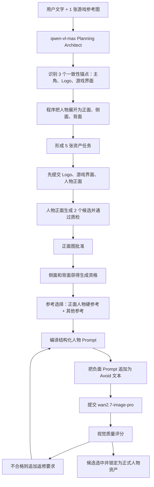

# Color Blitz Social：资产拆解与人物资产提示词日志还原

> 目标项目：`Color Blitz Social 30s Ad`  
> 项目 ID：`cmrugh98g0001tvj49o61t1ur`  
> 项目创建时间：2026-07-21 17:33:17（北京时间）  
> 最终成功完成规划：2026-07-22 14:52:07（北京时间）  
> 用户原始要求：`如图这个游戏，我要做一个30s的广告宣传片，要求引人入胜，画面精良，且整个视频前后人物要一致`

## 1. 证据范围和可信度

本报告交叉检查了以下实际数据：

- 项目事件日志：`D:\zzz\v debug\projects\cmrugh98g0001tvj49o61t1ur\events.jsonl`
- 项目可读脚本：`D:\zzz\v debug\projects\cmrugh98g0001tvj49o61t1ur\01-script-breakdown.md`
- 关键帧与资产日志：`D:\zzz\v debug\projects\cmrugh98g0001tvj49o61t1ur\02-keyframes.md`
- 项目耗时日志：`D:\zzz\v debug\projects\cmrugh98g0001tvj49o61t1ur\耗时日志.log`
- 全局原始日志：`D:\zzz\v debug\one-prompt-video.log`
- PostgreSQL 中的项目计划、关键帧、生成候选、质量报告
- 运行当时最近的 Git 版本：`3582ce8`，提交时间 2026-07-21 10:28:37

可信度标记：

- **原始记录**：数据库或日志中保存的原文。
- **精确还原**：请求正文未写入日志，但由当时代码模板和该项目保存输入重建。
- **流程解释**：根据日志状态和代码执行顺序整理成人类可读说明。

本报告不展示 API Key、鉴权信息和完整 OSS 地址。参考图 URL 统一写成“用户上传参考图 #1”。

## 2. 先确认截图对应哪个同名项目

日志中有两个同名项目：

| 项目 ID | 日期 | 一致性参考数 | 片段数 | 是否截图项目 |
|---|---:|---:|---:|---|
| `cmrswr9bi0001tv20pgueatls` | 2026-07-20 | 2 | 4 | 否 |
| `cmrugh98g0001tvj49o61t1ur` | 2026-07-21/22 | 5 | 5 | 是 |

截图显示：

- 资产库 `5/5`
- 边界参考帧 `6/6`
- 片段 `5/5`

这与第二个项目完全对应，因此本报告没有混入 7 月 20 日的同名旧项目。

## 3. 资产拆解的完整实际流程

### 3.1 输入

系统收到：

```json
{
  "user_idea": "如图这个游戏，我要做一个30s的广告宣传片，要求引人入胜，画面精良，且整个视频前后人物要一致",
  "aspect_ratio": "9:16",
  "duration_seconds": 30,
  "style_preset": "guofeng",
  "segment_count_min": 2,
  "segment_count_max": 10,
  "segment_duration_min_seconds": 3,
  "segment_duration_max_seconds": 15,
  "reference_images": [
    {
      "index": 1,
      "url": "[已脱敏：用户上传参考图 #1]",
      "instruction": "Extract only stable visual facts needed for task understanding, timeline planning, and consistency anchors."
    }
  ]
}
```

请求还把用户上传图片作为多模态 `image_url` 内容一并交给 `qwen-vl-max`。

### 3.2 Planning Architect 识别一致性锚点

第一次 Planning Architect 请求：

- 模型：`qwen-vl-max`
- 开始：2026-07-21 17:33:19（北京时间）
- 返回：2026-07-21 17:35:51
- 耗时：152,816 ms，约 2 分 33 秒

这一阶段不是直接生成五张资产图，而是先从用户需求和参考图中识别“哪些对象必须跨视频保持稳定”。

### 3.3 当时发给 Planning Architect 的资产拆解 System Prompt

以下是运行时代码版本中与资产拆解直接相关的原始提示词。JSON 输出结构也属于请求的一部分。

```text
You are Planning Architect for a controllable AI video pipeline.

Return only valid JSON. No markdown, explanations, or comments.

Your only job in stage 1:
- Understand the user's video task.
- First decompose the task into narrative_events before deciding the segment timeline.
- Decide which objects, states, visual rules, and task elements must stay consistent across the whole video.
- For every consistency anchor, separate static visual locks from dynamic state changes across the story.
- Output anchor_state_timeline so later stages can distinguish legal state evolution from identity drift.
- Decide whether this video needs editorial overlay subtitles, and if needed define their role, language, timing, placement, readability, and editability requirements.
- Derive candidate_timeline and planning_manifest.timeline_blueprint from narrative_events. Do not invent segment boundaries without event reasons.
- Do not write detailed keyframes, video prompts, image prompts, or micro-shot prompts.

Hard rules:
- Every segment duration must be 3-15 seconds.
- Total segment duration must equal duration_seconds exactly.
- Segment count must be between segment_count_min and segment_count_max.
- Do not default to 6 segments for 30 seconds. Choose by task complexity, information rhythm, subtitle rhythm, action continuity, scene changes, and generation continuity risk.
- Every segment must be generatable as one continuous unbroken camera take. A segment is not a montage container.
- If a beat requires a location change, environment replacement, large time jump, major camera setup change, major composition reset, subject teleport, product state discontinuity, or dissolve-like transformation, create a new segment boundary instead of putting that change inside one segment.
- Start and end boundary frames of the same segment must be compatible as two moments from the same continuous shot: same location logic, same camera axis family, same subject/product identity, same lighting direction, and no impossible scene jump.
- Identify consistency anchors dynamically. Do not assume every task has a product. Anchors may be person, product, prop, location, style, brand_visual, task_object, effect_state, vehicle, food, space_layout, or custom.
- Every narrative_event must include event_id, dramatic_goal, participants, location_id, initial_state, action, resulting_state, required_anchor_ids, previous_event_ids, and must_become_separate_segment.
- previous_event_ids must only reference earlier narrative_events.
- required_anchor_ids must exist in consistency_manifest. If you discover a needed anchor, add it to consistency_manifest before referencing it.
- Every candidate_timeline segment and every planning_manifest.timeline_blueprint segment must include source_event_ids.
- If any source event has must_become_separate_segment=true, do not merge it with unrelated events unless split_reason_zh explicitly explains why this remains a single continuous take.
- anchor_state_timeline must record each dynamic anchor's anchor_id and states with segment_no or event_id, start_state, end_state, start_position, end_position, holder_at_start, holder_at_end, and visible_transition_path.
- A product/prop cannot occupy two mutually exclusive places at the same time unless consistency_manifest explicitly defines multiple instances.
- Holder changes must have a visible_transition_path or an event explanation.
- The timeline_blueprint is a hard contract for later stages.

Return this JSON shape:
{
  "consistency_manifest": {
    "anchors": []
  },
  "narrative_events": [
    {
      "event_id": "event_1",
      "dramatic_goal": "",
      "participants": [],
      "location_id": "",
      "initial_state": "",
      "action": "",
      "resulting_state": "",
      "required_anchor_ids": [],
      "previous_event_ids": [],
      "must_become_separate_segment": true
    }
  ],
  "anchor_state_timeline": [
    {
      "anchor_id": "",
      "states": [
        {
          "event_id": "event_1",
          "segment_no": 1,
          "start_state": "",
          "end_state": "",
          "start_position": "",
          "end_position": "",
          "holder_at_start": "",
          "holder_at_end": "",
          "visible_transition_path": ""
        }
      ]
    }
  ],
  "audio_bible": {
    "overall_strategy_zh": "",
    "voice_consistency_zh": "",
    "music_mood_zh": "",
    "sound_effect_rules_zh": ""
  },
  "candidate_timeline": [
    {
      "segment_no": 1,
      "start_time_seconds": 0,
      "end_time_seconds": 5,
      "duration_seconds": 5,
      "source_event_ids": [],
      "purpose_zh": "",
      "split_reason_zh": "",
      "required_anchor_ids": []
    }
  ],
  "planning_manifest": {
    "project_intent": {
      "video_type": "product_ad | short_drama | tutorial | ecommerce | brand_film | custom",
      "primary_goal_zh": "",
      "primary_goal_en": "",
      "target_viewer_zh": "",
      "target_viewer_en": "",
      "success_criteria": []
    },
    "story_strategy": {
      "narrative_arc_zh": "",
      "narrative_arc_en": "",
      "recommended_segment_density": "low | medium | high",
      "subtitle_strategy_zh": "",
      "audio_strategy_zh": ""
    },
    "subtitle_policy": {
      "needed": true,
      "reason_zh": "",
      "content_role": "none | brand_slogan | product_selling_points | voiceover_caption | dialogue_caption | emotional_copy | instructional_steps | custom",
      "language": "zh-CN",
      "style_zh": "",
      "timing_strategy_zh": "",
      "placement_zh": "",
      "max_chars_per_line": 14,
      "max_lines": 2,
      "avoid_regions_zh": [],
      "user_editable": true
    },
    "timeline_blueprint": {
      "segment_count": 0,
      "total_duration_seconds": 0,
      "segment_duration_min_seconds": 3,
      "segment_duration_max_seconds": 15,
      "split_strategy_zh": "",
      "segments": [
        {
          "segment_no": 1,
          "start_time_seconds": 0,
          "end_time_seconds": 5,
          "duration_seconds": 5,
          "beat_role": "hook | setup | interaction | proof | payoff | ending | custom",
          "purpose_zh": "",
          "purpose_en": "",
          "split_reason_zh": "",
          "subtitle_intent_zh": "",
          "audio_intent_zh": "",
          "required_anchor_ids": [],
          "source_event_ids": [],
          "boundary_mode_hint": "continuous | hard_cut | dissolve | match_cut"
        }
      ]
    },
    "consistency_manifest": {
      "anchors": [
        {
          "id": "main_character",
          "type": "person",
          "display_name_zh": "",
          "display_name_en": "",
          "must_stay_consistent": true,
          "needs_reference_image": true,
          "reference_strength": "hard",
          "description_zh": "",
          "description_en": "",
          "visual_lock": {
            "shape": "",
            "material": "",
            "color": "",
            "markings": "",
            "scale": "",
            "state": "",
            "forbidden_drift": []
          },
          "applies_to": ["keyframes", "segments", "micro_shots"],
          "user_editable": true,
          "image_prompt_zh": "",
          "image_prompt_en": ""
        }
      ]
    },
    "global_style": {
      "visual_style": "",
      "color_palette": "",
      "color_tone_lock": "",
      "lighting_tone_lock": "",
      "negative_prompt": ""
    },
    "risks": [
      {
        "type": "identity_drift | product_drift | scene_drift | text_artifact | action_confusion | custom",
        "description_zh": "",
        "mitigation_zh": ""
      }
    ]
  }
}
```

### 3.4 模型实际拆出的三个一致性锚点

Planning Architect 最终保存了三个需要参考图的一致性锚点：

#### 锚点 1：主角

```json
{
  "id": "main_character",
  "type": "person",
  "displayNameZh": "主角",
  "mustStayConsistent": true,
  "needsReferenceImage": true,
  "referenceStrength": "hard",
  "descriptionZh": "一位年轻男性，戴红色棒球帽，穿蓝色牛仔背心和白色T恤，脖子上挂红色项链，面带微笑，眼神明亮，代表游戏中的玩家角色。",
  "visualLock": {
    "shape": "青年男性，短发，圆脸",
    "material": "布料（帽子、衣服），金属（项链）",
    "color": "红（帽子、项链）、蓝（背心）、白（T恤）",
    "markings": "无明显纹身或标志",
    "scale": "成人比例",
    "state": "清醒、积极",
    "forbiddenDrift": [
      "更换服装",
      "改变发型",
      "添加新饰品"
    ]
  },
  "imagePromptZh": "一位年轻男性，戴红色棒球帽，穿蓝色牛仔背心和白色T恤，脖子上挂红色项链，正面视角，居中，纯白背景，无装饰，无文字，无UI元素，清晰面部特写"
}
```

#### 锚点 2：游戏 Logo

```json
{
  "id": "game_logo",
  "type": "brand_visual",
  "displayNameZh": "游戏LOGO",
  "mustStayConsistent": true,
  "needsReferenceImage": true,
  "descriptionZh": "‘COLOR BLITZ SOCIAL’字样，彩色立体字体，上方有‘DOUBLE UP BONUS’横幅，右侧有x2图标，整体风格活泼，带有节日氛围。",
  "forbiddenDrift": [
    "更改字体样式",
    "移除x2图标",
    "改变主色调"
  ]
}
```

#### 锚点 3：游戏界面

```json
{
  "id": "game_interface",
  "type": "prop",
  "displayNameZh": "游戏界面",
  "mustStayConsistent": true,
  "needsReferenceImage": true,
  "descriptionZh": "色彩鲜艳的方块拼图界面，包含多种颜色的圆形或方形元素，底部有计时器和得分栏，整体风格符合guofeng美学。",
  "forbiddenDrift": [
    "改变基础网格结构",
    "移除计时器",
    "使用低饱和度配色"
  ]
}
```

### 3.5 从三个锚点变成五张资产图

这里没有再调用一个“资产拆分大模型”。

当时流程是程序根据锚点类型做确定性展开：

```text
main_character（person）
  ├─ KF-1000 主角正面：primary
  ├─ KF-1001 主角侧面：derived_from_front
  └─ KF-1002 主角背面：derived_from_front

game_logo（brand_visual）
  └─ KF-1003 游戏 Logo 单图：primary

game_interface（prop）
  └─ KF-1004 游戏界面单图：primary
```

所以页面显示的 `5/5` 来自：

- 1 个模型识别的人物锚点，被程序展开成 3 个视图；
- 1 个 Logo 锚点，展开成 1 张；
- 1 个游戏界面锚点，展开成 1 张。

## 4. 规划阶段经历的失败和恢复

本项目不是一次完成规划。实际发生了：

| 北京时间 | 结果 |
|---|---|
| 07-21 17:33 | 开始首次规划 |
| 07-21 17:35 | Planning Architect 完成，人物等锚点已产生 |
| 07-21 17:38 | Storyboard Artist 完成 |
| 07-21 17:42 | 五段 Shot Decomposer 基本完成 |
| 07-21 17:51 | 网络流被终止：`TypeError: terminated` |
| 07-22 11:50 | Shot Decomposer 第 4 段首包超时 |
| 07-22 13:54 起 | 多次因为尾帧包含运动过程、锚点引用校验失败而停止 |
| 07-22 14:49 | 再次继续规划，复用 Planning Architect、Storyboard Artist 和五段 Shot Decomposer 检查点 |
| 07-22 14:49:50 | 只重新调用 Prompt Detailer |
| 07-22 14:52:07 | Prompt Detailer 返回，耗时 137,305 ms |
| 07-22 14:52:07 | 整体规划成功，得到 5 个资产、6 个边界帧、5 个视频片段 |

因此，最终成功那一轮并没有重新分析参考图和重新拆人物资产，而是复用了前面已经保存的锚点结果。

## 5. 人物资产图片的实际生成顺序

### 5.1 第一批先发三个主资产

2026-07-22 14:56 左右，系统先提交：

1. `KF-1004` 游戏界面
2. `KF-1003` 游戏 Logo
3. `KF-1000` 主角正面

人物侧面和背面此时仍是 `IMAGE_PENDING`。

### 5.2 正面审批后才放行侧面和背面

主角正面成为已批准参考后：

- 15:18:38 提交主角背面；
- 15:19:03 提交主角侧面；
- 两者都使用已生成的主角正面作为硬人物参考；
- 同时还带入用户上传的原始参考图或另一个可用参考。

这部分日志事件名为：

```text
asset_library.front_approved.submit.success
```

## 6. 图片生成的上游参数

人物正面提交时的原始日志：

```json
{
  "event": "aliyun.image.submit.prepare",
  "model": "wan2.7-image-pro",
  "aspectRatio": "9:16",
  "size": "864*1536",
  "promptLength": 4036,
  "negativePromptLength": 493,
  "referenceImageCount": 1,
  "supportsNegativePrompt": false
}
```

上游接口：

```text
/api/v1/services/aigc/image-generation/generation
```

因为 `supportsNegativePrompt=false`，真正交给万相的文本是：

```text
<正式 Prompt>
Avoid: <负面 Prompt>
```

正面人物的长度可以精确核对：

```text
3535（正式 Prompt）
+ 8（换行和 "Avoid: "）
+ 493（负面 Prompt）
= 4036
```

与日志完全一致。

## 7. 主角正面资产：两个同批候选共用的完整 Prompt

数据来源：原始运行日志和数据库 `video_generation_candidates`，`artifact_id=consistency_reference:-1000:image`，最终选中候选 2。

先说明一个容易被页面表现误导的事实：主角正面图看起来像“第一张出错后又生成一次，第二张才正确”，但日志显示它们不是前后两轮返修，而是**同一批次并发生成的两个候选**。候选 2 提交时，候选 1 还没有接受视觉质检，因此候选 1 后来产生的返修指令不可能进入候选 2 的 Prompt。

参考图：

- 用户上传参考图 #1

正式 Prompt 原文：

```text
IMAGE PROMPT COMPILED FROM STRUCTURED CONTRACT
Create one reusable still consistency reference image.
Frame contract:
- target: consistency_reference:-1000
- asset_category: person
- asset_view: front
- purpose: 主角 正面
- scene: 一位年轻男性，戴红色棒球帽，穿蓝色牛仔背心和白色T恤，脖子上挂红色项链，面带微笑，眼神明亮，代表游戏中的玩家角色。
- character_state: Main Character front view: Full-body character reference, exact front view, standing neutral pose, face clearly visible, same outfit, hairstyle, body proportions, and accessories.
- product_state: ‘COLOR BLITZ SOCIAL’ in colorful 3D font, with ‘DOUBLE UP BONUS’ banner above and x2 icon on right, vibrant style with festive atmosphere.
- source_image_prompt: 人物全身设定参考，严格正面视角，中性站姿，脸部清楚，同一套服装、发型、体型比例和配饰。 一位年轻男性，戴红色棒球帽，穿蓝色牛仔背心和白色T恤，脖子上挂红色项链，正面视角，居中，纯白背景，无装饰，无文字，无UI元素，清晰面部特写 资产库参考图，白色或浅色纯净背景，只展示一个资产，不要分镜拼图、不要多宫格、不要标签文字、字幕、UI 或水印。
Visible anchor locks:
- anchor_id=main_character; type=person; Main Character; A young male character wearing a red baseball cap, blue denim vest over white T-shirt, red necklace, smiling with bright eyes, representing the player avatar in the game.; shape: 青年男性，短发，圆脸; material: 布料（帽子、衣服），金属（项链）; color: 红（帽子、项链）、蓝（背心）、白（T恤）; markings: 无明显纹身或标志; scale: 成人比例; state: 清醒、积极; forbidden drift: 更换服装, 改变发型, 添加新饰品
- anchor_id=game_logo; type=brand_visual; Game Logo; ‘COLOR BLITZ SOCIAL’ in colorful 3D font, with ‘DOUBLE UP BONUS’ banner above and x2 icon on right, vibrant style with festive atmosphere.; shape: 立体文字组合; material: 发光材质; color: 多色渐变（红、黄、蓝、绿）; markings: x2图标，星形装饰; scale: 占据画面1/3以上; state: 静态或轻微闪烁; forbidden drift: 更改字体样式, 移除x2图标, 改变主色调
- anchor_id=game_interface; type=prop; Game Interface; Vibrant puzzle grid with colored circular/square elements, timer and score bar at bottom, overall style aligned with guofeng aesthetics.; shape: 网格状拼图; material: 发光像素感; color: 高饱和度多色; markings: 计时器、得分数字; scale: 占据画面中心区域; state: 动态变化; forbidden drift: 改变基础网格结构, 移除计时器, 使用低饱和度配色
Selected reference usage:
- User supplied visual reference. Inherit only the stated identity, layout, product, or style signal; ignore unrelated pose, crop, artifacts, and accidental text.
Image rules:
- The source_image_prompt is authoritative for subject count, pose, framing, and background. Ignore older purpose, scene, character-state, product-state, or reference-image composition when they conflict with it.
- One clean still image only; no storyboard panels, before/after layout, or timeline labels.
- For asset-library references, render only the requested asset and requested view; do not create a turnaround sheet, split-screen, multiple views, or duplicate characters in one image.
- PERSON ASSET ISOLATION: render exactly one character only, centered and clearly visible, on a uniform pure-white or light-neutral studio background. No environment, scenery, floor set, decorative backdrop, border, poster layout, title, logo, product card, UI, confetti, balloons, flags, fireworks, or secondary character.
- Reference images are identity/style evidence only. Preserve the character's face, clothing, colors, proportions, and accessories, but never copy their background, typography, logo placement, crop, poster composition, or other people.
- Do not render subtitles, captions, UI overlays, watermarks, timecodes, random letters, or misspelled text.
- No text or logo is allowed anywhere in a person asset image, even if a brand/logo anchor exists elsewhere in the project.
- Preserve identity, clothing details, product geometry, scene layout, lighting direction, and color tone from the relevant contracts.
```

负面 Prompt 原文：

```text
暗淡、灰暗、低对比度、模糊、失真, background scenery, decorative background, poster composition, advertisement layout, title, typography, letters, logo, product card, UI, confetti, balloons, flags, fireworks, border, frame, duplicate person, multiple people, cropped duplicate, subtitles, captions, UI overlays, watermarks, timecodes, random letters, misspelled text, storyboard panels, split screen, before-after comparison, duplicated product, identity drift, distorted hands, distorted face, malformed logo
```

因此实际提交文本结尾还包含：

```text
Avoid: 暗淡、灰暗、低对比度、模糊、失真, background scenery, decorative background, poster composition, advertisement layout, title, typography, letters, logo, product card, UI, confetti, balloons, flags, fireworks, border, frame, duplicate person, multiple people, cropped duplicate, subtitles, captions, UI overlays, watermarks, timecodes, random letters, misspelled text, storyboard panels, split screen, before-after comparison, duplicated product, identity drift, distorted hands, distorted face, malformed logo
```

### 7.1 两张图实际上是同批并发候选

两条候选记录的共同批次 ID 是：

```text
67dc5620-9a25-426e-9cef-13a23d48fe79
```

| 项目 | 候选 1 | 候选 2 |
|---|---|---|
| candidate ID | `cmrvqbu9q000rtvv04v5a9dkq` | `cmrvqbued000ttvv0xrhla5p6` |
| 上游 task ID | `40e2f989-e7a0-41c4-a1f3-1ad390c949eb` | `16e7e34a-511f-4b9c-9490-1493a2698f3f` |
| 创建时间（北京时间） | 2026-07-22 14:56:47.102 | 2026-07-22 14:56:47.270 |
| 上游完成时间（北京时间） | 2026-07-22 14:56:59.062 | 2026-07-22 14:57:09.030 |
| `attempt` | 1 | 1 |
| 模型 | `wan2.7-image-pro` | `wan2.7-image-pro` |
| 画幅与尺寸 | 9:16，864×1536 | 9:16，864×1536 |
| 随机种子 | `8919` | `16838` |

两个候选的创建时间只相差 **168 毫秒**，而且都标记为 `attempt=1`。这证明它们是候选池一次发出的双候选，不是 `attempt=1` 失败后再执行 `attempt=2`。

### 7.2 第一次是哪一个模块查出的错误

检查模块是图片生成后的视觉质检模块，日志事件名为：

```text
generation_quality.report
```

对应代码职责位于：

```text
src/services/video-orchestrator/generation-quality-evaluator.ts
```

入口函数是 `evaluateGeneratedImageQuality`：它让视觉模型查看实际生成图片，对身份、构图、Prompt 符合度、连贯性和画面缺陷进行评分，再由编排层规范化报告并决定候选是否通过。保存的候选 1 报告标记 `evaluationModel=qwen3.6-flash`，与项目的质量视觉模型配置一致；需要注意，原始 `generation_quality.report` 日志事件本身没有再次打印模型字段。

候选 1 的首份失败报告出现在 **2026-07-22 14:57:52.754（北京时间）**，当时返回：

| 指标 | 分数 |
|---|---:|
| 身份一致性 | 95 |
| 构图 | 85 |
| Prompt 符合度 | 80 |
| 连贯性 | 90 |
| 是否通过 | 否 |
| 建议从哪一阶段重试 | `stage2b` |

原始错误项为：

```text
Character is cropped at waist, missing full-body view as required by 'full-body character reference' in contract.
Background is slightly off-white instead of pure white, though acceptable.
```

如实翻译就是：

1. 人物在腰部被截断，没有满足合约中“全身人物参考图”的要求；
2. 背景略微偏灰白，不是纯白，不过这个问题本身仍在可接受范围内。

真正导致不通过的核心问题是**没有从头到脚完整显示人物**，而不是人物身份或服装不一致。

### 7.3 第一次质检要求模型怎么改

首份失败报告返回的完整返修指令是：

```text
Regenerate the image to include the full body of the character in a neutral standing pose, ensuring complete visibility from head to feet. Maintain strict front-facing alignment and pure white background. Ensure no UI elements or text are present.
```

中文含义：

```text
重新生成图片，包含人物完整全身，采用中性站姿，确保从头到脚全部可见。
保持严格正面朝向和纯白背景，确保没有 UI 元素或文字。
```

同一张候选 1 随后又被重复质检，日志还出现过两种更具体的返修措辞：

```text
Generate a full-body view of the main character in strict front pose with clear facial features, same outfit, hairstyle, and accessories. Ensure pure white background without any UI elements, text, or decorative elements. Include full body from head to feet in neutral stance.
```

```text
Generate a full-body view of the main character in strict front-facing neutral pose with clear facial features, wearing red baseball cap, blue denim vest over white T-shirt, and red necklace with silver pendant. Ensure pure white background, no text, UI, or additional elements. Maintain consistent proportions and accessories as defined in anchor_reference_image.
```

这些指令逐步明确了：从头到脚、严格正面、中性站姿、清晰脸部、红帽、蓝色牛仔背心、白 T 恤、红色项链与银色吊坠、纯白背景、无文字和 UI。

但必须强调：**这些是候选 1 的质检返修建议，并没有用于生成候选 2。**

### 7.4 第二次给生图模型的 Prompt 以及具体变化

候选 2 给生图模型的完整正向 Prompt，就是本节上方已经逐字列出的“正式 Prompt 原文”；负面限制也是同一段 `Avoid: ...`。数据库逐字段比较结果如下：

| 输入项 | 是否变化 |
|---|---|
| 正向 Prompt | 没有变化，逐字相同 |
| 负面 Prompt / `Avoid:` 文本 | 没有变化，逐字相同 |
| 参考图 | 没有变化，都是用户上传参考图 #1 |
| 模型 | 没有变化，都是 `wan2.7-image-pro` |
| 比例和尺寸 | 没有变化，都是 9:16、864×1536 |
| 质检返修指令 | 没有加入候选 2 |
| 随机种子 | 从 `8919` 变为 `16838` |

可复核的文本摘要值：

```text
正向 Prompt MD5：15bd51661ef02770722fa4484fac01bc
负面 Prompt MD5：d7dfdc95506274718f0812d6200043cf
```

两条候选的正向 Prompt、负面 Prompt 和参考图字段直接比较均为相等。因此，第二张正确图不是“模型按照第一次错误报告修改后生成”的结果，而是**相同输入条件下，另一个随机种子采样出的候选恰好满足全身构图要求**。

### 7.5 当时两张图的真实质量结论

候选 2 的第一份通过报告出现在 **2026-07-22 14:57:28.388（北京时间）**：

| 指标 | 分数 |
|---|---:|
| 身份一致性 | 95 |
| 构图 | 98 |
| Prompt 符合度 | 96 |
| 连贯性 | 97 |
| 缺陷项 | 无 |
| 返修指令 | `None` |
| 是否通过 | 是 |

时间顺序尤其关键：

1. 14:56:47.102，候选 1 创建；
2. 14:56:47.270，候选 2 创建；
3. 14:56:59.062，候选 1 图片完成；
4. 14:57:09.030，候选 2 图片完成；
5. 14:57:28.388，候选 2 被质检判定通过；
6. 14:57:52.754，候选 1 才被质检判定失败并生成返修指令。

所以页面上的真实业务过程是：系统同时生成两张候选图，视觉质检选中了满足要求的候选 2，而不是先失败、再把错误喂回生图模型完成一次闭环返修。

### 7.6 为什么数据库现在会显示候选 1 也通过

当前数据库中的候选 1 报告后来在 2026-07-27 被新版质量策略重新评估并覆盖，现值变成了通过；候选 2 的保存分数也发生过更新。这不是 7 月 22 日首次生成时的原始判断。

因此，本节关于“第一次为什么失败、当时返回什么错误”的结论以 7 月 22 日原始运行日志为准；不能用 7 月 27 日重评后的当前字段倒推当时的执行过程。文档旧版曾把重评后的 `98/100/100/100` 写成候选 1 的当时结果，那一行现已按原始日志纠正。

原始日志可直接定位到 `D:\zzz\v debug\one-prompt-video.log`：

- 第 12166、12169 行：两个候选的提交参数与不同随机种子；
- 第 12167—12171 行：两个任务的提交请求与 PENDING 响应；
- 第 12232 行：候选 2 首次质检通过；
- 第 12248 行：候选 1 首次质检失败、两个错误项和完整返修指令；
- 第 12253、12267 行：候选 1 后续重复质检产生的两版更具体返修指令。

## 8. 主角侧面资产：实际最终 Prompt

数据来源：`artifact_id=consistency_reference:-1001:image`，最终选中候选 2。

使用的参考图：

- 已批准的主角正面图；
- 当时可用的游戏 Logo 单图。

正式 Prompt 原文：

```text
IMAGE PROMPT COMPILED FROM STRUCTURED CONTRACT
Create one reusable still consistency reference image.
Frame contract:
- target: consistency_reference:-1001
- asset_category: person
- asset_view: side
- purpose: 主角 侧面
- scene: 一位年轻男性，戴红色棒球帽，穿蓝色牛仔背心和白色T恤，脖子上挂红色项链，面带微笑，眼神明亮，代表游戏中的玩家角色。
- character_state: Main Character side view: Full-body character reference, exact left side profile view, standing neutral pose, same outfit, hairstyle silhouette, body proportions, and accessories.
- product_state: ‘COLOR BLITZ SOCIAL’ in colorful 3D font, with ‘DOUBLE UP BONUS’ banner above and x2 icon on right, vibrant style with festive atmosphere.
- source_image_prompt: 人物全身设定参考，严格侧面视角，中性站姿，同一套服装、发型轮廓、体型比例和配饰。 一位年轻男性，戴红色棒球帽，穿蓝色牛仔背心和白色T恤，脖子上挂红色项链，正面视角，居中，纯白背景，无装饰，无文字，无UI元素，清晰面部特写 资产库参考图，白色或浅色纯净背景，只展示一个资产，不要分镜拼图、不要多宫格、不要标签文字、字幕、UI 或水印。
Visible anchor locks:
- anchor_id=main_character; type=person; Main Character; A young male character wearing a red baseball cap, blue denim vest over white T-shirt, red necklace, smiling with bright eyes, representing the player avatar in the game.; shape: 青年男性，短发，圆脸; material: 布料（帽子、衣服），金属（项链）; color: 红（帽子、项链）、蓝（背心）、白（T恤）; markings: 无明显纹身或标志; scale: 成人比例; state: 清醒、积极; forbidden drift: 更换服装, 改变发型, 添加新饰品
- anchor_id=game_logo; type=brand_visual; Game Logo; ‘COLOR BLITZ SOCIAL’ in colorful 3D font, with ‘DOUBLE UP BONUS’ banner above and x2 icon on right, vibrant style with festive atmosphere.; shape: 立体文字组合; material: 发光材质; color: 多色渐变（红、黄、蓝、绿）; markings: x2图标，星形装饰; scale: 占据画面1/3以上; state: 静态或轻微闪烁; forbidden drift: 更改字体样式, 移除x2图标, 改变主色调
- anchor_id=game_interface; type=prop; Game Interface; Vibrant puzzle grid with colored circular/square elements, timer and score bar at bottom, overall style aligned with guofeng aesthetics.; shape: 网格状拼图; material: 发光像素感; color: 高饱和度多色; markings: 计时器、得分数字; scale: 占据画面中心区域; state: 动态变化; forbidden drift: 改变基础网格结构, 移除计时器, 使用低饱和度配色
Selected reference usage:
- Required hard anchor main_character, front view. Inherit only the stated identity, layout, product, or style signal; ignore unrelated pose, crop, artifacts, and accidental text.
- Available brand_visual anchor, single view. Inherit only the stated identity, layout, product, or style signal; ignore unrelated pose, crop, artifacts, and accidental text.
MANDATORY RETRY CORRECTION FROM ACTUAL IMAGE QUALITY CHECK: Ensure the red necklace is consistently visible in the side profile view. Adjust lighting or character pose slightly to expose the necklace without altering other attributes.
Image rules:
- The source_image_prompt is authoritative for subject count, pose, framing, and background. Ignore older purpose, scene, character-state, product-state, or reference-image composition when they conflict with it.
- One clean still image only; no storyboard panels, before/after layout, or timeline labels.
- For asset-library references, render only the requested asset and requested view; do not create a turnaround sheet, split-screen, multiple views, or duplicate characters in one image.
- PERSON ASSET ISOLATION: render exactly one character only, centered and clearly visible, on a uniform pure-white or light-neutral studio background. No environment, scenery, floor set, decorative backdrop, border, poster layout, title, logo, product card, UI, confetti, balloons, flags, fireworks, or secondary character.
- Reference images are identity/style evidence only. Preserve the character's face, clothing, colors, proportions, and accessories, but never copy their background, typography, logo placement, crop, poster composition, or other people.
- Do not render subtitles, captions, UI overlays, watermarks, timecodes, random letters, or misspelled text.
- No text or logo is allowed anywhere in a person asset image, even if a brand/logo anchor exists elsewhere in the project.
- Preserve identity, clothing details, product geometry, scene layout, lighting direction, and color tone from the relevant contracts.
```

负面 Prompt：

```text
暗淡、灰暗、低对比度、模糊、失真, background scenery, decorative background, poster composition, advertisement layout, title, typography, letters, logo, product card, UI, confetti, balloons, flags, fireworks, border, frame, duplicate person, multiple people, cropped duplicate, subtitles, captions, UI overlays, watermarks, timecodes, random letters, misspelled text, storyboard panels, split screen, before-after comparison, duplicated product, identity drift, distorted hands, distorted face, malformed logo, corrupted text, gibberish glyphs, broken timer display, illegible score display, decorative pseudo-text, non-standard symbols
```

第一轮侧面图的主要质检问题：

```text
Generate a strict left-side profile view of the main character in neutral standing pose...
```

第一候选评分：

| 身份 | 构图 | Prompt 符合 | 连贯性 |
|---:|---:|---:|---:|
| 95 | 40 | 30 | 20 |

说明身份外观还像原人物，但视角、构图和任务符合度严重不合格。随后返修指令又特别要求红色项链在侧面可见。

## 9. 主角背面资产：实际最终 Prompt

数据来源：`artifact_id=consistency_reference:-1002:image`，选中候选 2。

参考图：

- 已批准的主角正面图；
- 用户上传参考图 #1。

正式 Prompt 原文：

```text
IMAGE PROMPT COMPILED FROM STRUCTURED CONTRACT
Create one reusable still consistency reference image.
Frame contract:
- target: consistency_reference:-1002
- asset_category: person
- asset_view: back
- purpose: 主角 背面
- scene: 一位年轻男性，戴红色棒球帽，穿蓝色牛仔背心和白色T恤，脖子上挂红色项链，面带微笑，眼神明亮，代表游戏中的玩家角色。
- character_state: Main Character back view: Full-body character reference, exact back view, standing neutral pose, same outfit back details, hairstyle from behind, body proportions, and accessories.
- product_state: ‘COLOR BLITZ SOCIAL’ in colorful 3D font, with ‘DOUBLE UP BONUS’ banner above and x2 icon on right, vibrant style with festive atmosphere.
- source_image_prompt: 人物全身设定参考，严格背面视角，中性站姿，清楚展示服装背面细节、背后发型、体型比例和配饰。 一位年轻男性，戴红色棒球帽，穿蓝色牛仔背心和白色T恤，脖子上挂红色项链，正面视角，居中，纯白背景，无装饰，无文字，无UI元素，清晰面部特写 资产库参考图，白色或浅色纯净背景，只展示一个资产，不要分镜拼图、不要多宫格、不要标签文字、字幕、UI 或水印。
Visible anchor locks:
- anchor_id=main_character; type=person; Main Character; A young male character wearing a red baseball cap, blue denim vest over white T-shirt, red necklace, smiling with bright eyes, representing the player avatar in the game.; shape: 青年男性，短发，圆脸; material: 布料（帽子、衣服），金属（项链）; color: 红（帽子、项链）、蓝（背心）、白（T恤）; markings: 无明显纹身或标志; scale: 成人比例; state: 清醒、积极; forbidden drift: 更换服装, 改变发型, 添加新饰品
- anchor_id=game_logo; type=brand_visual; Game Logo; ‘COLOR BLITZ SOCIAL’ in colorful 3D font, with ‘DOUBLE UP BONUS’ banner above and x2 icon on right, vibrant style with festive atmosphere.; shape: 立体文字组合; material: 发光材质; color: 多色渐变（红、黄、蓝、绿）; markings: x2图标，星形装饰; scale: 占据画面1/3以上; state: 静态或轻微闪烁; forbidden drift: 更改字体样式, 移除x2图标, 改变主色调
- anchor_id=game_interface; type=prop; Game Interface; Vibrant puzzle grid with colored circular/square elements, timer and score bar at bottom, overall style aligned with guofeng aesthetics.; shape: 网格状拼图; material: 发光像素感; color: 高饱和度多色; markings: 计时器、得分数字; scale: 占据画面中心区域; state: 动态变化; forbidden drift: 改变基础网格结构, 移除计时器, 使用低饱和度配色
Selected reference usage:
- Required hard anchor main_character, front view. Inherit only the stated identity, layout, product, or style signal; ignore unrelated pose, crop, artifacts, and accidental text.
- User supplied visual reference. Inherit only the stated identity, layout, product, or style signal; ignore unrelated pose, crop, artifacts, and accidental text.
Image rules:
- The source_image_prompt is authoritative for subject count, pose, framing, and background. Ignore older purpose, scene, character-state, product-state, or reference-image composition when they conflict with it.
- One clean still image only; no storyboard panels, before/after layout, or timeline labels.
- For asset-library references, render only the requested asset and requested view; do not create a turnaround sheet, split-screen, multiple views, or duplicate characters in one image.
- PERSON ASSET ISOLATION: render exactly one character only, centered and clearly visible, on a uniform pure-white or light-neutral studio background. No environment, scenery, floor set, decorative backdrop, border, poster layout, title, logo, product card, UI, confetti, balloons, flags, fireworks, or secondary character.
- Reference images are identity/style evidence only. Preserve the character's face, clothing, colors, proportions, and accessories, but never copy their background, typography, logo placement, crop, poster composition, or other people.
- Do not render subtitles, captions, UI overlays, watermarks, timecodes, random letters, or misspelled text.
- No text or logo is allowed anywhere in a person asset image, even if a brand/logo anchor exists elsewhere in the project.
- Preserve identity, clothing details, product geometry, scene layout, lighting direction, and color tone from the relevant contracts.
```

负面 Prompt 与侧面图相同。

质量结果：

| 候选 | 身份 | 构图 | Prompt 符合 | 连贯性 | 结果 |
|---|---:|---:|---:|---:|---|
| 1 | 95 | 98 | 90 | 92 | 通过，但报告建议核对背面项链和配饰 |
| 2 | 95 | 98 | 97 | 96 | 通过，最终选中 |

## 10. 侧面资产当时发生了异常重复提交

数据库里人物候选数量：

| 资产 | 候选记录数 |
|---|---:|
| 主角正面 | 2 |
| 主角背面 | 2 |
| 主角侧面 | 40 |

侧面图在 15:19 到 15:26 之间产生了大量重复任务：

- 多张候选已经被质检判定通过；
- 仍继续创建相同 `candidate_no=1/2` 的新批次；
- 多次触发 `Throttling.RateQuota`；
- 部分质检模型输出了 1/100 的异常量纲分数，进入“重新裁决现有图片”；
- 最终在 15:26:54 的候选被选中并接受。

这不是人物资产设计要求导致的正常多轮返修，而是当时旧调度/同步路径重复提交造成的历史异常。

## 11. 从这些原始 Prompt 中能看到的旧版本问题

### 11.1 侧面和背面 Prompt 自相矛盾

侧面 Prompt 同时包含：

```text
严格侧面视角
exact left side profile view
```

但后面的 `source_image_prompt` 又包含：

```text
正面视角
```

背面 Prompt 也同时包含：

```text
严格背面视角
exact back view
```

以及：

```text
正面视角
```

虽然 Prompt 后面声明 `source_image_prompt` 权威最高，但它恰好包含错误的“正面视角”，会直接干扰侧面和背面生成。这与第一张侧面图构图 40、Prompt 符合度 30、连贯性 20 的失败结果一致。

### 11.2 人物资产里混入了不应该出现的游戏锚点

人物 Prompt 中包含：

- `product_state` 的游戏 Logo；
- 游戏 Logo 全量锚点锁；
- 游戏界面全量锚点锁。

后面又要求：

```text
No text or logo is allowed anywhere in a person asset image
```

这虽然不一定必然生成 Logo，但会增加提示词噪声和合同冲突风险。

### 11.3 当时的身份信息重复了多次

同一人物服装和身份分别出现在：

- `scene`
- `character_state`
- `source_image_prompt`
- `Visible anchor locks`
- 参考图说明
- `Image rules`

这也是后来代码改成“单一 textual identity owner”的原因。当前实现已经把人物身份、当前姿势、构图和参考图权限拆开，避免这类重复所有权。

## 12. 最终人类可读流程



## 13. 核心结论

这个项目的资产拆解不是“大模型直接说生成五张图”：

1. 大模型先识别出三个跨镜头一致性锚点；
2. 程序把人物锚点确定性展开为正、侧、背三个视图；
3. 正面图先生成并批准；
4. 侧面和背面再以正面图为硬参考生成；
5. 每张图经过结构化 Prompt 编译、负面约束追加、万相生成和视觉质检；
6. 当时旧 Prompt 存在侧/背视角与“正面视角”冲突、无关 Logo/界面锚点污染、身份事实重复等问题；
7. 侧面人物还遭遇了旧调度路径的异常重复提交，共留下 40 条候选记录。
