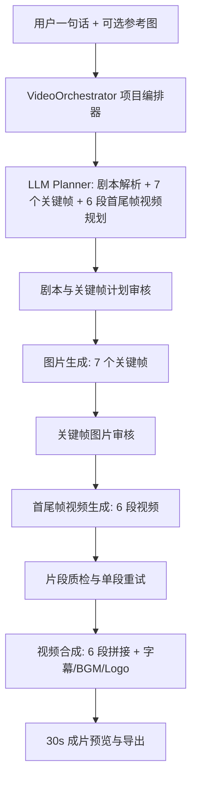

# 一句话生成 30s 可审核视频工作流方案

## 1. 背景与目标

当前网站已经具备“用户选择现有能力 -> 提交上游 API -> 等待结果”的基础能力，也已经接入了图片生成、图生视频、视频合成等能力。现在要升级的是“一句话成片”的生产方式：用户只输入一句话，系统自动完成剧本解析、关键帧规划、关键帧图片生成、分镜视频生成和最终 30s 合成。

新的核心要求是：

- 不再把每个关键帧当成一个镜头的中点。
- 30s 视频固定拆成 6 段视频片段。
- 系统先规划并生成 7 个关键帧，分别对应 30s 时间轴上的 7 个边界节点。
- 第 1 段视频使用关键帧 1 作为首帧、关键帧 2 作为尾帧。
- 第 2 段视频使用关键帧 2 作为首帧、关键帧 3 作为尾帧。
- 依此类推，第 6 段视频使用关键帧 6 作为首帧、关键帧 7 作为尾帧。

也就是说，新方案是“关键帧作为首尾帧控制视频段”，而不是“关键帧作为单个镜头的中心画面”。

这样做的好处：

- 相邻镜头之间的视觉连续性更强。
- 视频段生成更可控，每段都有明确起点和终点。
- 用户审核的是完整时间轴节点，而不是孤立镜头画面。
- 后续可以支持局部重生成：只要替换某个关键帧，就能影响它前后相邻的视频段。

核心原则：

**自动化负责提效，关键帧负责控制，首尾帧负责连续性，审核点负责可控。**

## 2. 推荐产品形态

入口建议保持为独立工具或 SKU：

- 页面名称：`一句话成片`
- SKU 示例：`ONE_PROMPT_30S_VIDEO`
- providerCode 示例：`VIDEO_ORCHESTRATOR`
- 默认输出：30 秒，9:16，7 个关键帧，6 段视频，每段约 5 秒
- 高级参数：视频比例、风格、节奏、参考图、角色一致性、是否自动生成字幕、是否自动加 BGM / Logo / CTA

用户流程：

1. 用户输入一句话，例如：“做一条 30 秒国风护肤品广告，主角在清晨庭院使用产品，质感高级。”
2. 用户可上传产品、人物、场景或风格参考图。
3. 系统解析创意，生成：
   - 创意大纲
   - 7 个关键帧节点
   - 每个关键帧的图片生成提示词
   - 6 段视频片段规划
   - 每段视频的首帧、尾帧和视频生成提示词
4. 用户审核剧本和关键帧规划。
5. 系统生成 7 张关键帧图片。
6. 用户审核关键帧图片，可替换、重生成、锁定任意关键帧。
7. 用户确认关键帧后，系统按相邻关键帧生成 6 段视频：
   - 片段 1：关键帧 01 -> 关键帧 02
   - 片段 2：关键帧 02 -> 关键帧 03
   - 片段 3：关键帧 03 -> 关键帧 04
   - 片段 4：关键帧 04 -> 关键帧 05
   - 片段 5：关键帧 05 -> 关键帧 06
   - 片段 6：关键帧 06 -> 关键帧 07
8. 用户审核 6 段视频片段，可单段重试。
9. 系统合成完整 30s 视频，叠加字幕、BGM、Logo、转场等。
10. 用户预览成片，可局部返工或导出。

## 3. 总体架构

不要把这件事做成一个更大的 provider adapter。建议新增业务编排层 `VideoOrchestrator`，负责把 LLM 规划、图片生成、首尾帧视频生成、视频合成串起来，并保存每一步中间产物。



关键实体：

- `VideoProject`：一次“一句话成片”项目。
- `VideoKeyframe`：时间轴关键帧节点，共 7 个。
- `VideoSegment`：由相邻两个关键帧生成的视频段，共 6 段。
- `VideoRender`：最终成片合成任务。
- `LLM Planner`：把一句话和参考图转成结构化 JSON。
- `Quality Judge`：对关键帧、片段、最终视频做质量评估。

## 4. 核心数据关系

旧方案中，一个 `VideoShot` 同时承担“镜头脚本、关键帧图片、视频片段”的职责。新方案建议拆成两个概念：

- `VideoKeyframe`：负责画面节点。
- `VideoSegment`：负责两个节点之间的视频运动。

时间轴示意：

```text
0s       5s       10s      15s      20s      25s      30s
KF01 --> KF02 --> KF03 --> KF04 --> KF05 --> KF06 --> KF07
   S01      S02      S03      S04      S05      S06
```

关系说明：

| 对象 | 数量 | 作用 |
| --- | --- | --- |
| `VideoProject` | 1 | 保存用户输入、项目参数、总状态 |
| `VideoKeyframe` | 7 | 保存关键帧目的、画面描述、图片 prompt、图片 URL |
| `VideoSegment` | 6 | 保存起始关键帧、结束关键帧、视频 prompt、视频 URL |

每个视频片段都应引用两个关键帧：

```text
segment.startKeyframeId
segment.endKeyframeId
```

这样后续如果用户重生成 `KF03`，系统可以标记：

- `S02: KF02 -> KF03` 需要重生成
- `S03: KF03 -> KF04` 需要重生成

而其他片段不受影响。

## 5. 工作流状态机

项目级状态：

| 状态 | 含义 | 用户可操作 |
| --- | --- | --- |
| `DRAFT` | 用户刚创建项目，还没提交规划 | 编辑输入、上传参考图 |
| `PLANNING` | 正在生成剧本、关键帧和片段规划 | 等待 |
| `PLAN_REVIEW` | 等待用户审核规划 | 修改、确认、重生成 |
| `KEYFRAME_GENERATING` | 正在生成 7 张关键帧 | 查看进度 |
| `KEYFRAME_REVIEW` | 等待用户审核关键帧 | 重生成、替换、锁定 |
| `SEGMENT_GENERATING` | 正在生成 6 段首尾帧视频 | 查看每段进度 |
| `SEGMENT_REVIEW` | 等待用户审核视频片段 | 单段重试、确认 |
| `COMPOSING` | 正在合成 30s 成片 | 等待 |
| `FINAL_REVIEW` | 成片可预览 | 导出、返工 |
| `DONE` | 已导出或归档 | 查看、下载 |
| `FAILED` | 项目不可自动继续 | 查看失败原因、恢复 |

关键帧级状态：

| 状态 | 含义 |
| --- | --- |
| `SCRIPT_READY` | 关键帧描述和 prompt 已生成 |
| `IMAGE_PENDING` | 等待生成图片 |
| `IMAGE_RUNNING` | 图片生成中 |
| `IMAGE_READY` | 图片可审核 |
| `IMAGE_APPROVED` | 图片已锁定 |
| `FAILED` | 当前关键帧失败，可单独重试 |

视频段级状态：

| 状态 | 含义 |
| --- | --- |
| `SEGMENT_PENDING` | 等待生成 |
| `SEGMENT_RUNNING` | 首尾帧视频生成中 |
| `SEGMENT_READY` | 视频片段可审核 |
| `SEGMENT_APPROVED` | 视频片段已确认 |
| `FAILED` | 当前片段失败，可单独重试 |

## 6. LLM 剧本与首尾帧规划

第一步不直接出图，而是让 LLM 输出结构化 JSON。新方案里，LLM 不只要生成每个关键帧图片提示词，还要规划好每两个关键帧之间的视频生成提示词。

输入：

- 用户一句话
- 可选参考图
- 目标时长：默认 30 秒
- 关键帧数量：固定 7 个
- 视频片段数量：固定 6 段
- 视频比例：默认 9:16
- 风格偏好
- 禁止项，例如不要文字水印、不要血腥、不要品牌露出错误

输出结构建议：

```json
{
  "title": "清晨庭院国风护肤广告",
  "logline": "主角在清晨庭院完成护肤仪式，突出东方美学与高级质感。",
  "durationSeconds": 30,
  "aspectRatio": "9:16",
  "keyframeCount": 7,
  "segmentCount": 6,
  "styleBible": {
    "visualStyle": "cinematic, elegant Chinese courtyard, soft morning light",
    "characterLock": "same female lead, same face, same outfit, same hairstyle",
    "productLock": "same skincare bottle, jade green ceramic texture, gold details",
    "colorPalette": "jade green, ivory white, warm gold",
    "negativePrompt": "logo distortion, watermark, extra fingers, text artifacts"
  },
  "keyframes": [
    {
      "keyframeNo": 1,
      "timeSeconds": 0,
      "purpose": "建立清晨庭院氛围",
      "scene": "清晨薄雾中的中式庭院，竹影和亭台构成高级东方背景",
      "characterState": "主角尚未入画或远处轻步入画",
      "productState": "产品可作为远景道具轻微出现",
      "imagePrompt": "vertical 9:16 cinematic keyframe, elegant Chinese courtyard at dawn, bamboo shadows, soft morning mist, premium skincare ad mood...",
      "negativePrompt": "watermark, random text, logo distortion, blurry face"
    },
    {
      "keyframeNo": 2,
      "timeSeconds": 5,
      "purpose": "主角与产品建立关系",
      "scene": "主角站在庭院石桌旁，产品清晰可见",
      "characterState": "主角手持护肤品，动作自然优雅",
      "productState": "产品瓶身正面清晰，质感高级",
      "imagePrompt": "vertical 9:16 cinematic keyframe, same female lead holding jade green skincare bottle near stone table..."
    }
  ],
  "segments": [
    {
      "segmentNo": 1,
      "startTimeSeconds": 0,
      "endTimeSeconds": 5,
      "durationSeconds": 5,
      "startKeyframeNo": 1,
      "endKeyframeNo": 2,
      "purpose": "从环境建立过渡到主角与产品出现",
      "motion": "slow push-in from courtyard atmosphere to the lead near the stone table",
      "camera": "slow push-in, gentle parallax, stable cinematic movement",
      "subjectMotion": "the female lead slowly enters or turns toward the product",
      "environmentMotion": "morning mist drifts gently, bamboo leaves sway slightly",
      "videoPrompt": "Create a smooth 5-second transition from keyframe 1 to keyframe 2. Keep same courtyard, same lighting, same product identity. Slow push-in, gentle bamboo movement, natural fabric motion, premium advertising pacing.",
      "negativePrompt": "identity drift, product deformation, sudden camera shake, extra text, watermark"
    }
  ]
}
```

服务端校验规则：

- `keyframes.length` 必须等于 7。
- `segments.length` 必须等于 6。
- 第 1 个关键帧 `timeSeconds = 0`，第 7 个关键帧 `timeSeconds = 30`。
- 每个 `segments[i].startKeyframeNo = i`。
- 每个 `segments[i].endKeyframeNo = i + 1`。
- 所有片段时长总和必须等于 30 秒。
- 每个关键帧必须有 `imagePrompt`。
- 每个视频段必须有 `videoPrompt`、`startKeyframeNo`、`endKeyframeNo`、`durationSeconds`。
- 中文说明可保留中文，但给图片 / 视频模型的 prompt 建议使用英文或中英混合。

## 7. 图片生成阶段

图片生成阶段的对象从“6 个镜头图”改为“7 个关键帧图”。

生成规则：

- 依次或并发生成 `KF01` 到 `KF07`。
- 每张图都使用对应的 `keyframes[i].imagePrompt`。
- 每张图都带统一的 `styleBible`、`characterLock`、`productLock` 和负面提示词。
- 如果用户上传了参考图，参考图应影响所有关键帧。

用户审核重点：

- 角色是否一致。
- 产品是否一致。
- 场景时间线是否合理。
- 相邻关键帧之间是否能自然过渡。
- 是否有明显文字、水印、畸形、品牌错误。

用户操作：

- 重生成单个关键帧。
- 上传自己的图片替换某个关键帧。
- 锁定满意的关键帧。
- 修改关键帧 prompt 后重生成。

## 8. 首尾帧视频生成阶段

视频生成阶段的对象是 6 个 `VideoSegment`。

每段视频必须使用：

- 起始关键帧图片：`startKeyframe.imageUrl`
- 结束关键帧图片：`endKeyframe.imageUrl`
- 当前片段的视频提示词：`segment.videoPrompt`
- 当前片段时长：默认 5 秒

片段生成示例：

| 片段 | 首帧 | 尾帧 | 时长 |
| --- | --- | --- | --- |
| `S01` | `KF01` | `KF02` | 5s |
| `S02` | `KF02` | `KF03` | 5s |
| `S03` | `KF03` | `KF04` | 5s |
| `S04` | `KF04` | `KF05` | 5s |
| `S05` | `KF05` | `KF06` | 5s |
| `S06` | `KF06` | `KF07` | 5s |

对上游模型的能力要求：

- 优先选择支持“首尾帧图生视频”的模型。
- 如果某个模型只支持单首帧图生视频，则不适合作为本方案的主链路，只能作为降级方案。
- 视频 prompt 应描述从首帧到尾帧之间的动作、运镜、环境变化和节奏，而不是只描述单个画面。

用户审核重点：

- 首帧是否接近起始关键帧。
- 尾帧是否接近结束关键帧。
- 运动是否自然。
- 角色和产品是否漂移。
- 相邻片段拼接是否突兀。

## 9. 可控与可调节设计

项目级控制：

- 总时长：MVP 固定 30s。
- 关键帧数量：MVP 固定 7。
- 视频段数量：MVP 固定 6。
- 视频比例：9:16 / 16:9 / 1:1。
- 风格：电影感、广告片、短剧、产品展示、国风、电商种草等。
- 审核模式：每个阶段都需要用户确认。
- 自动模式：后续可支持一路生成到成片。

关键帧级控制：

- 修改关键帧目的。
- 修改图片 prompt。
- 重生成关键帧。
- 上传图片替换关键帧。
- 锁定关键帧。

片段级控制：

- 修改视频 prompt。
- 调整片段动作、运镜、节奏。
- 单独重生成某个片段。
- 下载单个片段视频。
- 锁定满意片段。

联动规则：

- 修改 `KF03` 后，应提示 `S02` 和 `S03` 可能需要重生成。
- 修改 `S03.videoPrompt` 只影响 `S03`。
- 锁定关键帧后，除非用户手动解锁，否则不应被自动重生成。
- 锁定片段后，最终合成直接使用该片段。

## 10. 数据库模型建议

建议从 `VideoShot` 单表逐步升级为 `VideoKeyframe` + `VideoSegment`。

```prisma
enum VideoProjectStatus {
  DRAFT
  PLANNING
  PLAN_REVIEW
  KEYFRAME_GENERATING
  KEYFRAME_REVIEW
  SEGMENT_GENERATING
  SEGMENT_REVIEW
  COMPOSING
  FINAL_REVIEW
  DONE
  FAILED
}

enum VideoKeyframeStatus {
  SCRIPT_READY
  IMAGE_PENDING
  IMAGE_RUNNING
  IMAGE_READY
  IMAGE_APPROVED
  FAILED
}

enum VideoSegmentStatus {
  SEGMENT_PENDING
  SEGMENT_RUNNING
  SEGMENT_READY
  SEGMENT_APPROVED
  FAILED
}

model VideoProject {
  id                 String             @id @default(cuid())
  userId             String             @map("user_id")
  status             VideoProjectStatus @default(DRAFT)
  title              String             @default("")
  userPrompt         String             @map("user_prompt") @db.Text
  referenceImageUrls Json               @default("[]") @map("reference_image_urls")
  planJson           Json?              @map("plan_json")
  aspectRatio        String             @default("9:16") @map("aspect_ratio")
  durationSeconds    Int                @default(30) @map("duration_seconds")
  stylePreset        String             @default("") @map("style_preset")
  finalVideoUrl      String?            @map("final_video_url") @db.Text
  composeTaskId      String?            @map("compose_task_id")
  errorMessage       String?            @map("error_message") @db.Text
  createdAt          DateTime           @default(now()) @map("created_at")
  updatedAt          DateTime           @updatedAt @map("updated_at")

  keyframes VideoKeyframe[]
  segments  VideoSegment[]

  @@index([userId, createdAt])
  @@map("video_projects")
}

model VideoKeyframe {
  id              String              @id @default(cuid())
  projectId       String              @map("project_id")
  keyframeNo      Int                 @map("keyframe_no")
  timeSeconds     Int                 @map("time_seconds")
  status          VideoKeyframeStatus @default(SCRIPT_READY)
  purpose         String              @default("") @db.Text
  scene           String              @default("") @db.Text
  characterState  String              @default("") @map("character_state") @db.Text
  productState    String              @default("") @map("product_state") @db.Text
  imagePrompt     String              @map("image_prompt") @db.Text
  negativePrompt  String              @default("") @map("negative_prompt") @db.Text
  imageUrl        String?             @map("image_url") @db.Text
  imageTaskId     String?             @map("image_task_id")
  qualityScore    Int?                @map("quality_score")
  errorMessage    String?             @map("error_message") @db.Text
  locked          Boolean             @default(false)
  createdAt       DateTime            @default(now()) @map("created_at")
  updatedAt       DateTime            @updatedAt @map("updated_at")

  project VideoProject @relation(fields: [projectId], references: [id], onDelete: Cascade)

  @@unique([projectId, keyframeNo])
  @@index([projectId, status])
  @@map("video_keyframes")
}

model VideoSegment {
  id                 String             @id @default(cuid())
  projectId          String             @map("project_id")
  segmentNo          Int                @map("segment_no")
  status             VideoSegmentStatus @default(SEGMENT_PENDING)
  startKeyframeNo    Int                @map("start_keyframe_no")
  endKeyframeNo      Int                @map("end_keyframe_no")
  startTimeSeconds   Int                @map("start_time_seconds")
  endTimeSeconds     Int                @map("end_time_seconds")
  durationSeconds    Int                @default(5) @map("duration_seconds")
  purpose            String             @default("") @db.Text
  motion             String             @default("") @db.Text
  camera             String             @default("") @db.Text
  subjectMotion      String             @default("") @map("subject_motion") @db.Text
  environmentMotion  String             @default("") @map("environment_motion") @db.Text
  videoPrompt        String             @map("video_prompt") @db.Text
  negativePrompt     String             @default("") @map("negative_prompt") @db.Text
  clipUrl            String?            @map("clip_url") @db.Text
  clipTaskId         String?            @map("clip_task_id")
  qualityScore       Int?               @map("quality_score")
  errorMessage       String?            @map("error_message") @db.Text
  locked             Boolean            @default(false)
  createdAt          DateTime           @default(now()) @map("created_at")
  updatedAt          DateTime           @updatedAt @map("updated_at")

  project VideoProject @relation(fields: [projectId], references: [id], onDelete: Cascade)

  @@unique([projectId, segmentNo])
  @@index([projectId, status])
  @@map("video_segments")
}
```

如果为了兼容当前代码，也可以短期保留 `VideoShot`，把它解释为 `VideoSegment`，同时新增 `VideoKeyframe`。但从长期设计看，关键帧和片段应该分表。

## 11. API 设计建议

| 方法 | 路径 | 说明 |
| --- | --- | --- |
| `POST` | `/api/video-projects` | 创建项目，保存用户一句话、参考图和参数 |
| `POST` | `/api/video-projects/[id]/plan` | 生成或重生成剧本、7 个关键帧、6 个片段规划 |
| `PATCH` | `/api/video-projects/[id]/plan` | 用户编辑规划 |
| `POST` | `/api/video-projects/[id]/approve-plan` | 确认规划，进入关键帧图片生成 |
| `POST` | `/api/video-projects/[id]/keyframes/[keyframeId]/image` | 生成或重生成单个关键帧 |
| `PATCH` | `/api/video-projects/[id]/keyframes/[keyframeId]` | 修改关键帧描述、prompt、锁定状态 |
| `POST` | `/api/video-projects/[id]/approve-keyframes` | 确认 7 个关键帧，进入视频片段生成 |
| `POST` | `/api/video-projects/[id]/segments/[segmentId]/clip` | 生成或重生成单个首尾帧视频片段 |
| `PATCH` | `/api/video-projects/[id]/segments/[segmentId]` | 修改片段 prompt、锁定状态 |
| `GET` | `/api/video-projects/[id]/segments/[segmentId]/download` | 下载单段视频 |
| `POST` | `/api/video-projects/[id]/approve-segments` | 确认 6 个片段，进入合成阶段 |
| `POST` | `/api/video-projects/[id]/compose` | 合成最终 30s 视频 |
| `GET` | `/api/video-projects/[id]` | 获取项目、关键帧、片段和任务状态 |
| `POST` | `/api/video-projects/[id]/sync` | 同步上游任务状态 |

长任务执行方式：

- API 只负责创建任务和推进状态，不阻塞等待所有上游完成。
- 前端轮询项目详情或 sync 接口。
- 服务端 worker 扫描 `*_PENDING` 和 `*_RUNNING` 状态。
- 每个任务必须有幂等键，例如 `projectId + keyframeId + stage + attemptNo`。

## 12. 上游模型编排

推荐能力选择：

| 环节 | 能力要求 |
| --- | --- |
| 剧本解析与规划 | 支持文本 + 可选参考图理解的多模态 LLM |
| 关键帧图片生成 | 高质量文生图 / 图文生图 |
| 视频片段生成 | 必须优先支持首尾帧图生视频 |
| 最终合成 | IMS / FFmpeg / 独立视频后处理服务 |

视频片段生成请求应包含：

```json
{
  "firstFrameUrl": "KF01 image url",
  "lastFrameUrl": "KF02 image url",
  "prompt": "segment 01 video prompt",
  "durationSeconds": 5,
  "aspectRatio": "9:16"
}
```

如果上游模型暂时只支持单首帧：

- 可以作为降级方案生成片段。
- 但必须在 UI 上标识“非首尾帧控制”，避免用户误以为尾帧一定会对齐。
- 长期仍应切换到支持首尾帧的视频模型。

## 13. 前端页面设计

页面应从“镜头列表”升级为“关键帧时间轴 + 视频片段时间轴”。

建议布局：

```text
顶部：项目标题 / 状态 / 总进度 / 更新时间 / 导出按钮

上方：一句话输入 + 参考图上传 + 参数

左侧：时间轴导航
  KF01 0s image ready
  S01 0-5s clip ready
  KF02 5s image ready
  S02 5-10s clip pending
  ...
  KF07 30s image ready

中间：当前阶段主画布
  阶段 1：剧本、关键帧、片段规划审核
  阶段 2：7 个关键帧图片审核
  阶段 3：6 个视频片段审核
  阶段 4：30s 成片预览

右侧：当前关键帧或片段编辑面板
  关键帧：目的、画面描述、图片 prompt、重生成、替换、锁定
  片段：首帧、尾帧、视频 prompt、运动说明、下载、重生成、锁定
```

关键 UI 点：

- 关键帧审核界面要同时显示 7 张图。
- 视频段审核界面要显示 6 个播放器。
- 每个视频段要清晰标注“KF01 -> KF02”。
- 用户点某个关键帧时，应提示它影响哪两个相邻片段。
- 用户点某个视频段时，应同时展示首帧和尾帧，方便判断是否对齐。

## 14. 质量检测与返工

关键帧质检：

- 是否有图片 URL。
- 图片比例是否正确。
- 是否黑图、白图、空图。
- 是否有明显文字水印。
- 人物、产品、场景是否符合参考图和 styleBible。
- 相邻关键帧是否有过大跳变。

视频段质检：

- 是否有可播放 URL。
- 时长是否接近目标时长。
- 首帧是否接近起始关键帧。
- 尾帧是否接近结束关键帧。
- 是否出现人物漂移、产品变形。
- 是否有明显文字乱码、水印、闪烁。
- 运动是否过强或过弱。

返工规则：

- 单个关键帧失败，只重试该关键帧。
- 单个片段失败，只重试该片段。
- 修改关键帧后，只提示并重生成相邻片段。
- 修改片段 prompt 后，只重生成该片段。
- 合成失败不需要重生成关键帧和片段。

## 15. MVP 落地路径

### 第一阶段：7 关键帧规划与审核

目标：用户一句话生成可编辑的 7 个关键帧规划和 6 个片段规划。

范围：

- 新增或调整数据模型，支持 `VideoKeyframe` 和 `VideoSegment`。
- LLM 输出结构化 JSON。
- 前端展示关键帧时间轴和片段时间轴。
- 支持编辑关键帧 prompt 和片段 prompt。

验收标准：

- 用户输入一句话后，得到 7 个关键帧节点和 6 个片段规划。
- 每个关键帧都有图片 prompt。
- 每个片段都有首尾帧编号和视频 prompt。
- 服务端能校验 7/6 结构是否合法。

### 第二阶段：7 张关键帧图片生成

目标：生成并审核 7 张关键帧图片。

范围：

- 调用图片生成模型。
- 保存关键帧图片 URL。
- 支持单张重生成、替换、锁定。
- 支持参考图影响关键帧生成。

验收标准：

- 7 张关键帧能全部生成。
- 用户能锁定满意关键帧。
- 任意关键帧失败不影响其他关键帧继续。

### 第三阶段：6 段首尾帧视频生成

目标：用 7 张关键帧生成 6 段视频。

范围：

- 接入支持首尾帧的视频模型。
- 每段视频使用相邻两个关键帧作为首尾帧。
- 支持单段轮询、失败、重试、下载。
- 前端支持 6 段视频审核。

验收标准：

- 6 段视频可以逐个生成。
- 每段视频能看到、能下载、能重试。
- 用户确认后进入最终合成。

### 第四阶段：30s 成片合成

目标：把 6 段视频合成完整 30s 视频。

范围：

- 按 `segmentNo` 顺序拼接。
- 裁剪或补齐时长。
- 可选叠加字幕、BGM、Logo、CTA。
- 输出 mp4 并上传 OSS。

验收标准：

- 能生成完整 30s mp4。
- 成片顺序符合 6 段片段顺序。
- 合成失败可重试，不需要重新生成片段。

## 16. 风险与处理

| 风险 | 表现 | 处理 |
| --- | --- | --- |
| 首尾帧模型不可用 | 无法保证尾帧对齐 | 优先选支持首尾帧的模型；单首帧模型只做降级 |
| 相邻关键帧差异过大 | 视频段过渡困难 | LLM 规划时限制相邻帧变化幅度；关键帧审核时提示跳变 |
| 角色或产品漂移 | 片段中人物变脸、产品变形 | styleBible + reference images + 关键帧锁定 + 片段质检 |
| 单段失败影响成片 | 某段失败导致无法合成 | 片段独立状态、独立重试 |
| 用户修改关键帧后依赖混乱 | 不知道哪些片段要重生成 | 明确依赖关系，自动标记相邻片段需更新 |
| 成本不可控 | 重试烧积分 | 进入关键帧和视频阶段前分别确认预算，限制重试次数 |
| 上游耗时长 | 用户等待焦虑 | 项目级进度 + 关键帧/片段级进度 + 日志 |

## 17. 推荐最终效果

用户看到的不是“等待一个神秘 API 返回”，而是一个可控的视频制作台：

- “剧本已生成：7 个关键帧，6 段视频，请确认。”
- “正在生成关键帧 1/7。”
- “关键帧 03 被修改，建议重生成片段 02 和片段 03。”
- “片段 04 已生成，可预览，可下载，可重试。”
- “6 段片段已确认，正在合成 30s 成片。”

这样用户仍然只需要输入一句话，但系统内部已经从“单点关键帧生成视频”升级成“关键帧时间轴 + 首尾帧视频段”的可控生产流程。对于 30 秒视频这种长耗时任务，这会比单纯的一键生成更稳定，也更适合商业化的视频生产工具。
