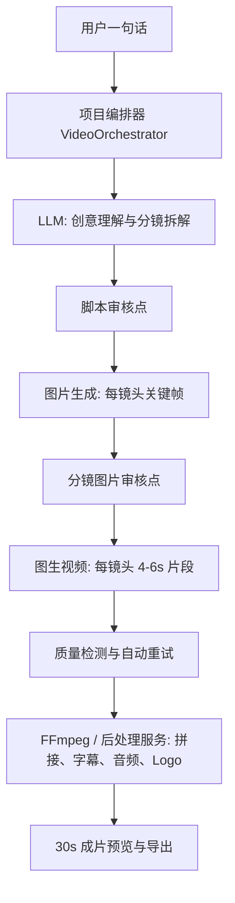

# 一句话生成 30s 可审核视频工作流方案

## 1. 背景与目标

当前网站已经具备“用户选择现有 SKU -> 提交上游 API -> 等待结果”的能力，也已经接入了图片、分镜、图生视频、视频增强等能力。但现在的问题是：

- 用户需要自己拆分镜头、自己写每个镜头提示词，门槛高。
- 单个上游 API 的耗时长、排队不可控，用户只能等待，缺少中间可视化进度。
- 出图、出视频、合成之间缺少统一编排，失败后不能局部重试。
- 生成结果缺少审核点，用户不容易在成本投入前控制方向。

目标是新增一条“**一句话到 30s 成片**”的长工作流：用户输入一句话，系统自动生成脚本、拆分镜头、生成分镜图片和提示词说明，用户可以逐镜头审核和调整，确认后系统生成单镜头视频并自动合成为完整 30s 视频。

核心原则：**自动化负责提效，审核点负责可控，编排层负责恢复和重试。**

## 2. 推荐产品形态

入口建议新增一个独立 SKU / 页面：

- 页面名称：`一句话成片`
- SKU 示例：`ONE_PROMPT_30S_VIDEO`
- providerCode 示例：`VIDEO_ORCHESTRATOR`
- 默认输出：9:16，30 秒，6 个镜头，每镜头约 5 秒
- 高级参数：镜头数量、视频比例、风格、节奏、角色一致性、是否自动生成字幕、是否自动加 BGM / Logo / CTA

用户流程：

1. 用户输入一句话，例如“做一条 30 秒国风护肤品广告，主角在清晨庭院使用产品，质感高级。”
2. 系统生成 `创意大纲 + 6 个镜头脚本 + 每镜头提示词 + 负面提示词 + 镜头时长`。
3. 用户审核脚本，可以一键接受，也可以改某个镜头。
4. 系统生成每个镜头的关键帧图片，展示为分镜板。
5. 用户审核图片，可以替换图片、重生成单镜头、锁定满意镜头。
6. 用户确认后，系统按镜头生成短视频片段。
7. 系统自动质检每个片段，失败或低分片段单独重试。
8. 系统按时间轴合成 30s 视频，叠加字幕、BGM、Logo、转场。
9. 用户预览成片，可以局部返工或导出。

## 3. 总体架构

不要把这件事做成一个“更大的 provider adapter”。建议新增一个业务编排层，负责把多个现有上游能力串起来，并保存每个中间产物。



建议复用现有能力：

- 分镜出图：已有 `RH_STORYBOARD` / `RUNNINGHUB_STORYBOARD`，可作为早期版本的批量分镜图生成能力。
- 单镜视频：复用现有 Kling / Bailian / RunningHub 图生视频适配器。
- 任务状态：复用现有 `/api/gateway/generate` 和 `/api/gateway/task/[taskId]` 的上游任务创建与轮询思路。
- 视频工作台：复用 `src/workbench/lib/video-workflow.ts` 中已有的草稿、精品、后处理、自动保存概念。

新增能力：

- `VideoOrchestrator`：长工作流编排器。
- `VideoProject`：一次“一句话成片”的项目。
- `VideoShot`：单个镜头，包含脚本、提示词、关键帧、视频片段、状态。
- `VideoRender`：最终合成任务。
- `LLM Planner`：把一句话转成结构化分镜 JSON。
- `Quality Judge`：对图片、视频片段、最终视频做自动评分和返工建议。

## 4. 工作流状态机

一次项目不要只有 `PENDING / SUCCESS / FAILED` 三种状态，应该拆成可恢复的阶段。

项目级状态：

| 状态 | 含义 | 用户可操作 |
| --- | --- | --- |
| `DRAFT` | 用户刚创建项目，还没提交规划 | 编辑输入 |
| `PLANNING` | 正在生成脚本和分镜计划 | 等待 |
| `PLAN_REVIEW` | 等待用户审核分镜计划 | 修改、确认、重生成 |
| `IMAGE_GENERATING` | 正在生成镜头关键帧 | 查看进度 |
| `IMAGE_REVIEW` | 等待用户审核关键帧 | 单张重生成、替换、锁定 |
| `CLIP_GENERATING` | 正在生成单镜头视频 | 查看每镜头进度 |
| `CLIP_REVIEW` | 等待用户审核视频片段 | 单镜头重试、确认 |
| `COMPOSING` | 正在合成完整视频 | 等待 |
| `FINAL_REVIEW` | 成片可预览 | 导出、返工 |
| `DONE` | 已导出或归档 | 查看、下载 |
| `FAILED` | 项目不可自动继续 | 查看失败原因、恢复 |

镜头级状态：

| 状态 | 含义 |
| --- | --- |
| `SCRIPT_READY` | 镜头脚本已生成 |
| `IMAGE_PENDING` | 等待生成关键帧 |
| `IMAGE_RUNNING` | 关键帧生成中 |
| `IMAGE_READY` | 关键帧可审核 |
| `IMAGE_APPROVED` | 关键帧已锁定 |
| `CLIP_PENDING` | 等待生成视频片段 |
| `CLIP_RUNNING` | 视频片段生成中 |
| `CLIP_READY` | 视频片段可审核 |
| `CLIP_APPROVED` | 视频片段已锁定 |
| `FAILED` | 当前镜头失败，可单独重试 |

关键点：**项目状态用于页面大流程，镜头状态用于局部重试和并发控制。**

## 5. LLM 分镜规划

第一步不要直接出图，而是先让 LLM 输出结构化 JSON。这样用户能在花大成本前审核方向。

输入：

- 用户一句话
- 目标时长，默认 30 秒
- 镜头数量，默认 6 个
- 视频比例，默认 9:16
- 风格偏好
- 品牌 / 产品 / 角色参考图，可选
- 禁止项，例如不要文字水印、不要血腥、不要品牌露出错误

输出结构建议：

```json
{
  "title": "清晨庭院国风护肤广告",
  "logline": "主角在清晨庭院完成护肤仪式，突出东方美学与高级质感。",
  "durationSeconds": 30,
  "aspectRatio": "9:16",
  "styleBible": {
    "visualStyle": "cinematic, elegant Chinese courtyard, soft morning light",
    "characterLock": "same female lead, same face, same outfit, same hairstyle",
    "colorPalette": "jade green, ivory white, warm gold",
    "negativePrompt": "logo distortion, watermark, extra fingers, text artifacts"
  },
  "shots": [
    {
      "shotNo": 1,
      "durationSeconds": 5,
      "purpose": "建立场景与高级氛围",
      "camera": "slow push-in, wide shot",
      "action": "主角走入清晨庭院，手持护肤品",
      "imagePrompt": "vertical cinematic keyframe ...",
      "videoPrompt": "slow push-in, gentle fabric movement ...",
      "subtitle": "清晨，从一抹东方光影开始",
      "negativePrompt": "watermark, text, blurry face"
    }
  ]
}
```

LLM 输出后必须做服务端校验：

- 总时长必须等于目标时长，允许误差不超过 1 秒。
- 镜头数量在 4 到 8 之间。
- 每个镜头必须有 `imagePrompt`、`videoPrompt`、`durationSeconds`。
- 自动追加统一的 `characterLock`、`styleBible`、安全负面词。
- 中文输入可以保留中文说明，但给上游图像 / 视频模型的 prompt 建议转换成英文或中英混合，减少模型歧义。

## 6. 可控与可调节设计

要让用户觉得“系统在帮我做”，而不是“系统把我锁死”。建议把控制点分成三层。

项目级控制：

- 总时长：15s / 30s / 45s，MVP 只做 30s。
- 镜头数量：4 / 6 / 8，MVP 默认 6。
- 风格：电影感、广告片、短剧、产品展示、新闻口播、国风、电商种草。
- 比例：9:16 / 16:9 / 1:1。
- 自动模式：自动生成到最终成片，中间只在失败或低分时提醒。
- 审核模式：每个阶段都需要用户确认。

镜头级控制：

- 修改镜头说明。
- 修改图片 prompt / 视频 prompt。
- 调整时长。
- 锁定镜头，锁定后重生成其他镜头不影响它。
- 单独重生成图片。
- 单独重生成视频片段。
- 上传自己的关键帧替换 AI 出图。

质量级控制：

- 质量阈值，例如 75 分以下自动建议重试。
- 角色一致性开关。
- 产品一致性开关。
- 文本干净度检查，避免画面出现乱码文字。
- 运动幅度：轻微、自然、强运动。
- 成本上限：超过预计积分前二次确认。

## 7. 关键技术实现

### 7.1 编排层

建议新增目录：

```text
src/services/video-orchestrator/
  planner.ts
  project-service.ts
  shot-service.ts
  queue.ts
  quality-judge.ts
  composer.ts
  types.ts
```

职责：

- `planner.ts`：调用 LLM，把一句话转成结构化分镜。
- `project-service.ts`：创建项目、更新项目状态、恢复项目。
- `shot-service.ts`：提交单镜头图片 / 视频任务，保存结果。
- `queue.ts`：控制并发、重试、超时、取消。
- `quality-judge.ts`：对图片、视频片段、最终成片评分。
- `composer.ts`：调用合成服务，拼接片段并叠加字幕、音频、Logo。

实现上可以先用数据库轮询任务表，后续再换 BullMQ / Redis 队列。MVP 不建议一开始引入太重的分布式工作流引擎，先把状态和幂等做好。

### 7.2 数据库模型

建议新增 Prisma 模型，命名可按项目习惯调整。

```prisma
enum VideoProjectStatus {
  DRAFT
  PLANNING
  PLAN_REVIEW
  IMAGE_GENERATING
  IMAGE_REVIEW
  CLIP_GENERATING
  CLIP_REVIEW
  COMPOSING
  FINAL_REVIEW
  DONE
  FAILED
}

enum VideoShotStatus {
  SCRIPT_READY
  IMAGE_PENDING
  IMAGE_RUNNING
  IMAGE_READY
  IMAGE_APPROVED
  CLIP_PENDING
  CLIP_RUNNING
  CLIP_READY
  CLIP_APPROVED
  FAILED
}

model VideoProject {
  id              String             @id @default(cuid())
  userId          String             @map("user_id")
  status          VideoProjectStatus @default(DRAFT)
  title           String             @default("")
  userPrompt      String             @map("user_prompt") @db.Text
  planJson        Json?              @map("plan_json")
  aspectRatio     String             @default("9:16") @map("aspect_ratio")
  durationSeconds Int                @default(30) @map("duration_seconds")
  stylePreset     String             @default("") @map("style_preset")
  finalVideoUrl   String?            @map("final_video_url") @db.Text
  errorMessage    String?            @map("error_message") @db.Text
  createdAt       DateTime           @default(now()) @map("created_at")
  updatedAt       DateTime           @updatedAt @map("updated_at")

  shots VideoShot[]

  @@index([userId, createdAt])
  @@map("video_projects")
}

model VideoShot {
  id                 String          @id @default(cuid())
  projectId          String          @map("project_id")
  shotNo             Int             @map("shot_no")
  status             VideoShotStatus @default(SCRIPT_READY)
  durationSeconds    Int             @default(5) @map("duration_seconds")
  purpose            String          @default("") @db.Text
  camera             String          @default("") @db.Text
  action             String          @default("") @db.Text
  imagePrompt        String          @map("image_prompt") @db.Text
  videoPrompt        String          @map("video_prompt") @db.Text
  negativePrompt     String          @default("") @map("negative_prompt") @db.Text
  subtitle           String          @default("") @db.Text
  imageUrl           String?         @map("image_url") @db.Text
  clipUrl            String?         @map("clip_url") @db.Text
  imageTaskId        String?         @map("image_task_id")
  clipTaskId         String?         @map("clip_task_id")
  qualityScore       Int?            @map("quality_score")
  errorMessage       String?         @map("error_message") @db.Text
  locked             Boolean         @default(false)
  createdAt          DateTime        @default(now()) @map("created_at")
  updatedAt          DateTime        @updatedAt @map("updated_at")

  project VideoProject @relation(fields: [projectId], references: [id], onDelete: Cascade)

  @@unique([projectId, shotNo])
  @@index([projectId, status])
  @@map("video_shots")
}
```

后续如果要做更细的审计和恢复，可以再加 `VideoProjectEvent`，记录每次状态变化、用户修改、自动重试、扣费动作。

### 7.3 API 设计

建议新增项目级 API，不要让前端自己串多个 `/gateway/generate`。

| 方法 | 路径 | 说明 |
| --- | --- | --- |
| `POST` | `/api/video-projects` | 创建项目，保存用户一句话与参数 |
| `POST` | `/api/video-projects/[id]/plan` | 生成或重生成分镜计划 |
| `PATCH` | `/api/video-projects/[id]/plan` | 用户编辑分镜计划 |
| `POST` | `/api/video-projects/[id]/approve-plan` | 确认脚本，进入出图阶段 |
| `POST` | `/api/video-projects/[id]/shots/[shotId]/image` | 生成或重生成单镜头图片 |
| `PATCH` | `/api/video-projects/[id]/shots/[shotId]` | 修改单镜头脚本、prompt、锁定状态 |
| `POST` | `/api/video-projects/[id]/approve-images` | 确认关键帧，进入视频片段阶段 |
| `POST` | `/api/video-projects/[id]/shots/[shotId]/clip` | 生成或重生成单镜头视频 |
| `POST` | `/api/video-projects/[id]/approve-clips` | 确认片段，进入合成阶段 |
| `POST` | `/api/video-projects/[id]/compose` | 合成最终 30s 视频 |
| `GET` | `/api/video-projects/[id]` | 获取项目、镜头、任务状态 |

长任务执行方式：

- API 只负责创建任务和推进状态，不阻塞等待所有上游完成。
- 前端轮询 `GET /api/video-projects/[id]`。
- 服务端 worker 扫描 `*_PENDING` 或 `*_RUNNING` 状态，提交上游或查询上游。
- 每个子任务必须有幂等键，例如 `projectId + shotId + stage + attemptNo`。

### 7.4 上游 provider 编排

建议保持现有 adapter 边界：

- 文生图 / 分镜图：通过 `getProviderAdapter` 调已有图片能力，或新增专用 `RUNNINGHUB_SHOT_IMAGE`。
- 图生视频：通过 `KLING_STD`、`KLING_PRO`、`ALIYUN_BAILIAN` 或 RunningHub 视频工作流。
- 合成：不建议走 RunningHub，建议本地或独立后处理服务调用 FFmpeg，成本低且可控。

合成服务负责：

- 按 shotNo 排序拼接片段。
- 不足时长的片段补帧或轻微慢放。
- 超长片段裁剪到镜头时长。
- 添加交叉淡入淡出或硬切。
- 叠加字幕。
- 添加 BGM，做简单 ducking。
- 添加 Logo / CTA。
- 输出最终 mp4，并上传 OSS。

### 7.5 并发与成本控制

建议并发策略：

- 单用户最多 1 个 `CLIP_GENERATING` 项目。
- 单项目图片生成并发 2 到 3 个镜头。
- 单项目视频片段生成并发 1 到 2 个镜头。
- 失败自动重试最多 2 次。
- 用户锁定的镜头不再重生成，避免浪费成本。

扣费策略：

- 创建项目时只预估成本，不立即扣完整费用。
- 进入出图阶段前提示预计图片成本。
- 进入视频阶段前提示预计视频成本，这是成本大头。
- 每个上游任务成功后按实际 SKU 扣费。
- 失败不扣费或只扣已成功阶段费用，具体按现有计费规则保持一致。
- 最终合成可作为固定低成本 SKU。

用户体验上必须显示：

- 当前阶段。
- 每个镜头状态。
- 已花费积分。
- 预计剩余积分。
- 哪些镜头失败、哪些镜头已锁定。
- 当前等待原因：排队中、上游处理中、合成中、重试中。

## 8. 前端页面设计

建议做成一个项目工作台，而不是传统表单。

页面结构：

```text
顶部：项目标题 / 状态 / 总进度 / 保存时间 / 导出按钮

左侧：镜头列表
  Shot 01 5s image ready clip pending
  Shot 02 5s image approved clip ready
  ...

中间：当前阶段主画布
  阶段 1: 一句话与参数
  阶段 2: 分镜脚本审核
  阶段 3: 分镜图片审核
  阶段 4: 视频片段审核
  阶段 5: 成片预览

右侧：当前镜头编辑面板
  镜头目的
  动作说明
  图片 prompt
  视频 prompt
  时长
  字幕
  锁定 / 重生成 / 替换
```

审核界面重点：

- 脚本审核：表格或时间线，能快速编辑镜头文本。
- 图片审核：分镜宫格，显示 shotNo、时长、镜头目的、重生成按钮。
- 视频审核：每个镜头一个小播放器，显示质量分、失败原因、重试建议。
- 成片审核：一个完整播放器，下方是 30s 时间线，可点击定位镜头。

MVP 可以先做“审核模式”，等流程稳定后再加“自动模式”。

## 9. 自动质检与返工

质检不要追求一步到位，但至少要覆盖高频坏结果。

图片质检：

- 是否有图片 URL。
- 图片尺寸是否符合目标比例。
- 是否疑似黑图 / 白图 / 空图。
- 是否出现明显文字水印。
- 如果有参考图，检查角色或产品描述是否偏离，早期可用 LLM 视觉模型判断。

视频片段质检：

- 是否有可播放 URL。
- 时长是否接近目标镜头时长。
- 是否首帧和关键帧差异过大。
- 是否画面严重变形。
- 是否有明显文字乱码。
- 是否运动过强或过弱。

自动返工规则：

- 无结果 URL：直接重试。
- 时长严重不符：重试或合成时裁剪。
- 质量分低于阈值：提示用户，可选择自动重试。
- 同一镜头连续失败 2 次：暂停该镜头，展示错误原因，等待人工处理。

## 10. MVP 落地路径

### 第一期：可审核分镜项目

目标：用户一句话生成可编辑分镜脚本和关键帧图片。

范围：

- 新增 `VideoProject` / `VideoShot` 表。
- 新增项目创建、规划、计划审核 API。
- LLM 输出结构化分镜 JSON。
- 复用现有图片 / storyboard 能力生成关键帧。
- 前端实现分镜脚本审核和图片审核。
- 支持单镜头重生成图片。

验收标准：

- 用户输入一句话后，能得到 6 个镜头的脚本和图片。
- 用户能修改任意镜头 prompt。
- 用户能锁定满意图片。
- 任一镜头失败不影响其他镜头继续。

### 第二期：单镜头视频生成

目标：从审核后的关键帧批量生成镜头视频。

范围：

- 新增镜头级 clip 生成 worker。
- 接入 Kling / Bailian / RunningHub 图生视频。
- 每个镜头独立轮询、独立失败、独立重试。
- 前端支持视频片段审核。
- 增加基础质量评分。

验收标准：

- 6 个镜头可以逐个生成视频片段。
- 用户能单独重试某个失败片段。
- 用户能确认片段进入最终合成。

### 第三期：30s 成片合成

目标：把多个片段合成完整视频。

范围：

- 新增 `composer.ts` 或独立后处理服务。
- FFmpeg 拼接、裁剪、转场、字幕、BGM、Logo。
- 输出 mp4 上传 OSS。
- 前端成片预览与导出。

验收标准：

- 能生成完整 30s mp4。
- 成片包含用户确认的镜头顺序。
- 字幕和音频可开关。
- 合成失败可重试，不需要重新生成镜头。

### 第四期：自动模式与优化

目标：降低用户操作成本，提高成功率。

范围：

- 自动模式，一句话后自动跑到成片，只在关键失败时通知。
- 更强质量检测。
- 失败原因聚类和后台报表。
- 根据用户历史偏好自动生成风格参数。
- A/B 测试不同上游模型和 prompt 模板。

## 11. 风险与处理

| 风险 | 表现 | 处理 |
| --- | --- | --- |
| 上游耗时不可控 | 用户长时间等待 | 项目级进度 + 镜头级进度 + 可离开页面后回来 |
| 单镜头失败影响全片 | 一个失败导致整片失败 | 镜头独立状态、独立重试、失败不阻塞其他镜头 |
| 角色不一致 | 每个镜头人物变脸 | styleBible + characterLock + 参考图 + 锁定关键帧 |
| 成本不可控 | 自动重试烧积分 | 进入视频阶段前确认预算，重试次数上限 |
| 用户不满意但不知道改哪里 | 只能重来 | 分阶段审核，支持局部修改 |
| 提示词质量不稳定 | 出图偏题 | LLM planner 输出 JSON 后服务端校验和 prompt 模板增强 |
| 合成质量差 | 时长不齐、字幕错位 | FFmpeg 后处理统一裁剪、补齐、字幕按 shot 时间轴生成 |

## 12. 与当前项目的结合点

当前项目已有这些基础，适合直接承接：

- `src/services/providers/ProviderFactory.ts` 已有 SKU 到 provider 的映射，可以继续注册新 SKU。
- `src/services/providers/types.ts` 已有 `IProviderAdapter`，单个上游任务继续走适配器。
- `src/app/api/gateway/generate/route.ts` 已有登录、扣费、并发限制、任务落库逻辑，可以复用其中的计费和上游提交策略。
- `src/components/TaskStatusViewer/StoryboardResultGrid.tsx` 已能展示多张分镜图，可扩展为镜头审核卡片。
- `src/workbench/lib/video-workflow.ts` 已有视频工作台状态、草稿、最终视频、后处理配置概念，可作为新工作台的数据结构参考。
- `src/workbench/lib/video-automation.ts` 已有 prompt 构建、质量评分、字幕切分等工具，可复用到新工作流。

建议不要直接把“一句话成片”塞进现有 `/api/gateway/generate` 的单任务模型里。`gateway` 适合提交单个上游任务，`video-orchestrator` 适合管理一组有依赖关系的任务。两者关系应该是：

```text
VideoOrchestrator
  -> 调用内部服务
  -> 内部服务复用 provider adapter
  -> provider adapter 提交 RunningHub / Kling / Bailian / OpenAI-compatible API
```

## 13. 推荐最终效果

用户看到的不是“等待一个神秘 API 返回”，而是一个可控的制作台：

- “脚本已生成，6 个镜头，请确认。”
- “正在生成第 1、2、3 个镜头图片。”
- “第 4 个镜头图片偏离产品，建议重生成。”
- “5 个视频片段已通过，1 个片段低于 75 分，是否自动重试？”
- “成片已合成，可预览，支持替换第 3 镜头后重新合成。”

这样用户仍然只输入一句话，但每一步都有中间产物、审核点、局部返工能力和清晰成本预期。对于 30s 视频这种长耗时任务，这会比单纯再接一个“一键生成视频 API”稳定得多，也更适合作为一个真正可商业化的视频生产工具。
