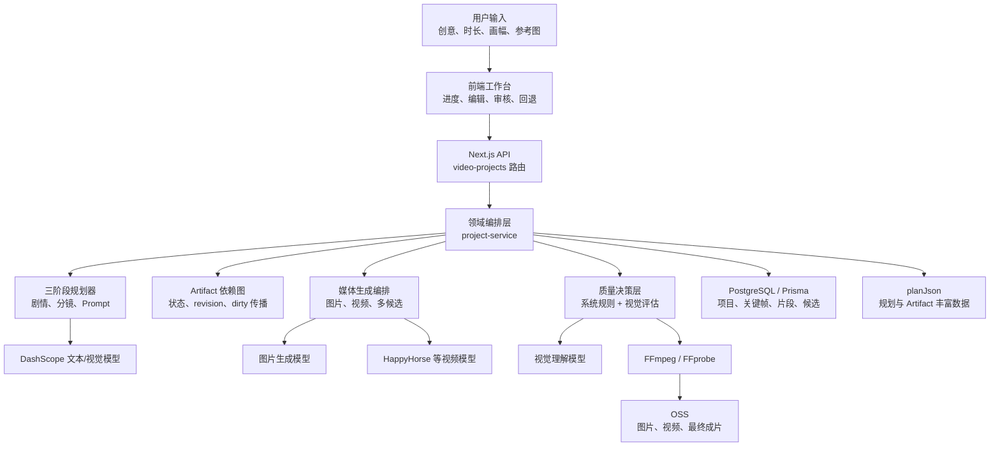
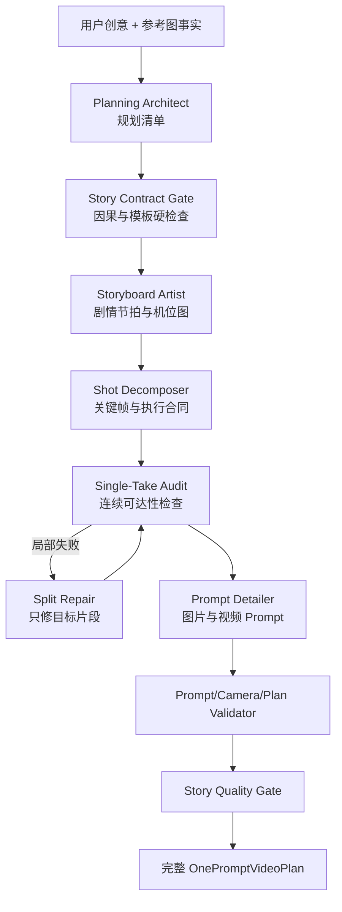
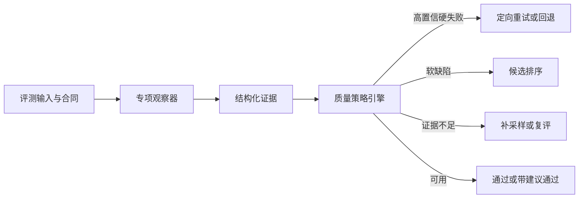
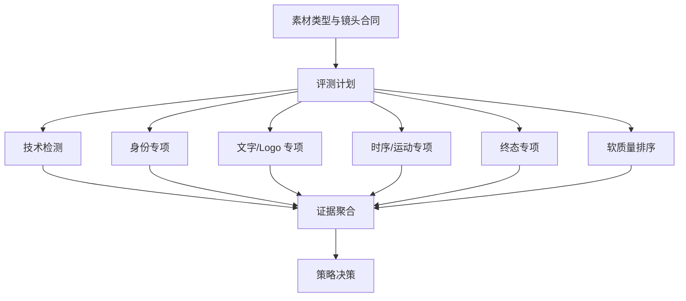
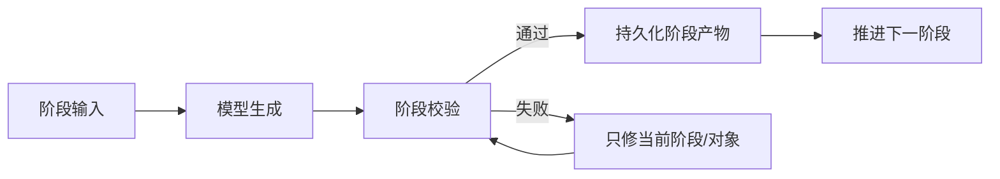

# 一句话成片：全链路技术架构、质量控制与剧本拆解健壮性分析

日期：2026-07-24  
适用范围：`/workbench/workflows/one-prompt-video`  
文档性质：当前实现说明、问题复盘与目标改造方案  
说明：本文不包含代码实现。

---

## 1. 文档目标

本文统一说明“一句话成片”系统的以下内容：

1. 用户输入一句话后，系统如何形成完整视频。
2. 剧本如何从创意拆成剧情节拍、镜头、关键帧和可执行视频片段。
3. 人物、角色、产品、场景和机位的一致性如何建立并向下游传递。
4. 关键帧、子分镜参考图和视频片段如何生成、审核、重试和回退。
5. 确定性系统规则检查什么，视觉模型判断什么，两者如何共同形成质量结论。
6. 当前“剧本拆解很慢、执行到后期容易报错”反映了哪些架构、工程和 Prompt 问题。
7. 如何把系统从“长流程一次性成功”改造成“分阶段提交、局部失败、局部恢复”的可靠生产系统。

本文讨论的不是某一条游戏广告或某一个具体镜头怎么改，而是利用真实故障暴露系统中的通用问题，并给出可复用的架构方案。

---

## 2. 一句话成片的产品能力与边界

### 2.1 用户提供什么

用户主要提供：

- 一句话创意或业务需求。
- 视频时长。
- 横竖屏比例。
- 风格预设。
- 可选的人物、产品、场景、品牌等参考图。

### 2.2 系统自动完成什么

系统负责：

1. 判断视频类型、目标受众、转化目标和叙事策略。
2. 扩写出具有 Hook、冲突、转折、证明、结果和 CTA 的剧本。
3. 把剧本拆成若干可由图生视频模型执行的片段。
4. 规划人物、产品、品牌和场景的一致性资产。
5. 生成时间轴边界关键帧和必要的内部子分镜参考图。
6. 为图片与视频生成模型编译专属 Prompt。
7. 生成多个候选图片和视频，并进行技术检查与视觉质量判断。
8. 允许用户审核、改选、重新生成和回退版本。
9. 使用 FFmpeg 合成视频、字幕、音乐和转场，并上传 OSS。

### 2.3 系统不应该做出的错误承诺

- 参考图不是自动生成好剧情的替代品。
- 视频模型不应承担临时发明剧情的职责。
- 单首帧图生视频模型无法保证精确到达指定尾帧，只能提高达到终态的概率。
- 视觉模型评分不是绝对真理，低置信度判断不能直接等价为生成失败。
- 调用超时、FFmpeg 失败或模型返回字段缺失不等价于画面质量为 0。

系统的核心原则应当是：

> 规划模型负责设计“拍什么”，生成模型负责执行“怎么呈现”，确定性规则负责验证结构合法性，视觉模型负责判断实际媒体是否符合可见合同。

---

## 3. 总体技术架构



### 3.1 前端层

负责：

- 项目创建与输入。
- 展示真实规划阶段和进度。
- 剧本、资产、关键帧、子分镜和视频审核。
- 单个对象重新生成。
- 候选预览与人工改选。
- 版本回退和阶段回退。
- 展示质量报告、系统状态和人工接受记录。

前端不应该自己推断任务是否完成，也不应该根据经过时间伪造进度；进度必须来自后端持久化状态。

### 3.2 API 层

主要接口分为：

- 项目创建、查询、修改和删除。
- 计划生成、取消、恢复和回退。
- 计划、资产、关键帧、子分镜、视频片段的审核。
- 图片、视频和桥接片段生成。
- 候选质量复评、候选切换和人工接受。
- 最终合成与完成确认。
- 异步任务状态同步。

### 3.3 领域编排层

`project-service` 是当前主编排入口，负责：

- 状态机推进。
- 规划任务和媒体任务调度。
- 上游并发限制。
- 数据持久化。
- 审核门禁。
- Prompt 编译。
- Reference Selection。
- 质量评估和候选择优。
- Artifact dirty 传播。
- resume、rollback 和媒体 revision。
- 最终合成。

当前它承担的职责较多，长期应继续拆成规划编排、媒体编排、质量决策和 Artifact 生命周期等独立服务。

### 3.4 数据层

当前数据由两部分组成：

1. 业务表：项目、关键帧、片段、生成候选等高频调度数据。
2. `planJson`：创意策略、剧情节拍、Camera Graph、资产合同、参考图选择、Prompt Debug、质量报告、Artifact Metadata 等丰富结构。

系统已准备可选的 Artifact 独立表与双写机制，但当前默认仍以 `planJson` 为主要兼容真源。

---

## 4. 项目状态机与人工审核关卡

```text
DRAFT
  → PLANNING
  → PLAN_REVIEW
  → IMAGE_GENERATING
  → IMAGE_REVIEW
  → MICRO_SHOT_REVIEW
  → CLIP_GENERATING
  → CLIP_REVIEW
  → COMPOSING
  → FINAL_REVIEW
  → DONE
```

任意执行阶段都可能进入 `FAILED`，但失败不应意味着所有历史产物失效。

主要人工关卡：

1. 剧本与分镜计划审核。
2. 人物、产品和场景一致性资产审核。
3. 时间轴边界关键帧审核。
4. 子分镜参考图审核。
5. 视频片段审核。
6. 最终成片审核。

人工审核的作用不是替代所有自动判断，而是：

- 确认业务意图。
- 锁定权威视觉资产。
- 对低置信度或主观质量问题作最终决定。
- 防止自动系统在不确定时反复扣费重生成。

---

## 5. 核心数据对象

### 5.1 Video Project

保存：

- 用户输入。
- 当前流程状态。
- 规划结果。
- 最终视频。
- 错误信息。
- 规划进度和 checkpoint。

### 5.2 Segment

Segment 是主要视频生成单元。

每个 Segment 应具备：

- 片段编号和时间范围。
- 起止关键帧编号。
- 剧情功能。
- 起因、结果和信息单元。
- 主体运动、环境运动和机位运动。
- 首帧、尾帧、运动和一镜到底合同。
- 视频 Prompt 合同。

单段时长通常限制在 3–15 秒。

### 5.3 Keyframe

关键帧分为两类：

- 一致性资产帧：人物正面/侧面/背面、产品、品牌、场景等，不直接位于时间轴。
- 边界关键帧：Segment 的开始或结束状态，位于正式时间轴。

相邻 Segment 通常共享同一个边界关键帧：

```text
Segment 1 尾帧 = Segment 2 首帧
```

### 5.4 Micro Shot

Micro Shot 是片段内部的动作检查点，用于描述：

- 动作在第几秒达到什么状态。
- 主体如何连续移动。
- 镜头如何连续跟随。
- 是否需要额外内部参考图。

Micro Shot 不是额外剪辑点，也不是独立场景。

### 5.5 Consistency Anchor

一致性锚点表示必须在多个产物之间保持稳定的对象，例如：

- 人物身份。
- 角色服装与造型。
- 产品实例。
- 品牌 Logo。
- 固定道具。
- 场景空间布局。
- 特定效果状态。

锚点需要记录：

- 对象类型。
- 视觉锁定字段。
- 是否硬要求。
- 应出现在哪些剧情节拍、片段和关键帧。
- 是否需要生成资产图。

### 5.6 Camera Graph

Camera Graph 记录机位之间的继承关系。

典型关系：

- `same_camera_setup`
- `same_axis`
- `derived_reframe`
- `same_spatial_context`
- `same_subject_group`
- `alternate_view`
- `new_camera_setup`

它决定下游应该继承：

- 构图。
- 轴线。
- 左右关系。
- 空间布局。
- 光线。
- 固定物体位置。

它不能替代人物和产品身份参考。

### 5.7 Artifact

系统中的每个可生成、可审核、可回退对象都应被视为 Artifact，例如：

- 人物 front/side/back。
- 产品资产图。
- 关键帧。
- 子分镜参考图。
- Segment Prompt。
- Segment 视频。
- Transition Reference。
- Generated Bridge。
- 最终视频。

Artifact Metadata 记录：

- 状态：draft、dirty、approved、generating、ready、failed。
- 生产阶段。
- 依赖对象。
- 失效来源。
- revision 血缘。
- 是否被用户接受。

---

## 6. 剧本是如何拆解的

当前默认规划架构可理解为四个连续职责角色，以及多个确定性 Gate。



### 6.1 参考图事实提取

如果用户上传参考图，视觉模型先提取稳定事实，例如：

- 人物数量、年龄感、发型、服装。
- 产品外形、颜色和材质。
- 场景类型和空间关系。
- 已存在的品牌文字或 UI。

参考图的职责是提供视觉事实，不应直接替代故事创作。规划 Prompt 必须明确：

- 不要简单把参考图分成几段让它动起来。
- 必须重新设计符合视频类型的剧情结构。
- 参考图中未出现的剧情事件仍需由 Story Architect 合理设计。

### 6.2 Planning Architect

Planning Architect 先建立项目级 Manifest。

主要产出：

- 视频类型和模板。
- 目标受众和转化目标。
- 成功标准。
- 总时长与 Segment 数量范围。
- Timeline Blueprint。
- 全局风格和负面约束。
- 一致性锚点。
- 资产合同。
- 初步故事策略。

它不应直接写最终生图或生视频 Prompt。

### 6.3 Story Contract Gate

在进入镜头拆解前，系统检查：

- 事件 ID 是否真实存在。
- 因果引用是否指向已发生事件。
- 证据引用是否可见。
- 模板要求的 Hook、冲突、证明、Payoff 和 CTA 是否具备。
- CTA 是否可追溯到前面的利益点或结果。
- 参考图是否被过度当作剧情。

这一步应在昂贵的逐 Segment 拆解前完成，避免错误故事继续向下游扩散。

### 6.4 Storyboard Artist

Storyboard Artist 负责把规划 Manifest 变成剧情。

主要产出：

- Creative Strategy。
- Narrative Events。
- Story Beats。
- Storyboard Brief。
- Shot Grouping。
- Camera Graph。
- Final Transition Plan。
- Audio Bible。

每个 Story Beat 至少应回答：

- 这一刻发生什么。
- 为什么发生。
- 产生了什么结果。
- 用户能看到什么证据。
- 涉及哪些人物、产品和场景锚点。
- 它依赖哪些前置 Beat。

对于复杂动作，应拆成：

```text
动机/准备 → 执行 → 结果/反应
```

### 6.5 Shot Grouping

Shot Grouping 决定哪些相邻剧情 Beat 可以处在同一个 Segment。

允许合并的典型条件：

- 同一空间。
- 同一连续动作链。
- 相同或兼容机位。
- 情绪和动作自然递进。
- 合并后不超过模型时长上限。

必须切分的典型条件：

- 时间跳跃。
- 场景变化。
- 机位关系无法连续执行。
- 主体状态突变。
- Payoff 和 CTA 需要独立强调。
- 合并后超过 15 秒。
- 一个 Segment 内必须发生剪辑才能完成。

### 6.6 Shot Decomposer

Shot Decomposer 把剧情翻译成可拍摄合同。

每个 Segment 需要输出：

1. 首帧可见状态。
2. 尾帧最小可见结果。
3. 连续运动路径。
4. 一镜到底合同。
5. 最多三个关键运动步骤。
6. 可见锚点。
7. Camera Graph 继承信息。
8. 终态要求等级。
9. 结构化 `video_prompt_contract`。

长视频采用逐 Segment 调用和有限并发，降低单次 JSON 体积。

### 6.7 Single-Take Audit

Single-Take Audit 使用确定性规则检查 Segment 是否能作为一次连续镜头执行。

主要阻断条件：

- 缺少首帧、尾帧、运动或一镜到底合同。
- `requiresCut=true`。
- `riskLevel=high`。
- `physicallyReachable=false`。
- 正向要求 cut、dissolve、fade、montage、switch angle 等内部剪辑。
- 动作跨度在规定时长内不可达。
- Camera Graph 的 alternate view 缺少轴线或左右关系约束。

“不要切镜”“禁止 dissolve”等负向禁令不能被误判为正向切镜要求。

失败时应该只修当前 Segment，不能重新生成已通过的其他片段。

### 6.8 Prompt Detailer

Prompt Detailer 把已批准的结构合同编译成：

- 关键帧图片 Prompt。
- 子分镜图片 Prompt。
- Segment 视频 Prompt。
- 负面 Prompt。
- 引用图用途说明。

它不能重写：

- 故事结构。
- Segment 时间。
- 锚点身份。
- Camera Graph。
- 首尾帧合同。
- 已批准终态。

它的职责是表达和适配，不是重新做一次编剧。

---

## 7. 人物一致性、角色一致性和产品一致性如何实现

一致性不是靠一句“保持人物一致”的 Prompt 实现，而是多层合同共同完成。

### 7.1 身份定义层

Planning Architect 为人物、角色、产品、品牌和场景创建 Consistency Anchor。

人物视觉锁通常包括：

- 脸型、年龄感和五官特征。
- 发型和发色。
- 服装款式、颜色和材质。
- 身材和显著标记。
- 禁止漂移项。

产品视觉锁通常包括：

- 产品实例和数量。
- 外形、材质、颜色。
- Logo 与合法文字。
- 尺寸比例。
- 禁止出现的错误版本。

### 7.2 资产库层

硬人物和硬产品优先生成一致性资产。

人物通常采用：

```text
Front 主视图
  → Side 派生视图
  → Back 派生视图
```

规则：

- Front 是身份真源。
- Side/Back 必须在 Front 被批准后生成。
- Side/Back 只继承同一个人的 Front，不能混入其他人物。
- Front 改变后，派生视图和下游产物进入 dirty。
- 历史 revision 保留，不静默覆盖。

### 7.3 锚点覆盖推导

理想架构不应完全依赖大模型自行填写“这个关键帧需要哪些锚点”。

系统应根据：

- Story Beat 涉及对象。
- Segment 可见证据。
- Keyframe 人物和产品状态。
- Camera Graph。

确定性推导必选锚点，再允许模型补充或解释特殊排除。

这样可以同时检查：

- 引用是否错误。
- 应引用的锚点是否遗漏。

### 7.4 Reference Selector

每次生成关键帧或子分镜图前，系统从候选参考图中确定性选择。

当前核心评分思想：

```text
相关性 + 视角匹配 + 时效性 - 冲突风险
```

选择规则：

- 当前画面可见的 hard person/product 必须选入。
- 人物正面目标优先 front，侧面优先 side，背面优先 back。
- 对应视图缺失时可回退 front，但必须记录原因。
- 错误人物、错误产品、错误 Logo、错误文字或场景冲突候选应淘汰。
- 风格图不能挤掉人物和产品的硬身份图。
- 最终参考图数量受上游限制，当前最多九张。

视觉模型可辅助识别候选冲突和朝向，但最终选择权属于确定性选择器。

### 7.5 Camera Graph 的一致性作用

Camera Graph 负责空间一致性，不负责人物身份。

它可以要求：

- 保持同一轴线。
- 保持人物左右关系。
- 保持桌椅、门窗等固定布局。
- 保持光线方向。
- 为新机位提供 Transition Reference。

人物身份仍必须来自人物锚点，产品身份仍必须来自产品锚点。

### 7.6 Prompt 编译层

图片和视频 Prompt 需要显式写入：

- 选中的锚点及用途。
- 哪些内容必须保持。
- 哪些内容允许变化。
- Camera Graph 继承范围。
- 禁止身份漂移、实例重复和错误文字。

Prompt 不能简单堆叠所有参考图描述，而应明确每张图只负责什么。

### 7.7 生成后视觉验证

实际图片生成后，视觉模型比较：

- 候选图片。
- 权威人物或产品资产图。
- 目标画面合同。
- Reference Selector 的用途说明。

它判断：

- 人物身份是否漂移。
- 产品是否为同一实例。
- 数量是否异常。
- 构图和空间是否符合合同。
- Logo 或文字是否错误。

缺少权威参考时，identity 分数不能被当作可信硬结论。

---

## 8. 关键帧如何生成和约束

### 8.1 关键帧的职责

关键帧不是简单截图，而是时间轴上的状态合同。

每张边界关键帧应表达：

- 当前场景。
- 人物姿态和情绪。
- 产品或道具状态。
- 可见剧情证据。
- Camera Graph 对应机位。
- 它是上一段结果还是下一段起点。

### 8.2 生成顺序

```text
规划一致性资产
  → 生成并审核 hard 人物/产品资产
  → Reference Selector
  → 生成边界关键帧候选
  → 技术检查与视觉评估
  → 用户选择/批准
  → 必要时生成 Micro Shot 参考图
```

没有批准的 hard anchor 时，下游关键帧生成应阻断。

### 8.3 静态帧约束

关键帧 Prompt 只描述一个静止时刻，不能包含：

- “正在从 A 变成 B”。
- “镜头旋转过去”。
- “人物逐渐走来”。
- “画面淡入”。

这些属于运动合同，不属于静态帧合同。

### 8.4 多候选

图片通常生成多个候选。

系统应等待同一批候选都到达终态后：

1. 排除技术失败项。
2. 对可评估项执行视觉判断。
3. 在通过项中择优。
4. 保留其他候选供用户改选。

不能使用第一个完成的候选替代完整候选池择优。

### 8.5 修改与回退

用户重新生成关键帧时：

- 当前已批准图片不应立即消失。
- 新结果作为候选进入审核。
- 用户明确选择后才切换 active revision。
- 旧 active 写入 revision history。
- 只使依赖该帧的 Segment 和最终成片 dirty。

---

## 9. 视频片段如何生成和约束

### 9.1 Provider 能力边界

当前 HappyHorse 能力是：

- 接受首帧图片。
- 不接受原生尾帧图片。
- 尾帧只能作为 Prompt 中的语义目标和生成后检查参考。

因此终态要求分为：

| 等级 | 业务含义 | 推荐执行 |
|---|---|---|
| Hard Exact | 构图和状态必须近似指定尾帧 | 路由到真正支持首尾帧输入的模型 |
| Hard Semantic | 必须完成可见结果，构图允许变化 | HappyHorse 多候选 + 终态检查 |
| Soft Directional | 尾帧是期望方向 | HappyHorse |
| Editorial | 只需稳定编辑点 | 以剪辑连续性为主 |

Hard Exact 不能静默降级到 HappyHorse。

### 9.2 结构化视频 Prompt 合同

规划模型输出：

- 1–3 个终态可观察事实。
- 1–3 个连续运动步骤。
- 必须保持项。
- 禁止结果。
- 叙事边界。
- 镜头意图。

规划模型负责：

- 语义压缩。
- 去重。
- 冲突消解。
- 软硬优先级。

HappyHorse 编译器只负责：

- 严格校验。
- 无损序列化。
- 字符预算预检。

编译器不应截断、选择 Top-N、自动去重或改写模型合同。超过预算时应反馈规划模型重新压缩软描述。

### 9.3 重试差量

生成失败后的下一轮 Prompt 不应重复堆叠完整诊断历史。

视觉模型只应输出当前候选最多三个最高影响差量：

- 哪个区域有问题。
- 当前可见状态。
- 目标状态。
- 如何修改。
- 哪些正确内容必须保持。

原合同保持不变，只附加本轮差量。

### 9.4 末尾稳定窗口

尾帧连续性不能只看视频最后一张截图。

系统应提取末尾多个有序采样帧，判断：

- 终态是否真正达到。
- 是否只是瞬间碰到目标又离开。
- 是否在最后阶段稳定保持。
- 是否出现跳切、冻结或贴帧。

结果可分为：

- pass
- retry_generation
- return_stage_2b
- manual_review
- evaluation_failed

评估失败不能自动触发付费重生成。

---

## 10. 系统确定性检测规则

系统规则适合判断可以被明确计算或验证的事实。

### 10.1 规划结构规则

- Segment 时长为 3–15 秒。
- Segment 总时长等于项目时长。
- Segment 编号连续。
- Keyframe 编号和首尾引用连续。
- 每个 Segment 都有完整执行合同。
- Event、Beat、Anchor、Camera 和 Keyframe 引用真实存在。
- CTA、Payoff 和证据链满足模板要求。

### 10.2 一镜到底规则

- Segment 内没有正向切镜语义。
- `requiresCut` 不为 true。
- 物理可达性不为 false。
- 高风险动作必须先拆分或简化。
- Motion Checkpoint 不得成为隐藏剪辑点。
- 静态 Frame Contract 不包含运动过程。

### 10.3 一致性引用规则

- Hard 人物和产品必须存在批准资产。
- 必选资产必须进入最终 Reference Selection。
- Side/Back 不能在 Front 未批准时生成。
- Camera Relation 所需的空间参考必须存在。
- Alternate View 必须具备轴线和左右关系锁。

### 10.4 技术媒体规则

图片：

- URL 可下载。
- 文件可解码。
- 尺寸和格式有效。

视频：

- URL 可下载。
- FFprobe 可读取。
- 有视频流。
- 时长和尺寸有效。
- FFmpeg 可以提取采样帧。

技术失败只应产生：

```text
technical_failed / unavailable / not_run
```

不能产生一组视觉 0 分。

### 10.5 Artifact 与状态规则

- 上游修改只传播到真正依赖它的下游。
- Dirty 不删除当前媒体。
- 新候选未被用户选择前，不覆盖 active revision。
- Resume 遇到运行中任务只能同步，不能重复提交。
- 旧 worker 返回结果时必须验证 active task ID。

---

## 11. 视觉模型判断规则

视觉模型适合判断实际媒体中的语义和观感。

### 11.1 图片视觉评估

输入：

- 实际候选图。
- 目标合同。
- 生成 Prompt。
- 负面 Prompt。
- 权威参考图。
- 每张参考图的用途。

判断维度：

- Identity：人物或产品身份。
- Layout：主体位置、数量、空间布局。
- Prompt Alignment：是否实现目标画面。
- Continuity：与相邻边界和继承关系是否连续。
- Wrong Text：文字、Logo、UI 是否错误。
- Artifact：手部、面部、重复实例、融合和画面瑕疵。

### 11.2 视频视觉评估

视频通过 FFmpeg 提取多个采样帧后判断：

- 首帧一致性。
- 人物和产品身份连续性。
- 实例数量。
- 空间布局漂移。
- 动作顺序。
- Motion Checkpoint 顺序。
- 是否存在跳切、瞬移、融化、换景。
- 是否符合一镜到底。
- 是否达到并稳定保持终态。

### 11.3 证据与置信度

视觉模型的每个问题应包含：

- 可见证据。
- 具体区域。
- 当前状态。
- 目标状态。
- 置信度。
- 严重级别。

低置信度问题：

- 可以成为建议。
- 可以进入复评或人工审核。
- 不能单独否决媒体。

### 11.4 视觉模型不能做什么

- 不能绕过确定性 Reference Selector 自己选参考图。
- 不能把技术失败解释成质量差。
- 不能把没有权威参考的身份判断当成绝对事实。
- 不能凭空发明合同里不存在的禁止项。
- 不能因为看到合法品牌文字就一律判定为错误文字。
- 不能独自决定结构问题应该回退到哪个规划阶段。

---

## 12. 质量决策体系

质量结果应拆成四层。

| 层级 | 回答的问题 | 负责者 |
|---|---|---|
| 技术可用性 | 文件是否存在、可下载、可解码 | 确定性系统 |
| 结构与事实 | 时长、数量、引用、合同是否满足 | 确定性系统 |
| 视觉语义 | 身份、布局、动作、终态是否符合 | 视觉模型 |
| 风险与建议 | 是否值得重试、人工复核或回退 | 决策层 |

评估状态：

- `completed`
- `partial`
- `technical_failed`
- `reference_missing`
- `unavailable`
- `not_run`

综合分只计算真实返回的有效维度；没有有效分数时保持为空。

视觉结果的角色：

- 对多候选排序。
- 发现高置信度合同违例。
- 给出可执行差量修复。
- 标记人工复核风险。

它不应作为多个阈值串联后的唯一发布许可。

---

## 13. 转场、桥接和最终合成

### 13.1 Transition Reference

Transition Reference 只服务于新机位的空间继承，不进入最终成片。

用于：

- new camera setup。
- alternate view。
- derived reframe。
- 继承父机位布局、光线和固定物体。

### 13.2 Generated Bridge

Generated Bridge 是正式媒体。

当相邻视频无法仅靠 hard cut 或普通转场连接时，可以生成短桥接片段。它需要独立：

- 多候选生成。
- 质量评估。
- 人工审核。
- revision 和回退。

### 13.3 最终 FFmpeg 合成

最终合成包括：

- 按时间轴排列 Segment。
- 根据 Final Transition Plan 使用 hard cut、xfade 或 bridge。
- 添加字幕。
- 添加 BGM、TTS 或 SFX。
- 响度归一化。
- 生成最终 MP4。
- 上传 OSS。

没有明确转场计划时，默认不应偷偷使用 dissolve。

---

## 14. 可恢复性与版本管理

### 14.1 Dirty 传播

典型依赖：

```text
人物 Front
  → Side / Back
  → Reference Selection
  → Keyframe
  → Segment Video
  → Final Video
```

修改上游时：

- 只标记依赖下游 dirty。
- 不删除现有媒体。
- 记录失效来源。
- 保留用户已批准 revision。

### 14.2 Resume

Resume 应：

1. 同步已存在的运行中任务。
2. 等待待审核候选，不自动覆盖用户选择。
3. 找到依赖图中最早可执行的 dirty 节点。
4. 每次恢复一个局部节点。
5. 只有最终视频 dirty 时才重新合成。

### 14.3 Rollback

支持：

- 阶段回退。
- 单图片回退。
- 单视频回退。
- Transition Reference 和 Bridge 回退。
- 最终成片回退。

回退不应破坏无关 Artifact。

---

## 15. 当前 Bug：剧本拆解又慢又容易报错

### 15.1 现象

真实项目曾出现：

- 总体持续一个多小时。
- 多次接近完成时失败。
- 修改后看似重新生成。
- 同一错误重复修复。
- 页面状态和错误信息互相矛盾。

日志统计显示，同一项目发生：

- 12 次规划启动。
- 8 次规划失败。
- 1 次最终成功。
- 第 5 镜至少 15 次 Split Repair 请求。

单轮模型调用的典型耗时：

- 首个输出 Token：56–82 秒。
- 单轮 Split Repair：92–109 秒。
- Prompt Detailer：47–77 秒。

因此“一小时”主要不是一个请求持续一小时，而是多个慢请求、重复修复、失败恢复和并发任务累计。

### 15.2 直接故障链

真实失败字段长期是：

```text
segment.description.motion_contract.subject_motion
```

修复模型声称已经去掉 fade/opacity reveal，但实际补丁只修改了其他字段，没有修改审计指出的真实字段。

结果：

```text
审计失败
  → 调用修复模型
  → 修复模型声称成功
  → 稀疏补丁没有覆盖错误路径
  → 合并后旧值仍存在
  → 再次出现同一错误
```

另一次修复因为返回结构不完整，又引入：

- start frame contract missing
- end frame contract missing
- motion contract missing
- single-take contract missing

第一次完整长流程还在 Prompt Detailer 之后才发现：

- 视频 Prompt 重新出现内部转场词。
- Segment 引用了不存在的 Camera ID。

说明错误不仅来自模型，也来自阶段合同、补丁协议和校验位置。

---

## 16. Bug 反映出的系统架构问题

### 16.1 长事务架构

当前规划在产品体验上仍像一个长事务：

```text
前面十几分钟全部成功
  + 最后一个字段失败
  = 整体 FAILED
```

虽然已经有 checkpoint，但 checkpoint 粒度不覆盖每一轮修复和最终 Prompt 校验，因此不能完全恢复到最近成功点。

### 16.2 阶段之间的 Schema 不一致

审计器要求完整执行合同，Split Repair 的输出示例却允许只返回部分合同。

这意味着：

- 生成阶段认为“这是一个完整片段”。
- 修复阶段认为“返回少量字段也可以”。
- 合并阶段不知道哪些字段必须替换。
- 审计阶段最终发现对象残缺。

### 16.3 稀疏补丁缺少后置条件

系统接受“模型说修好了”，却没有在应用前检查：

- 错误路径是否真的改变。
- 必填字段是否仍在。
- 已通过字段是否被删除。
- 修复后的局部对象是否已通过同一个 Validator。

这是典型的“相信修复声明，而不是验证修复结果”。

### 16.4 校验过晚

Prompt Detailer 之后才执行完整 Plan Validator，导致 Stage 3 引入的问题只能让整个任务失败。

正确做法应是每个阶段只对自己的产出负责，并在阶段边界立即提交或回滚。

### 16.5 并发锁只存在于单进程内

进程内 Map 无法阻止：

- 多个 Next.js 实例。
- 后台 worker。
- 手工脚本。
- 开发服务器。

同时运行同一个项目。

多个 worker 会：

- 同时写 checkpoint。
- 相互覆盖 progress。
- 旧任务在新任务之后写入失败。
- 重复调用付费模型。

### 16.6 状态与错误不是原子更新

成功任务可能把状态写成 `PLAN_REVIEW`，但不清除旧 `errorMessage`。

过期任务也可能在成功任务之后写入失败信息。

于是出现：

```text
status = PLAN_REVIEW
errorMessage = 一镜到底审计失败
```

### 16.7 错误没有按责任阶段路由

当前多个错误最终都表现成“规划失败”，但实际责任不同：

| 错误 | 责任阶段 |
|---|---|
| 剧情因果错误 | Storyboard Artist |
| Motion Contract 不可达 | Shot Decomposer |
| 视频 Prompt 出现 fade | Prompt Detailer |
| Camera ID 不存在 | Storyboard / Camera Graph |
| JSON 解析失败 | JSON Repair |
| 模型超时 | 上游调用层 |
| 评估服务失败 | 质量基础设施 |

不区分责任阶段，就无法做到局部重试。

### 16.8 超时与性能预算缺少端到端治理

系统已经有请求级超时，但缺少：

- 每个阶段的目标耗时。
- 整个项目的最大规划预算。
- 相同错误的熔断。
- 上游并发额度感知。
- 不同任务之间的优先级。

因此一个独立 benchmark 任务也可能与用户正式规划竞争上游容量。

---

## 17. Bug 反映出的 Prompt 问题

### 17.1 修复 Prompt 要求与返回 Schema 不一致

文字要求模型“保持完整合同”，示例却只展示部分字段。模型通常更服从具体 JSON 示例，而不是前面的抽象文字。

解决原则：

> Prompt 的示例 Schema 必须完整表达硬要求，不能靠说明文字补足示例中缺失的结构。

### 17.2 没有把错误路径转成强输出要求

系统告诉模型：

```text
motion_contract.subject_motion 有问题
```

但没有要求：

```text
新响应必须完整返回该字段，并证明它与旧值不同。
```

模型容易修改语义相近的其他字段，却漏掉真正的机器校验路径。

### 17.3 让模型同时诊断、重写、保持和合并

Split Repair Prompt 同时要求模型：

- 理解审计错误。
- 修改动作。
- 保留故事。
- 保留时间轴。
- 保留锚点。
- 保留 Camera Graph。
- 保留所有合同。
- 返回局部补丁。

任务认知负担过高，尤其在长 JSON 中容易漏字段。

应拆成：

1. 确认错误与目标字段。
2. 输出完整目标 Segment 替换对象。
3. 系统验证后置条件。

### 17.4 负向约束多于正向目标

如果 Prompt 大量重复：

- 不要 fade。
- 不要 dissolve。
- 不要 cut。
- 不要 montage。

模型可能仍围绕这些概念生成文字，甚至把禁止项写进可执行字段。

更有效的结构是：

1. 先给合法连续动作的正向形式。
2. 再用少量禁令排除高风险行为。
3. 给正反例。

例如 CTA 不应只写“不要淡入”，而应优先要求：

- 生成干净稳定背景板，CTA 由后期字幕完成；或
- 实体标牌从桌后连续升起并保持稳定。

### 17.5 Prompt Detailer 权限过大

Prompt Detailer 只应翻译合同，却被允许重新表达动作、机位和剧情，导致已通过的结构又被污染。

应将其输出限制为：

- 不可变合同引用。
- 模型专属表达。
- 不得新增结构事件。
- 不得新增 Camera ID。
- 不得新增未批准的运动类型。

---

## 18. 第二个 Bug：系统检测正常，但视觉模型长期不通过

### 18.1 现象定义

当前现象是：

1. 文件存在、可读取、尺寸和时长等系统检测看起来正常。
2. 视觉模型判断却大概率为不通过。
3. 系统按照评测建议重新生成，最多连续执行六轮。
4. 六轮之后仍然不通过。
5. 最终仍需人工在候选结果中选择，自动评测没有完成筛选职责。

“系统检测正常”和“视觉模型不通过”并不矛盾。前者主要证明素材在工程上可用，后者试图判断角色、构图、剧情、运动、连续性和终态等语义质量。真正的问题不是两个检测结果不同，而是系统把一个高不确定性的语义判断当成了稳定的二值质量门禁。

### 18.2 当前实际通过条件过于苛刻

当前视觉评测不是只看一个 `passed`，而是把多个条件串联：

- 视觉模型必须主动返回 `passed=true`。
- 身份一致性、布局、Prompt 对齐、连续性等分数必须完整。
- 每个分数都必须达到独立阈值。
- 总体评测置信度必须达到要求。
- 不能命中硬失败原因。
- 视频还要满足单镜头、首帧一致性、检查点顺序等额外阈值。
- 元数据不能出现问题，视频时长必须有效。

这会产生“串联门禁放大效应”。假设七个条件各自有 90% 的正确放行率，同时通过的理论概率也只有：

```text
0.9 ^ 7 ≈ 47.8%
```

即使每个局部规则看起来都合理，串联以后也可能让大部分可用结果失败。当前 Bug 因而首先是决策聚合方式的问题，不能只靠继续调整某一个分数阈值解决。

### 18.3 当前实现与目标架构存在口径冲突

目标架构希望视觉模型提供语义证据和建议，由编排层综合判断；但当前评测 Prompt 明确把视觉模型定义为“最终视觉质量门”，并强调编排层不会推翻其否决。

与此同时，归一化逻辑又坚持：

```text
视觉模型只要返回 passed=false，
即使其他分数较高，也不能自动翻转为通过。
```

这形成了双重否决：

1. Prompt 先诱导模型采取保守裁判姿态。
2. 程序再把这个保守判断设为不可逆否决。

因此，人工最终经常能选出可用素材，并不能简单说明人工“降低了标准”；它更可能说明自动裁判的假阴性过高，或者评测要求中混入了并非本镜头必须满足的条件。

---

## 19. 第二个 Bug 反映出的系统架构问题

### 19.1 技术可用性、合同符合度和审美质量没有分层决策

系统目前虽然分别执行系统检测和视觉检测，但最终决策仍接近“一票否决”。更合理的职责边界应是：

| 层级 | 负责判断 | 适合的检测方式 | 是否可以直接否决 |
|---|---|---|---|
| 技术可用性 | 文件、编码、尺寸、时长、黑帧、损坏 | 确定性程序 | 可以 |
| 硬合同符合度 | 必须出现的角色、文字、终态、关键物体 | 规则或专项视觉检测 | 高置信证据下可以 |
| 软质量 | 美观、自然度、轻微变形、构图偏好 | 视觉模型评分与排序 | 通常不应 |
| 业务决策 | 是否重试、是否回退、是否人工复核 | 策略引擎 | 最终决定 |

视觉模型应提供证据，策略层才负责决定动作。否则只要视觉模型在任一维度过度保守，整条流水线就会被阻断。

### 19.2 一个评测器承担了过多正交任务

单个视觉模型当前需要同时判断：

- 角色或产品身份一致性。
- 人体和物体结构。
- 构图与主体布局。
- 文本和 Logo。
- 剧情与 Prompt 对齐。
- 首帧、关键检查点和终态。
- 时间顺序、运动连续性和单镜头约束。
- 是否存在硬失败，以及应该如何修复。

这些任务需要的证据、采样方式和阈值并不相同。例如，文字检查需要高清局部图；动作连续性需要更密集的时间采样；人物一致性需要角色参考图；终态检查只关心最后一段时间。把它们压进一次评测，不仅降低准确率，也无法知道“不通过”究竟来自哪一个可靠子判断。

### 19.3 视频稀疏采样无法支撑所有结论

如果评测只抽取少量帧，却要求模型判断完整运动、镜头连续性和检查点顺序，就会出现证据不足：

- 中间动作可能未被采样。
- 瞬时瑕疵可能被偶然采到并被放大。
- 终态刚达到又离开时，单张尾帧不能表达持续时间。
- 快速运动中的模糊帧会被当成结构错误。

证据不足本应返回“无法判断”或要求补采样，而不是直接折算为低分和不通过。

### 19.4 全局固定阈值忽略素材类型和镜头风险

不同资产不应共用完全相同的评分项和阈值：

- 角色定妆图必须严格检查身份一致性。
- 氛围空镜不存在角色时，身份分数应为“不适用”。
- 高速动作镜头不应以静态清晰度标准逐帧处罚。
- CTA 背景板重点是留白和稳定，而不是剧情复杂度。
- 产品特写对 Logo、文字和几何形状的要求高于环境镜头。

如果“不适用”被错误表示成低分或缺失分数，程序就会把本来无关的维度转成失败。

### 19.5 视觉模型既诊断又裁决，缺少独立决策层

同一个调用同时输出：

1. 它看到了什么问题。
2. 问题有多严重。
3. 是否通过。
4. 下一轮如何修改。

这会产生自我强化：模型一旦描述了某个缺陷，就倾向于把它评为足以否决；下一轮再把旧缺陷作为上下文注入，模型又容易被先验锚定，继续寻找同一个问题。

更合理的结构是：



### 19.6 评测失败和生成失败没有被充分区分

“视觉模型说不通过”至少可能代表五类情况：

1. 素材确实违反硬合同。
2. 素材存在可接受的软缺陷。
3. 评测证据不足。
4. 评测模型误判或输出不稳定。
5. 评测 Prompt 或 Schema 让模型被迫判失败。

如果五类情况都触发重新生成，系统就在用昂贵且不可控的生成操作修复评测器自身的问题。

正确原则是：

> 先证明问题真实存在、可以被生成器控制，再消耗生成重试预算。

低置信、不一致或证据缺失的结果，应优先对同一候选补采样或复评，而不是重新生成。

### 19.7 六轮串行重试不是闭环优化

当前“初次生成 + 最多五次自动重试”表面上是六轮修错，但如果每轮只是：

```text
生成 → 视觉否决 → 把自然语言意见塞回 Prompt → 重新生成
```

它并不是稳定的优化算法，原因包括：

- 生成模型不是确定性的局部编辑器，修复 A 时可能破坏 B。
- 评测意见未必能映射为生成模型可控制的参数。
- 每轮生成的随机种子和画面结构改变，无法进行单变量归因。
- 缺少“同一问题是否再次出现”的稳定指纹。
- 缺少边际收益判断，即使分数不再改善仍继续重试。
- 只有一个候选时，没有相对排序和保留最优解的空间。

六轮仍失败不是说明轮数太少，反而说明重试控制器没有识别“继续生成已经无效”。

### 19.8 只追求绝对通过，忽略候选排序

生成内容的质量通常是连续值，而不是天然的二值状态。即使所有候选都没有达到理想标准，系统仍应能够回答：

- 哪个候选最接近硬合同。
- 哪个候选只有可接受的软缺陷。
- 哪个候选最值得人工选择。
- 每个候选的主要风险是什么。

如果系统只保存“通过/不通过”，人工最终仍需从头检查全部结果，自动评测的价值就被浪费了。

### 19.9 缺少用人工结果反校评测器的闭环

人工经常推翻视觉模型并选择某个候选，本身是一组高价值标注。当前若只记录“人工接受”，却不记录：

- 视觉模型当时否决的原因。
- 人工是否认为该问题真实存在。
- 问题存在但是否可接受。
- 人工最终选择与自动排序是否一致。

系统就无法校准阈值，也无法判断是生成质量差、评测精度差，还是业务标准定义不清。

---

## 20. 第二个 Bug 反映出的 Prompt 问题

### 20.1 “最终质量门”角色设定制造保守偏差

当 System Prompt 告诉模型“你是最终质量门，编排层不会推翻你的否决”时，模型会自然倾向于宁可错杀、不可漏放。对于安全审查这种策略可能合适，但对于生成素材筛选，会造成高假阴性率。

应把角色改成：

> 你是证据观察器，不是最终决策者。只报告当前输入中可直接观察并能定位的事实；不确定时明确返回不确定，不要为了谨慎而臆测失败。最终动作由策略层依据合同等级、置信度和候选比较决定。

### 20.2 Prompt 将硬合同、软偏好和审美意见混在一起

“角色必须是同一个人”和“构图不够理想”不是同等级问题。Prompt 若没有先声明要求等级，模型很容易把审美建议升级为硬失败。

每条要求应携带：

```text
requirement_id
level: hard | soft | advisory
applicable_when
evidence_needed
failure_threshold
```

评测模型不得自行创造未提供的硬要求。

### 20.3 缺少“不适用”和“无法观察”的合法出口

只允许模型返回数字分数，会逼迫它对无角色镜头的身份一致性、对稀疏帧中的动作顺序等内容进行猜测。

每个维度应允许：

```text
status: pass | fail | uncertain | not_applicable
confidence
evidence
```

`uncertain` 触发补证据，`not_applicable` 不进入总分和门禁，两者都不能自动等同于失败。

### 20.4 一次 Prompt 中的任务过长且认知目标相互竞争

评测 Prompt 同时要求看参考图、理解剧情、检查结构、比较帧序列、打多个分数、找硬失败、输出修复建议并决定是否通过。模型会优先完成最显眼的“找错误和判失败”，而弱化证据质量。

应拆成短而专一的 Prompt：

- 身份观察器只比较授权的角色参考与目标区域。
- 文字观察器只核对规定文字、拼写和可读性。
- 时序观察器只检查指定检查点和顺序。
- 终态观察器只检查尾段是否达到并保持目标状态。
- 软质量评分器只用于候选排序，不拥有否决权。

### 20.5 参考资料角色不清会造成错误比较

首帧、角色定妆图、场景参考、上一镜尾帧和风格图具有不同权威范围。如果把所有图片平铺给模型，它可能：

- 用风格图检查角色身份。
- 用首帧要求尾帧完全静态一致。
- 把场景参考中的临时元素当成必须出现。
- 在多角色画面中匹配错对象。

每个参考必须带有：

```text
reference_id
reference_role
applies_to
authority
must_match_fields
may_vary_fields
```

### 20.6 缺少可复核的证据约束

“角色不一致”“运动不自然”这样的结论无法被程序或人工快速复核。Prompt 应先要求证据，后允许结论：

- 对应哪个 `requirement_id`。
- 出现在第几帧或哪个时间区间。
- 位于画面哪个区域。
- 观察到的事实是什么。
- 置信度是多少。
- 是硬失败、软缺陷还是不确定。

没有定位证据的严重问题不能直接成为自动否决。

### 20.7 历史错误容易对下一轮形成锚定

将上一轮完整评测报告反复注入，会暗示下一轮评测器“这个问题应该仍然存在”。即使素材已修复，模型也可能围绕原问题继续给出相似判断。

历史问题只能作为待验证假设：

> 不得继承上一轮结论。必须仅依据当前候选重新证明问题是否存在；若无当前证据，应标记为已解决或无法确认。

### 20.8 修复建议未必是生成器可执行的差量

“更自然”“更像参考图”“提升电影感”是评审语言，不是生成控制语言。即使限制为三条，也不一定能提高下一轮结果。

重试 Prompt 中的差量必须满足：

- 指向一个确认存在的高影响问题。
- 只修改生成模型能够控制的内容。
- 描述期望状态，而不是重复负面评价。
- 明确哪些已正确内容必须保持。
- 不重新注入整份评测历史。
- 无可执行修复时明确返回 `not_controllable`。

---

## 21. 第二个 Bug 的目标解决方案

### 21.1 将视觉模型从最终裁判改为结构化证据提供者

最终是否通过由策略引擎计算，而不是照抄视觉模型的单个 Boolean。推荐决策状态为：

| 状态 | 含义 | 下一步 |
|---|---|---|
| `pass` | 硬合同满足，无明显风险 | 自动进入下一阶段 |
| `pass_with_advisory` | 硬合同满足，仅有软缺陷 | 进入下一阶段并保留建议 |
| `review` | 证据冲突或低置信 | 复评或人工快速确认 |
| `retry_generation` | 高置信且可由生成器修复 | 定向重试 |
| `return_stage` | 问题来自剧本、分镜、参考图或关键帧 | 回退责任阶段 |
| `evaluation_unavailable` | 评测服务或输入失败 | 重评同一候选 |

只有“命中明确硬合同 + 有可定位证据 + 高置信度”才允许视觉结果直接阻断。

### 21.2 使用专项观察器和按需路由

不要为每个素材执行所有评测项。先根据资产类型、镜头标签和硬合同生成评测计划：



不存在角色的镜头不运行身份门禁；没有文字合同的镜头不运行文字门禁。这样既减少误判，也降低评测耗时和成本。

### 21.3 建立证据优先的统一问题结构

每个评测问题至少应包含：

```json
{
  "issue_id": "stable-fingerprint",
  "requirement_id": "terminal_state.subject_position",
  "severity": "hard | soft | advisory",
  "status": "confirmed | uncertain | not_applicable",
  "frame_or_time": "4.8s-5.0s",
  "region": "center-right",
  "observation": "可直接观察的事实",
  "confidence": 0.91,
  "controllability": "generation | upstream | evaluation_only",
  "suggested_delta": "仅在可控时提供"
}
```

稳定指纹应基于要求 ID、对象、时间区间和问题类型，而不是依赖每轮自然语言措辞，以便识别同一问题是否重复发生。

### 21.4 重构六轮重试为分类型预算

不再固定允许六次完整重新生成，而是按失败类别分配动作：

1. **技术或评测服务失败**：重试评测，不消耗生成预算。
2. **低置信或观察器冲突**：对同一候选补采样或换一次评测实例。
3. **高置信硬失败且生成可控**：允许一至两次差量生成。
4. **问题属于剧本、分镜、参考图或关键帧**：回退对应阶段，禁止在生成阶段空转。
5. **同一问题连续两次出现或综合质量无明显提升**：立即熔断，不继续重复生成。
6. **只有软缺陷**：保留候选并进入排序，不强制重试。

重试次数应是风险上限，不是必须跑满的流程目标。

### 21.5 先复评，再决定是否重新生成

当第一次视觉模型否决时，系统应执行以下决策：

```text
否决是否有高置信、可定位、与硬合同绑定的证据？
├─ 否：补采样或复评同一候选
└─ 是：问题是否能由当前生成阶段控制？
   ├─ 否：回退责任阶段
   └─ 是：生成差量修复并保留原候选
```

如果同一素材两次评测结论明显不同，应把它归类为评测不稳定，而不是素材失败。

### 21.6 从单候选绝对门禁转成候选保留与排序

对于高随机性的生成阶段，建议：

- 首轮生成少量具有明确差异的候选，而不是对单候选连续盲改。
- 所有重试都保留当前最优候选，不能被新结果覆盖。
- 硬合同先过滤，软质量再做成对比较或排序。
- 即使没有理想候选，也向人工展示前两名、风险摘要和推荐理由。
- 人工选择后将结果作为评测校准数据。

这能把视觉模型从“不稳定门卫”转化为“有解释的筛选器”。

### 21.7 采用合同编译式评测 Prompt

评测 Prompt 不应手工堆砌所有通用规则，而应由镜头合同编译出本次最小评测任务：

```text
[ROLE]
你只负责观察和提供证据，不决定最终流程动作。

[ASSET TYPE]
本次素材类型、镜头类型、允许变化。

[REFERENCES]
每个参考图的角色、权威范围和禁止比较的字段。

[HARD REQUIREMENTS]
最多列出当前镜头真正适用的硬要求及证据标准。

[SOFT CRITERIA]
只用于排序，不得单独造成失败。

[OBSERVATION RULES]
不确定和不适用必须显式返回；不得创造新要求；历史问题必须重新举证。

[OUTPUT]
仅返回结构化证据、置信度、可控性和最多三条差量建议。
```

这与生成 Prompt 的原则一致：约束应在模型输出前通过明确合同建立，而不是事后用字符串硬改模型结果。

### 21.8 校准阈值，而不是凭感觉调低标准

需要建立覆盖实际镜头类型的“金标评测集”，至少包含：

- 明确应该自动通过的素材。
- 明确应该自动拒绝的硬失败。
- 应当带建议通过的轻微瑕疵。
- 证据不足、应进入复评的样本。
- 人工曾推翻视觉模型的真实案例。

针对每种镜头和评测器分别测量精确率、召回率和人工推翻率。硬否决应优先保证高精确率；宁可把不确定样本送入 `review`，也不要让低置信判断触发多轮昂贵生成。

### 21.9 推荐分阶段实施

#### 第一阶段：先停止无效重试

- 去掉视觉模型 `passed=false` 的不可逆最终否决地位。
- 低置信、分数缺失和评测异常改为 `review`，不触发生成。
- 同一问题连续两次或分数无改善时熔断。
- 始终保留并展示最佳候选。

#### 第二阶段：拆分评测职责

- 区分技术检测、硬合同检测、软质量排序和策略决策。
- 只运行与当前镜头相关的专项观察器。
- 为参考图增加角色和权威范围。
- 为每个问题增加可定位证据、置信度和可控性。

#### 第三阶段：建立数据校准闭环

- 记录人工推翻和最终选择。
- 建立分镜头类型的金标集。
- 校准阈值与 Prompt。
- 用线上指标持续发现假阴性和无效重试。

### 21.10 验收指标

修复不能只以“自动通过率上升”为成功，因为简单放宽标准也会提高通过率。应同时观察：

- **人工推翻率**：人工接受被模型否决素材的比例。
- **高置信硬否决准确率**：被自动拦截的素材中，人工确认确有硬失败的比例。
- **同素材复评一致率**：相同输入重复评测得到相同结论的比例。
- **重复问题率**：同一问题指纹连续两轮出现的比例。
- **无改善重试率**：消耗生成预算却没有质量提升的比例。
- **平均付费生成次数**：每个最终可用镜头消耗的生成调用数。
- **最佳候选保留率**：后续重试不能丢失历史最优结果。
- **自动排序命中率**：人工最终选择是否位于系统推荐前列。
- **分类型自动处理率**：不同镜头类型分别统计通过、带建议通过、复评和人工介入比例。

目标不是让视觉模型“更容易给通过”，而是让每一次否决都可举证、可归因、可修复；无法确定时不浪费生成预算，存在多个可用结果时能够稳定选优。

---

## 22. 目标健壮性架构

### 22.1 从长事务改成 Saga

目标流程：



每个阶段都必须具备：

- 明确输入版本。
- 明确输出 Schema。
- 阶段级 Validator。
- 成功 checkpoint。
- 局部重试。
- 幂等提交。
- 最大重试和熔断。

### 22.2 完整替换对象，不使用不透明稀疏补丁

对单个 Segment 的修复，模型应返回完整目标 Segment 和完整 Render Description。

系统在应用前验证：

- Segment 编号正确。
- 必填字段完整。
- 非目标 Segment 未被返回或修改。
- 错误路径已改变。
- 原有硬约束仍存在。
- 局部审计已通过。

验证通过后，原子替换目标对象。

### 22.3 每一轮修复都持久化

建议持久化：

- segmentNo
- revision
- currentPlan
- issueFingerprint
- repairModel
- repairDuration
- validationResult

任务崩溃后从最新修复版本继续。

### 22.4 相同错误指纹熔断

错误指纹可由以下内容组成：

```text
阶段 + Artifact ID + 错误代码 + 字段路径
```

如果连续两轮指纹相同，说明修复没有触达问题，立即停止普通重试，进入：

- Prompt/Schema 修复。
- 人工审核。
- 更强模型。
- 明确的局部重新规划。

不能继续支付第三次相同模型调用。

### 22.5 阶段级校验前移

推荐：

```text
Planning Architect
  → Manifest Validator

Storyboard Artist
  → Story Contract + Camera Graph Validator

Shot Decomposer
  → Segment Contract + Single-Take Validator

Prompt Detailer
  → Prompt Permission + Camera Reference Validator

最终组装
  → 只做跨阶段一致性检查
```

最终 Validator 不应第一次发现某个阶段本应自己发现的问题。

### 22.6 数据库原子租约

每个项目只能有一个 active planning task。

所有写操作必须同时验证：

- projectId
- activeTaskId
- lease 未过期
- 当前阶段版本

过期 worker 返回时：

- 可以记录日志。
- 不得更新状态。
- 不得更新 checkpoint。
- 不得写入错误。
- 不得扣费。

### 22.7 成功、失败和扣费必须幂等

成功提交应原子完成：

- 写入计划。
- 写入 PLAN_REVIEW。
- 清除旧错误。
- 完成 planner progress。
- 记录成功 task ID。
- 使用项目级幂等键扣费。

失败提交必须确认当前 worker 仍拥有租约。

### 22.8 统一任务入口

页面、脚本、后台恢复和自动重试必须统一进入 Task Queue。

禁止任何脚本直接调用内部规划方法绕过：

- lease。
- task ID。
- 幂等检查。
- checkpoint 恢复。
- 性能观测。

### 22.9 Prompt 输出约束

结构化 Prompt 应明确：

1. 不可修改字段。
2. 必须完整返回字段。
3. 当前错误路径。
4. 新值需要满足的可观察条件。
5. 合法正例。
6. 非法反例。
7. 最大输出长度。

模型负责语义修复，代码负责验证，不由代码擅自改写语义。

---

## 23. 分阶段实施优先级

### P0：立即减少重复失败

1. 成功时清除旧错误和旧进度。
2. 失败写入增加 active task ID 条件。
3. 所有重试统一走数据库租约。
4. 禁止脚本直接绕过队列。
5. 相同错误连续两轮立即熔断。
6. Split Repair 返回完整目标片段。
7. 修复补丁应用前验证错误字段确实改变。

### P1：实现真正局部恢复

1. 每轮 Split Repair 保存 checkpoint。
2. Prompt Detailer 按 Segment 保存 checkpoint。
3. Prompt Detailer 产出后立即执行局部校验。
4. Camera Graph 错误只回退 Storyboard/Camera 阶段。
5. Segment Prompt 错误只重做当前 Segment Prompt。
6. 用户看到“从哪个 checkpoint 恢复”，而不是泛化的“重新生成中”。

### P2：性能和容量治理

1. 为各阶段设置 P50、P95、P99 目标。
2. 根据上游额度动态调整并发。
3. 正式任务优先于 benchmark 和离线回归。
4. 缓存参考图视觉事实。
5. 对不依赖的子任务并行，对有依赖的任务串行。
6. 减少每次模型输入中无关的完整项目 JSON。

### P3：长期数据化优化

1. 建立规划错误黄金集。
2. 记录模型版本、Prompt 版本和 Schema 版本。
3. 统计每类错误的人工推翻率。
4. 对不同视频模板校准 Story Quality 规则。
5. 建立模型升级前的离线回归。

---

## 24. 观测指标

至少应监控：

### 24.1 规划可靠性

- 一次成功率。
- 从 checkpoint 恢复成功率。
- 每个阶段失败率。
- 每个 Segment 修复次数。
- 相同错误指纹重复率。
- 最终 Validator 首次发现错误的比例。

### 24.2 性能

- 总规划耗时。
- 每阶段耗时。
- 首 Token 时间。
- JSON Repair 耗时。
- Split Repair 耗时。
- Prompt Detailer 耗时。
- 上游排队和限流时间。

### 24.3 成本

- 单项目模型调用次数。
- 重复调用次数。
- 被过期 worker 浪费的调用次数。
- 每个成功项目平均修复次数。
- 多候选和重试成本。

### 24.4 质量

- Story Quality Gate 通过率。
- Single-Take 一次通过率。
- 关键帧人工改选率。
- 视频片段人工改选率。
- 视觉模型误杀率。
- 尾帧终态达成率。
- 人工接受未通过候选的比例。

---

## 25. 验收标准

健壮性改造完成后，应满足：

1. 同一项目不能同时存在两个有效规划 worker。
2. 旧 worker 不能覆盖新任务的状态、错误或 checkpoint。
3. 任意 Segment 修复失败后，其他已通过 Segment 不重新生成。
4. 任意修复轮次完成后，进程退出仍能从该轮继续。
5. 相同错误连续两轮不再继续普通重试。
6. Split Repair 不能删除完整执行合同。
7. Prompt Detailer 新增非法切镜词时，只重做当前 Prompt。
8. 成功进入 PLAN_REVIEW 后，旧 errorMessage 必须为空。
9. 技术评估失败不显示视觉 0 分。
10. 低置信度视觉问题进入复评或人工灰区。
11. Hard Exact 终态不会被提交给仅支持首帧的模型。
12. 修改人物 Front 只使真实依赖对象 dirty，并保留所有历史 revision。
13. 视觉模型没有可定位的高置信硬失败证据时，不能单独否决候选。
14. `uncertain` 和 `not_applicable` 不会被折算成 0 分或自动失败。
15. 相同候选复评结论冲突时，系统标记评测不稳定，不消耗生成重试。
16. 同一视觉问题连续两轮出现或质量无明显改善时，停止盲目重生成。
17. 所有生成轮次都保留历史最佳候选，并能向人工解释推荐顺序。
18. 人工推翻视觉判断和最终选择能够进入评测校准数据集。

---

## 26. 最终结论

一句话成片不是一次“大模型帮我生成完整视频”的单调用功能，而是一条包含：

- 剧情设计。
- 结构化分镜。
- 资产一致性。
- 图片与视频生成。
- 确定性校验。
- 视觉评估。
- 人工审核。
- Artifact 依赖恢复。
- 最终合成。

的多阶段媒体生产系统。

当前系统已经具备较完整的规划、资产、关键帧、多候选、质量评估和回退能力，但剧本拆解的主要风险仍然来自：

> 阶段合同不一致、修复补丁不可验证、checkpoint 粒度不足、最终校验过晚、跨进程并发缺少数据库租约，以及 Prompt 示例没有完整表达硬约束。

视觉评测长期不通过的主要风险则来自：

> 把高不确定性的视觉模型设为不可逆最终裁判，把多个局部阈值串联成统一门禁，并在证据不足、模型误判和真实生成缺陷之间不加区分地触发重新生成。

解决这些问题的核心不是继续增加重试次数，也不是把更多规则塞进一个长 Prompt，而是：

1. 让每个阶段拥有清晰的输入、输出和权限边界。
2. 让模型负责语义生成与修复，系统负责严格验证后置条件。
3. 把每个成功阶段和每轮修复持久化。
4. 把失败限制在最小 Artifact 和最小责任阶段。
5. 用数据库原子租约和幂等提交保证只有一个有效任务。
6. 让视觉模型输出可复核证据，由策略层区分硬失败、软缺陷和不确定。
7. 先复评和补证据，再决定是否消耗生成预算。
8. 用候选保留、排序和人工反馈校准替代六轮串行盲改。

最终目标应当是：

> 一个镜头失败，只修一个镜头；一个 Prompt 失败，只重写一个 Prompt；一个评估服务失败，只重跑评估；一个低置信视觉意见，只补证据而不重生成。任何局部故障或不确定判断，都不应让用户重新等待整条剧本生产链。
