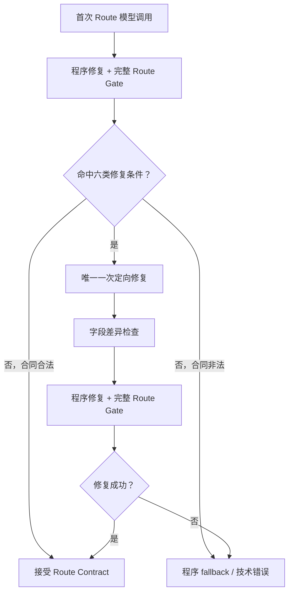

# 模型定向修复限制

> 适用合同：`planning-route-v1`  
> 程序实现：`src/services/video-orchestrator/planning-route-model-repair-policy.ts`  
> 调用实现：`src/services/video-orchestrator/planning-route-model-call.ts`

## 1. 核心规则

第二次 Route 模型调用不是通用 JSON 修理器。程序修复和 Route Gate 完成后，只有五类确实需要语义判断的歧义，以及一类低置信度可靠性问题，可以使用一次定向模型修复。

普通合同错误不再自动触发模型：

- JSON 或 Markdown 格式错误；
- 普通必填字段缺失；
- 非法枚举；
- 多余字段；
- 事件 ID 或越权内容；
- metadata 错误；
- confidence 格式错误；
- 输出超过 2KB；
- 不在六类白名单内的自定义校验错误。

这些问题由程序修复、Gate 回退或上层错误策略处理，不能浪费第二次语义判断调用。

## 2. 模型修复触发条件

| 稳定触发码 | 必须满足的条件 | 修复目标 |
|---|---|---|
| `PLANNING_ROUTE_REPAIR_GAME_TEMPLATE_AMBIGUOUS` | category 为 `game`，且 `game_reversal` 与 `game_bonus_payoff` 无法唯一确定 | 只确定游戏模板及其关联理由、置信度和 ambiguity |
| `PLANNING_ROUTE_REPAIR_PRODUCT_BRAND_AMBIGUOUS` | 输入证据同时具有 product、brand 信号，输出标记 `CATEGORY_CONFLICT`，当前类别位于二者之一 | 判断是产品销售表达还是品牌叙事 |
| `PLANNING_ROUTE_REPAIR_PRODUCT_ECOMMERCE_AMBIGUOUS` | 输入证据同时具有 product、ecommerce 信号，输出标记 `CATEGORY_CONFLICT`，当前类别位于二者之一 | 判断是产品问题解决还是电商转化 |
| `PLANNING_ROUTE_REPAIR_NONLINEAR_CHRONOLOGY_CONFLICT` | 用户明确提出非线性、倒叙、高潮/结果前置，但输出仍为 chronological 或标记 `CHRONOLOGY_CONFLICT` | 重判 chronology 及对应 Hook policy |
| `PLANNING_ROUTE_REPAIR_REFERENCE_TEXT_CATEGORY_CONFLICT` | 用户文本中的明确品类信号与精简参考图 categorySignals 相反 | 在相反证据间重新判断品类 |
| `PLANNING_ROUTE_REPAIR_LOW_CONFIDENCE` | category、template、chronology 任一置信度低于 `0.55` | 只复核路由决策、理由、ambiguity 和三项置信度 |

触发条件由程序判断。模型不能通过输出任意错误码自行获得额外调用。

无法解析的首轮输出没有足够证据证明属于上述六类，因此不允许修复调用。

## 3. 修复字段白名单

定向修复只允许改变：

```text
videoCategory
templateId
chronologyMode
hookMode
hookRevealLevel
requiresReturnPoint
categoryReason
templateReason
chronologyReason
categoryConfidence
templateConfidence
chronologyConfidence
ambiguityCodes
```

其中：

- Hook policy 指 `hookMode`、`hookRevealLevel`、`requiresReturnPoint`；
- confidence 只能修改三项分类可靠性；
- reason 只包括 category、template、chronology 三项理由；
- ambiguity 只包括 `ambiguityCodes`。

## 4. 冻结字段和输入事实

第二次调用不得修改：

```text
evidence
fallbackUsed
fallbackReason
version
modelName
inputFingerprint
referenceFactFingerprint
```

以下精简输入事实也全部冻结，并且不得出现在输出中：

```text
userCreative
durationSeconds
aspectRatio
stylePreset
hasReferenceImage
referenceFacts
userConstraints
allowedValues
categoryTemplateMap
```

修复返回后，程序先比较首次合同与修复合同。任何冻结字段差异、输入事实字段或非合同字段都构成越权修改，修复结果立即作废。

## 5. 定向修复 Prompt

修复 Prompt 明确携带：

- 唯一的 `repair_trigger`；
- `mutable_fields`；
- `protected_fields`；
- 原始精简输入，只作为不可修改事实；
- 首轮合同；
- Gate 校验问题。

模型必须返回完整的 `planning-route-v1`，但只能改变白名单字段。返回自由文本、Markdown 或部分补丁均不接受。

## 6. 单次修复上限

```text
正常调用：最多 1 次
定向修复：最多 1 次
总调用数：最多 2 次
第三次调用：禁止
```

`maxRepairCalls=1` 是程序硬限制。修复 Prompt 也声明这是唯一一次定向修复，但最终以程序调用计数为准。

## 7. 修复失败处理

第二次调用出现下列任一情况即失败：

- 仍未通过完整 Route Gate；
- 修改冻结字段；
- 输出或修改输入事实；
- 输出白名单外字段；
- JSON、合同、映射或 chronology/Hook policy 仍非法；
- 输出超过 2KB；
- 自定义校验仍失败；
- 超时、取消或网络失败。

处理规则：

1. 不发起第三次模型调用。
2. 合同或字段越权问题使用程序安全 fallback：
   `custom + generic_brand_story + chronological`。
3. timeout、cancel、HTTP 错误保留对应技术错误，交给外层任务策略处理，但本 Route 阶段不再调用模型。
4. 审计结果记录 `repairTrigger` 和 `repairFailureReasons`。
5. 失败的模型结果不得进入后续 Planning。

## 8. 调用流程



## 9. 测试要求

专项测试必须覆盖：

- 六类触发条件；
- 非白名单错误不触发第二次调用；
- 游戏模板非唯一场景；
- evidence、fallback 和 metadata 冻结；
- 输入事实字段禁止出现在修复输出；
- 合法白名单字段允许变化；
- 修复失败后调用总数仍为 2；
- 修复失败进入安全 fallback；
- 无第三次调用。
