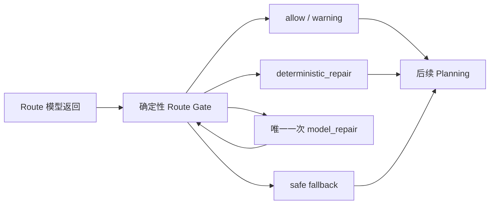

# 确定性 Route Gate

> 适用合同：`planning-route-v1`  
> 程序实现：`src/services/video-orchestrator/planning-route-gate.ts`  
> 原则：模型返回不能直接进入 Planning Architect，必须先经过此 Gate。

Gate 前置“程序优先修复”白名单、逐字段审计格式及完整重校验要求，见[程序优先修复与完整重校验](程序优先修复与重校验.md)。

## 1. Gate 输出状态

| 状态 | 含义 | 是否可以继续 |
|---|---|---:|
| `allow` | 合同完全合法，无修复、无警告 | 是 |
| `allow_with_warning` | 合同合法，但存在低置信度等非阻断风险 | 是，携带 warning |
| `deterministic_repair` | 程序已完成无歧义修复 | 是，使用修复后的值 |
| `model_repair` | 程序无法安全推断，需要唯一一次模型修复 | 否，先修复 |
| `fallback` | 模型明确使用合法 fallback，或修复机会耗尽后由程序生成安全合同 | 是，按 fallback 路线继续 |

状态优先级：

```text
需要模型判断、命中六类定向修复条件且仍有机会 → model_repair
需要模型判断但修复机会耗尽 → fallback
存在确定性修复             → deterministic_repair
合法且 fallbackUsed=true   → fallback
只有非阻断警告             → allow_with_warning
完全合法                   → allow
```

## 2. 固定校验顺序

Gate 必须严格按下列顺序执行：

| 顺序 | 校验 | 说明 |
|---:|---|---|
| 1 | JSON 是否可解析 | 必须是单一 JSON object；禁止 Markdown 和前后自由文本。简单修复后会重新序列化，并从本项重新执行 |
| 2 | 合同版本是否正确 | `version` 必须是 `planning-route-v1`；同时核对应用元数据 |
| 3 | 必填字段是否存在 | 检查20个顶层字段及关键字段类型 |
| 4 | 枚举值是否合法 | category、template、chronology、Hook、reveal、ambiguity code |
| 5 | category/template 是否匹配 | 使用程序映射表，不允许模型自由组合 |
| 6 | chronology/Hook policy 是否匹配 | 校验 Hook 类型、透露程度和 returnPoint |
| 7 | 置信度是否在0到1之间 | 非数字需要模型修复；有限数值越界可确定性 clamp |
| 8 | fallback 是否有原因 | `fallbackUsed=true` 必须有非空理由 |
| 9 | 是否出现事件 ID | 检查字段名和允许字段中的 `event_3` 等值 |
| 10 | 是否夹带越权内容 | 剧情、资产、Segment、时间线、声音、字幕、关键帧和 Prompt |

程序常量 `PLANNING_ROUTE_GATE_VALIDATION_ORDER` 固定上述顺序，测试会阻止顺序被无意改变。

## 3. 错误码与恢复动作

| 错误码 | 触发条件 | 恢复动作 |
|---|---|---|
| `PLANNING_ROUTE_GATE_JSON_INVALID` | 不是单一可解析 JSON object | 有机会：`model_repair`；无机会：`fallback` |
| `PLANNING_ROUTE_GATE_VERSION_INVALID` | version 缺失或错误 | 应用覆盖为当前版本，`deterministic_repair` |
| `PLANNING_ROUTE_GATE_REQUIRED_FIELD_MISSING` | 必填业务字段缺失 | 有机会：`model_repair`；无机会：安全 `fallback` |
| `PLANNING_ROUTE_GATE_FIELD_TYPE_INVALID` | reason、evidence、confidence 等类型错误 | 有机会：`model_repair`；无机会：安全 `fallback` |
| `PLANNING_ROUTE_GATE_ENUM_INVALID` | 枚举不存在 | 有明确模式默认值时确定性修复；核心 category 无法判断时模型修复 |
| `PLANNING_ROUTE_GATE_CATEGORY_TEMPLATE_MISMATCH` | category/template 不在映射表 | 保留 category，选择该品类默认模板 |
| `PLANNING_ROUTE_GATE_CHRONOLOGY_HOOK_MISMATCH` | chronology、Hook、reveal、returnPoint 冲突 | 使用该 chronology 的确定性 Hook policy 默认值 |
| `PLANNING_ROUTE_GATE_CONFIDENCE_INVALID` | 有限数字小于0或大于1 | clamp 到 `0..1` 并记录修复 |
| `PLANNING_ROUTE_GATE_FALLBACK_REASON_MISSING` | fallback=true 但没有原因 | 应用生成中性安全说明 |
| `PLANNING_ROUTE_GATE_EVENT_ID_FORBIDDEN` | 包含事件字段或 `event_3` 等值 | 字段可剥离时确定性删除；藏在允许文本中时模型修复 |
| `PLANNING_ROUTE_GATE_SCOPE_FIELD_FORBIDDEN` | 夹带剧情、资产或制作字段 | 递归删除越权字段并记录原路径 |
| `PLANNING_ROUTE_GATE_SCOPE_TEXT_SUSPECTED` | 允许文本中夹带镜头、资产 Prompt、事件等下游内容 | 有机会：模型修复；无机会：安全 fallback |
| `PLANNING_ROUTE_GATE_METADATA_MISMATCH` | modelName 或 fingerprint 与应用计算值不一致 | 应用元数据覆盖模型值 |
| `PLANNING_ROUTE_GATE_LOW_CONFIDENCE` | 合法 confidence 低于0.55 | `allow_with_warning`，不伪造更高置信度 |

## 4. 恢复动作定义

| recoveryAction | 行为 |
|---|---|
| `allow` | 原样接受 |
| `warn` | 接受并向下游携带风险 |
| `overwrite_application_metadata` | 用应用计算的 version/model/hash 覆盖模型值 |
| `select_category_default_template` | 保留品类，从合法映射表选择默认模板 |
| `apply_chronology_defaults` | 使用所选时间模式的默认 Hook/reveal/returnPoint |
| `clamp_confidence` | 仅把有限数值限制到 `0..1` |
| `synthesize_fallback_reason` | 生成中性、可审计的程序回退原因 |
| `strip_forbidden_fields` | 递归删除事件或越权字段，记录路径和旧值 |
| `request_model_repair` | 仅在命中五类语义歧义或低置信度可靠性问题时使用唯一一次定向修复调用 |
| `use_safe_fallback` | 生成 `custom + generic_brand_story + chronological` 安全合同 |

## 5. 确定性修复边界

程序只修复不需要重新理解用户意图的内容：

- 应用元数据；
- category 已知且只有一个合法模板时补齐缺失模板；
- category/template 已存在但组合非法时按映射表纠正；
- chronology 已知时的 Hook policy；
- 数字 confidence 越界；
- fallback reason 缺失；
- 明确禁止的额外字段。

程序不能确定性“猜测”：

- 缺失或非法的核心 `videoCategory`；
- `game` 缺失 `templateId`（两个合法模板，程序不能猜）；
- 缺失的分类、模板和时间理由；
- 空 evidence；
- 字符串形式的 confidence；
- 允许字段中夹带的事件 ID 或详细剧情。

这些问题只有同时命中模型修复触发白名单时才进入 `model_repair`；否则直接进入安全 `fallback` 或对应技术错误。详细规则见[模型定向修复限制](模型定向修复限制.md)。

## 6. 安全 Fallback

模型修复机会耗尽时，Gate 生成：

```text
videoCategory=custom
templateId=generic_brand_story
chronologyMode=chronological
hookMode=curiosity
hookRevealLevel=none
requiresReturnPoint=false
fallbackUsed=true
```

同时：

- 三项 confidence 为 `0`；
- `ambiguityCodes=["INSUFFICIENT_EVIDENCE"]`；
- reason 与 evidence 由程序生成；
- metadata 使用应用计算值；
- 不复用未通过 Gate 的剧情或制作文本。
- 默认不阻断 Planning，并提供计划审核阶段修改建议；
- 只有上游明确标记系统不支持的内容时才设置 `shouldBlockPlanning=true`。

完整原因模板、冲突记录和用户 warning 见[安全回退与用户警告](安全回退与用户警告.md)。

## 7. 与模型调用的连接



轻量调用组件已经直接调用 Gate：

- `model_repair` 才会触发第二次模型请求；
- 第二次仍无法通过时，Gate 返回安全 `fallback`；
- `allow`、`allow_with_warning`、`deterministic_repair`、`fallback` 才能作为调用结果返回；
- 原始模型文本保留供审计，后续 Planning 只能读取 `gate.value`。

## 8. Gate 审计信息

每次 Gate 返回：

- `status`
- 修复后的 `value`
- `issues[]`
- `repairs[]`

每条 issue 包含：

- 稳定错误码；
- JSON path；
- 可读原因；
- recovery action。

每条 repair 包含：

- JSON path；
- 修复动作；
- 原值；
- 修复值。

后续接入结构化日志时，应分别统计五种状态、错误码频率、确定性修复率、模型修复率和 fallback 率。
