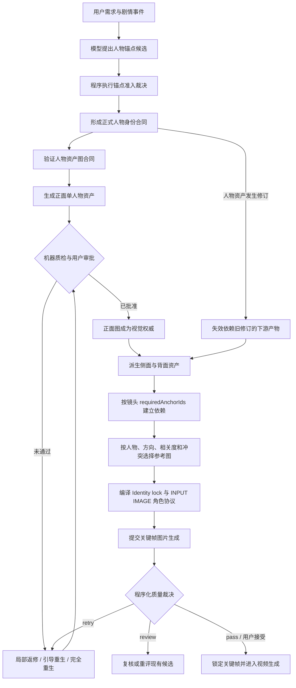

# 一句话成片：人物资产、生成质量与人物一致性技术说明

> 文档基线：2026-07-30 当前工作区代码  
> 适用范围：`RenYiMen` 项目中的“一句话成片”生产链路  
> 核心结论：系统不是只靠提示词中反复写“保持人物一致”，而是通过“结构化人物身份合同 + 已批准参考图 + 按镜头选择参考图 + 生成提示词权威分工 + 程序化质量裁决 + 候选版本与依赖失效”共同降低人物漂移。

## 1. 系统到底把什么认作“同一个人物”

项目先把人物从普通剧情文字中提升为一个有稳定 ID 的一致性锚点 `VideoConsistencyAnchor`。人物锚点是后续所有资产图、关键帧和视频片段共同引用的身份权威。

一个人物锚点主要包含：

| 信息 | 作用 |
|---|---|
| `id` | 人物在整个项目内的稳定身份 ID |
| `type: "person"` | 明确这是人物资产，而不是场景、风格或装饰 |
| `mustStayConsistent` | 表示它需要跨镜头保持一致 |
| `referenceStrength` | 决定参考图是硬参考、普通参考还是软参考 |
| `visualLock` | 锁定形状、颜色、标记、比例、状态以及禁止漂移项 |
| `assetImageContract` | 定义人物资产图应如何构图、打光、隔离和验收 |
| `sourceEvidence` | 记录该人物为何存在、来自用户要求还是剧情事件 |
| `usedByEventIds` | 记录人物在哪些剧情事件中实际出现 |
| `status` | 记录人物候选最终是正式锚点、事件局部元素还是被丢弃 |

对应实现：

- `src/services/video-orchestrator/types.ts`：`VideoConsistencyAnchor`
- `src/services/video-orchestrator/anchor-admission.ts`：`adjudicateConsistencyAnchorCandidates`

### 1.1 大模型可以提议人物，但不能单独决定人物资产

规划模型输出的人物只是“候选”。程序会根据确定性规则重新计算：

- 人物、产品和品牌属于核心主体，默认进入正式一致性资产；
- 用户明确要求“保持相同”“固定”“不能变化”的对象进入正式资产；
- 跨多个剧情事件重复出现的对象进入正式资产；
- 只出现一次的装饰或非核心对象保留为事件局部元素，不浪费参考图和生成配额；
- 完全没有被剧情使用的候选会被丢弃。

因此，模型不能因为一次错误判断就随意增加或删除人物权威。正式人物锚点由程序规则裁决，模型输出只是输入材料。

## 2. 人物身份不是一段混杂提示词，而是分字段管理

系统刻意把人物信息拆成不同“权威所有者”，避免同一事实在多段提示词中互相矛盾。

| 权威区域 | 负责内容 | 不应负责的内容 |
|---|---|---|
| `Identity lock` | 稳定脸部设计、发型、角/耳朵等识别结构、服装核心特征、身体比例、固定标记 | 当前镜头姿势、机位、表情 |
| `character_state` | 当前视角、姿势、表情、动作 | 重复定义身份、服装、材质和渲染风格 |
| `source_image_prompt` | 构图、景别、相机、画面位置、背景和光线 | 重新描述或改写稳定身份 |
| 参考图角色说明 | 说明这张图允许继承什么 | 不重复编造人物文字身份 |
| `negativePrompt` | 禁止多人物、重复身体、背景污染、文字/UI 等 | 不得否定权威合同中要求保留的事实 |

人物身份锁由 `compilePersonIdentityLock` 编译。它优先使用 `assetImageContract.intrinsicDetails`，最多提取八项稳定、可见、可比较的身份事实。最终图片提示词中会写成：

```text
Identity lock (sole textual identity source): ...
```

这里的 `sole textual identity source` 很重要：稳定人物身份只能由这一处文字负责，其他段落不能再用不同措辞重新定义同一个人物。

对应实现：

- `src/services/video-orchestrator/person-image-prompt-ownership.ts`
  - `compilePersonIdentityLock`
  - `compactPersonCharacterState`
  - `compilePersonCompositionPrompt`
  - `normalizePersonReferenceUsageNotes`
- `src/services/video-orchestrator/project-service.ts`
  - `compileImagePromptForKeyframe`

## 3. 人物资产图如何成为后续画面的视觉权威

### 3.1 先生成干净、可比较的单人物资产图

人物资产不是广告成片，也不是带剧情的场景图。它被约束为：

- 恰好一个人物；
- 白色或浅色中性背景；
- 不得出现其他人物；
- 不得出现标题、Logo、UI、海报排版和复杂场景；
- 明确人物占画比例、景别、相机角度和光线；
- 至少包含三项具体的身份、服装、结构或材质细节；
- 必须给出可由视觉检查的验收标准；
- 必须列出足够的禁止元素，形成隔离边界。

`validateAssetImageContract` 会在生成前验证合同。人物资产的 `subjectCount` 必须等于 1；缺少人物固有细节、构图、渲染维度、禁止元素或验收条件时，规划结果不能直接当作合格的生产输入。

正式提交上游的英文执行提示词由结构化合同编译产生，而不是依赖额外翻译模型：

```text
Asset reference sheet for ...
Exact visible subject count: 1
Composition: ...
Lighting: ...
Identity-locked details: ...
Forbidden: ...
Acceptance criteria: ...
```

对应实现：

- `src/services/video-orchestrator/asset-image-contract.ts`
  - `validateAssetImageContract`
  - `validatePlanningAssetImageContracts`
  - `validatePlanningAssetExecutionPrompts`
  - `compileAssetImagePromptEn`

### 3.2 正面图是人物多视图的母版

人物的侧面图和背面图不是三个互不相关的文生图任务。当前逻辑是：

1. 先生成正面人物资产；
2. 正面资产必须有图片，并进入 `IMAGE_APPROVED` 或被锁定；
3. 侧面/背面任务才变为可调度；
4. 派生视图必须选中同一人物锚点的已批准正面图；
5. 找不到已批准正面图时，生成前直接报错，不允许模型凭文字重新设计。

程序判断：

```text
side/back view
    -> requires same anchor's approved front view
    -> otherwise generation is blocked
```

这保证多视图至少共享同一个视觉起点，而不是分别抽样出三张“长得差不多但不是同一个人”的图片。

对应实现：

- `src/services/video-orchestrator/project-service.ts`
  - `assetGenerationPriority`
  - `isAssetViewGenerationReady`
  - `selectReferenceImagesForKeyframe`
- `prisma/schema.prisma`
  - `VideoAnchorReferenceView.sourceArtifactId`
  - `VideoAnchorReferenceView.sourceRevisionId`

数据库会记录派生视图来自哪个资产和哪个修订版本，便于在正面母版变化后识别旧侧面/背面已过期。

## 4. 资产审批是硬边界，不是“有 URL 就能用”

系统把“生成完成”和“成为权威参考”分开：

- `imageUrl` 只代表上游返回了一张图；
- `locked = true` 或状态为 `IMAGE_APPROVED` 才代表它可以成为人物一致性参考；
- 未批准资产不会进入关键帧的参考候选集；
- 某个关键帧缺少其所需的已批准人物资产时，该关键帧保持等待状态；
- 解锁已批准资产会把依赖产物标记为需要重新生成。

判断函数是：

```ts
Boolean(keyframe.imageUrl)
  && (keyframe.locked || keyframe.status === IMAGE_APPROVED)
```

审批有两种工作方式：

1. 单个资产审批：批准一个正面人物后，可立即解锁该人物的派生视图和仅依赖该人物的关键帧。
2. 资产库批量审批：要求本批资产全部生成完成，然后统一锁定并绑定到边界合同。

这意味着系统支持“按依赖逐步流动”，同时仍保留整批审核入口。

对应实现：

- `src/services/video-orchestrator/project-service.ts`
  - `isApprovedConsistencyReference`
  - `isBoundaryAssetDependencyReady`
  - `bindApprovedAssetsIntoBoundaryPlan`
  - `approveAssetLibrary`

## 5. 人物资产与关键帧并行时，如何防止人物资产被饿死

当前全局图片上游并发上限为 5，并采用资产优先调度：

| 任务类型 | 队列优先级 |
|---|---:|
| 人物等一致性资产 | 100 |
| 边界关键帧 | 50 |

在仍有未完成资产时：

- 资产任务优先占用所有可用槽位；
- 只有资产暂时没有可执行任务或仍有剩余槽位时，关键帧才能进入；
- 同时执行的关键帧最多为 2；
- 关键帧自身还必须满足“它所需资产已经批准”的依赖条件。

所以关键帧可以在部分人物资产批准后提前开始，但不能抢光资源，导致剩余人物资产长期无法生成。

对应实现：

- `src/services/video-orchestrator/project-service.ts`
  - `DEFAULT_IMAGE_TASK_CONCURRENCY = 5`
  - `ASSET_IMAGE_JOB_PRIORITY = 100`
  - `BOUNDARY_IMAGE_JOB_PRIORITY = 50`
  - `MAX_BOUNDARY_IMAGE_CONCURRENCY_WHILE_ASSETS_PENDING = 2`
  - `dependencyReadyImageTargets`

## 6. 每张关键帧如何选择正确的人物参考图

系统不会把整个资产库无差别塞给图片模型。每张目标图都有一次独立的参考选择。

### 6.1 先确定目标真正需要哪些人物

边界合同中记录 `requiredAnchorIds`。程序只把当前关键帧要求出现的人物当作硬参考，避免将其他镜头的人物错误带入。

如果要求的硬人物锚点没有已批准参考图，参考选择直接失败，不能退化成纯文字生成人物。

### 6.2 再按方向、相关度、时间距离和冲突评分

参考图总分为：

```text
finalScore
  = relevanceScore × 0.45
  + viewMatchScore × 0.25
  + recencyScore × 0.20
  - conflictScore × 0.35
```

其中：

- `relevanceScore`：是不是当前关键帧真正要求的人物；
- `viewMatchScore`：目标是正面、侧面还是背面，参考图方向是否匹配；
- `recencyScore`：连续镜头之间是否接近；
- `conflictScore`：参考图是否可能带入错误人物、场景、文字或风格；
- `hardRequired`：当前关键帧不可缺少的人物身份参考；
- `quotaType`：控制人物、产品、空间和风格等不同类别的覆盖。

冲突分达到 `0.75` 的普通参考会被排除。硬人物参考优先进入有限的参考图名额；同一人物有多视图时优先选择与镜头朝向匹配的版本，如果只能回退到正面图，选择结果会记录回退原因和警告。

每次选择结果会持久化：

- 目标产物；
- 被选中的资产 ID；
- 被选中的 URL；
- 候选评分和拒绝原因；
- 目标方向和最终视图；
- 参考使用说明；
- 选择策略版本。

对应实现：

- `src/services/video-orchestrator/reference-selector.ts`
  - `selectReferenceCandidates`
  - `referenceFinalScore`
  - `referenceViewMatchScore`
- `src/services/video-orchestrator/project-service.ts`
  - `collectReferenceCandidates`
  - `selectReferenceImagesForKeyframe`
- `prisma/schema.prisma`
  - `VideoReferenceSelectionOutput`

## 7. 参考图不是简单上传，还带有“允许继承范围”

人物、场景和风格参考图的权限不同。如果不给模型说明，人物参考图中的背景可能污染新关键帧，风格参考图中的人物也可能被误复制。

系统会给每张输入图建立顺序一致的角色映射：

```text
INPUT IMAGE 1: HARD IDENTITY ...
INPUT IMAGE 2: SCENE LAYOUT ...
INPUT IMAGE 3: STYLE ONLY ...
```

人物硬参考允许继承：

- 人物身份；
- 身体和脸部结构；
- 服装；
- 渲染媒介、维度、明暗、材质等被锁定的外观。

但不允许继承：

- 参考图背景；
- 参考图文字和 UI；
- 无关人物；
- 无关构图和场景布局。

场景参考只允许继承空间几何、轴线、固定物体和光线；风格参考只允许继承媒介、色板和边缘处理，不允许继承人物身份。

这些角色说明和对应 URL 保持相同顺序提交给上游，防止“文字说的是第一张图，实际模型收到的却是另一张图”。

对应实现：

- `src/services/video-orchestrator/anchor-semantics.ts`
  - `anchorReferenceUsagePolicy`
- `src/services/video-orchestrator/aliyun-workflow.ts`
  - `buildAliyunReferenceImageMap`
  - `compileReferenceRoleProtocol`

## 8. 最终提示词如何避免人物事实在压缩中丢失

图片提示词在提交上游前会经过结构化编译和长度控制。以下内容被视为受保护单元：

- `Identity lock`；
- 画面合同中的硬事实；
- 每张 `INPUT IMAGE` 的继承范围；
- 返修时的确定性修改要求；
- 禁止发生的结果；
- 数量、方向、姿势、颜色、文字、标记和空间关系。

提示词过长时，系统可以压缩普通描述，但压缩结果必须保留受保护事实和字面量。若受保护事实本身已经超过提供商预算，系统会报合同错误，而不是静默截断身份锁后继续生成。

对应实现：

- `src/services/video-orchestrator/aliyun-workflow.ts`
  - `isProtectedPromptUnit`
  - `protectedImagePromptFacts`
  - `validateModelImagePromptCompaction`

## 9. 生成质量如何判断

质量检查分为两层：

### 9.1 视觉模型只提取证据

视觉模型需要返回：

- `identityScore`
- `layoutScore`
- `promptAlignmentScore`
- `continuityScore`
- 适用时的 `styleFidelityScore`
- 人物数量
- 错误文字检测
- 每条原子要求对应的可见证据、位置、置信度和状态

视觉模型不拥有最终通过权，也不应自行新增合同要求。这样可以避免质检模型一句模糊的“整体不够好”导致无限打回。

### 9.2 程序根据固定规则裁决

普通图片当前最低分数门：

| 维度 | 最低分 |
|---|---:|
| 人物/主体身份 `identityScore` | 65 |
| 构图 `layoutScore` | 60 |
| 提示词符合度 `promptAlignmentScore` | 65 |
| 连贯性 `continuityScore` | 60 |
| 人物资产等适用场景的风格一致性 `styleFidelityScore` | 80 |

除此之外还要求：

- 必需分数完整；
- 评估置信度不能过低；
- 不能有高置信度、当前输出可见的硬要求违规；
- 不能有已经被权威合同确认的合同冲突；
- 需要精确文字时，文字错误属于硬失败；
- 参考合同要求人物锚点时，必须确实存在可比较的参考图。

质检输出不是简单的 true/false，而是：

| 决策 | 含义 |
|---|---|
| `pass` | 硬条件通过，没有剩余建议 |
| `recommended` | 硬条件通过，但有不阻塞的软建议 |
| `retry` | 有明确、可执行的失败项，需要重新生成或局部返修 |
| `review` | 证据不完整、低置信度或证据与高分冲突，需要人工复核或重评现有图片 |
| `blocked` | 权威合同自身存在已确认冲突，应先修合同，不能盲目重生图片 |

不确定观察必须低于规定置信度并作为建议，不能单独把图片判为失败。只有高置信度、指向当前输出、能够定位的硬违规才可形成确定性打回。

对应实现：

- `src/services/video-orchestrator/generation-quality-evaluator.ts`
  - `evaluateGeneratedImageQuality`
  - `normalizeReport`
  - `compileAtomicVisualRequirements`

## 10. 不合格图片如何返修并避免越修越坏

每次生成都是独立候选 `VideoGenerationCandidate`，历史候选不会被直接覆盖。系统保存：

- 候选序号和媒体 URL；
- 实际提示词和负面提示词；
- 质量报告与综合分；
- 是否通过、是否被选中、是否被用户接受；
- 返修说明；
- 父候选和依赖修订信息；
- 上游任务及轮询信息。

返修前，程序会先判断历史图片能否作为基线：

- 身份、布局等已验证维度达到 80 分，可作为“必须保留的优点”；
- 身份崩溃、人物数量错误、场景完全替换、空白/损坏图片等灾难性失败，不得继续作为基线；
- 从最新可用的候选血缘继续，而不是只挑综合分最高但可能属于旧分支的图片；
- 已修好的问题写入“已解决状态保护锁”，防止下一轮回退。

根据问题范围选择：

- `local_edit`：只改明确区域，尽量保持其他像素和已验证属性；
- `guided_regenerate`：保留可用人物身份和构图，在权威合同下重新渲染；
- `full_regenerate`：失败图不可用，从人物合同和已批准参考图重新开始；
- `review/reevaluate`：证据不足时重评现有图，不直接购买一次新的图片生成。

所有返修都遵循：

```text
权威人物合同和已批准参考图
    > 当前返修指令
    > 历史候选图
```

历史图片只能提供已验证的优点，不能覆盖人物身份合同。

对应实现：

- `src/services/video-orchestrator/project-service.ts`
  - `buildImageCandidateLearningSummary`
  - `buildImageAttemptPrompt`
  - `isStructurallyUsableImageBaseline`
  - `applySelectedGenerationCandidate`
- `prisma/schema.prisma`
  - `VideoGenerationCandidate`
  - `VideoGenerationQualityReport`

## 11. 用户审批与自动质检的关系

完整质量模式下：

- 未通过视觉质检的图片不能被普通自动流程直接选中；
- 用户可以查看候选和质量问题后，明确接受未通过候选；
- 这种情况会记录 `userAccepted = true`，不会伪装成模型质检通过；
- 人物资产被正式锁定后，才成为后续关键帧的权威参考。

用户最终仍然是审美和业务正确性的最后裁决者；程序负责确保“用户接受”与“机器判定通过”在数据上可区分。

## 12. 修改人物资产后，旧关键帧如何处理

系统给产物保存修订号、父修订、依赖关系和失效原因。人物资产变化后：

1. 新人物资产成为新的活动修订；
2. 依赖旧人物修订的侧面/背面、关键帧和后续媒体被标记为脏；
3. 不相关人物和不相关镜头不需要全项目重做；
4. 后续重生会重新选择当前已批准人物资产，并形成新的提示词编译和质量报告。

这是一种基于产物依赖图的局部失效，而不是“改一张人物图，整个项目全部推倒重来”。

对应数据：

- `ArtifactMetadata.dependsOn`
- `ArtifactMetadata.parentRevisionIds`
- `ArtifactMetadata.invalidatedByArtifactIds`
- `ArtifactMetadata.dirtyReason`
- `VideoAnchorReferenceView.sourceRevisionId`

## 13. 当前本机实际启用的质量配置

截至本文档基线，本机 `.env.local` 为：

```dotenv
ONE_PROMPT_VIDEO_FAST_PREVIEW=true
ONE_PROMPT_VIDEO_SCRIPT_QA=false
```

这意味着当前本地运行属于“快速预览”，不是完整质量生产模式。

快速预览会：

- 跳过模型型视觉评分的正常阻塞作用；
- 自动选择已有媒体候选；
- 自动批准计划、资产库、边界图、微镜头、视频片段和最终视频等审核关口；
- 仍保留结构化合同、依赖检查、正面图派生约束、参考图角色和提供商请求验证；
- 在生产环境中即使误配该变量，也会被代码强制禁止启用。

所以必须区分：

```text
系统已经实现的人物一致性能力
≠
当前快速预览运行中全部质量门都在生效
```

如果要验证正式人物一致性和生成质量，应使用：

```dotenv
ONE_PROMPT_VIDEO_FAST_PREVIEW=false
```

`ONE_PROMPT_VIDEO_SCRIPT_QA` 控制的是模型调用较重的脚本语义质检，不负责图片人物身份的基础结构校验；即使关闭，JSON、字段、时长、引用、依赖和提供商请求合同等程序校验仍然生效。

对应实现：

- `src/services/video-orchestrator/fast-preview-config.ts`
- `src/services/video-orchestrator/script-qa-config.ts`
- `src/services/video-orchestrator/project-service.ts`
  - `autoAdvanceFastPreviewProject`

## 14. 这套方案能保证什么，不能保证什么

### 能显著保证的部分

- 同一人物在数据上只有一个稳定锚点 ID；
- 身份、姿势、构图和参考图继承范围不会在提示词中无序争夺权威；
- 侧面和背面资产必须继承已批准正面人物；
- 关键帧必须使用当前镜头所需的已批准人物资产；
- 未批准人物图不能悄悄成为后续参考；
- 人物方向不匹配和参考图冲突可以被评分、排除和记录；
- 提示词压缩不能静默删除人物身份硬事实；
- 质检模型不能凭模糊意见无限打回；
- 返修保留已验证优点，并避免继续复制灾难性失败图；
- 人物资产修订后可以精确失效其下游产物。

### 不能数学保证的部分

扩散式图片模型本身具有随机性。即使参考图、身份锁和质量门全部正确，也不能保证：

- 每次都像传统 3D 绑定角色一样达到像素级身份不变；
- 极端角度、遮挡、强表情和大幅姿态变化完全不漂移；
- 上游模型始终正确理解复杂服装、手部和细小饰品；
- 单张正面图能完整提供看不见的背面结构。

因此当前系统的目标是“可追踪、可比较、可拦截、可返修的一致性生产”，而不是声称生成模型已经变成确定性渲染器。

## 15. 完整执行流程



## 16. 关键代码索引

| 关注点 | 主要文件 |
|---|---|
| 人物锚点和资产合同类型 | `src/services/video-orchestrator/types.ts` |
| 人物锚点准入 | `src/services/video-orchestrator/anchor-admission.ts` |
| 人物/场景/风格参考继承范围 | `src/services/video-orchestrator/anchor-semantics.ts` |
| 人物资产图合同验证与英文执行提示词 | `src/services/video-orchestrator/asset-image-contract.ts` |
| 人物身份、状态和构图权威拆分 | `src/services/video-orchestrator/person-image-prompt-ownership.ts` |
| 参考图评分与选择 | `src/services/video-orchestrator/reference-selector.ts` |
| 资产审批、依赖调度、提示词编译、候选返修 | `src/services/video-orchestrator/project-service.ts` |
| 上游参考图角色映射与提示词保护 | `src/services/video-orchestrator/aliyun-workflow.ts` |
| 图片视觉证据提取与程序裁决 | `src/services/video-orchestrator/generation-quality-evaluator.ts` |
| 修订、候选、参考选择和质量报告数据模型 | `prisma/schema.prisma` |

