# 一句话成片：当前执行架构、功能与流程

> 文档版本：2026-07-28  
> 依据：当前仓库代码，而非历史方案或理想设计  
> 适用范围：`RenYiMen` 一句话成片（One Prompt Video）工作流

## 1. 一句话总览

当前“一句话成片”是一套**以结构化创作合同为核心、以人工审核门为边界、以持久化后台任务为执行底座、以 Provider 能力声明适配不同生成模型**的视频生产流水线：

> 用户输入一句创意和基础参数后，系统依次完成参考素材理解、故事与资产规划、分镜和 Prompt 设计、一致性资产生成、边界关键帧生成、基于真实关键帧的运动校准、权威子分镜生成、视频片段生成与质量修复，最后在本地完成转场、音频、字幕和成片合成。

它不是“一个模型一次调用直接吐出完整视频”，而是一个可审核、可恢复、可追踪、可局部返工的生产系统。

---

## 2. 当前完整业务流程

```mermaid
flowchart TD
    A["用户输入一句创意<br/>时长、比例、风格、参考图"] --> B["创建项目 DRAFT"]
    B --> C["持久化规划任务 PLANNING"]

    C --> C1["参考图客观事实提取"]
    C1 --> C2["Planning Architect<br/>剧情因果、时间线、资产锚点、声音策略"]
    C2 --> C3["并发生成资产视觉规格"]
    C3 --> C4["资产合同校验与定向修复"]
    C4 --> C5["Storyboard Artist<br/>故事节拍、镜头组织、Camera Graph、转场意图"]
    C5 --> C6["Story Contract / 语义质量 / 资产依赖校验"]
    C6 --> C7["按 Segment 并发流水线"]
    C7 --> C8["Shot Decomposer"]
    C8 --> C9["Single-Take Audit v2"]
    C9 --> C10["Prompt Detailer<br/>关键帧、视频、暂定子分镜 Prompt"]
    C10 --> D["计划审核 PLAN_REVIEW"]

    D --> E["生成一致性资产图片"]
    E --> F["候选质检、选择与资产确认"]
    F --> G["把已批准资产绑定到边界合同"]
    G --> H["编译最终关键帧 Prompt"]
    H --> I["生成边界关键帧"]
    I --> J["候选质检、选择与关键帧整体确认"]

    J --> K["并发读取真实关键帧画面事实"]
    K --> L["按 Segment 并发执行媒体条件运动校准"]
    L --> M["生成权威 resolvedMicroShots"]
    M --> N["按需并发生成子分镜参考图"]
    N --> O["子分镜审核 MICRO_SHOT_REVIEW"]

    O --> P["收集视频参考图候选"]
    P --> Q["读取 Provider / Model 能力"]
    Q --> R["智能选图、固定编号和传输顺序"]
    R --> S["编译模型友好动作 Prompt + 系统硬合同"]
    S --> T["按 Segment 并发生成视频"]
    T --> U["技术检查与视觉质量审计"]
    U --> V{"是否通过"}
    V -- "否" --> W["结构化修复计划<br/>重检、定向重生成或升级人工"]
    W --> T
    V -- "是" --> X["视频片段审核 CLIP_REVIEW"]

    X --> Y["准备转场、桥接、音频和字幕"]
    Y --> Z["本地合成 COMPOSING"]
    Z --> AA["最终审核 FINAL_REVIEW"]
    AA --> AB["完成 DONE"]
```



---

## 3. 系统由五层组成

### 3.1 创作规划层：决定“讲什么、拍什么”

这一层把用户的一句话转成结构化生产计划，主要包括：

- 剧情事件和因果关系；
- Hook、冲突、转折、兑现、CTA；
- Segment 时间线和持续时间；
- 人物、产品、品牌、场景等一致性锚点；
- 每个边界关键帧应呈现的静态状态；
- 每个 Segment 的动作、机位和一镜到底合同；
- 暂定子分镜；
- 音频策略和最终转场计划。

系统只保留当前 `v2` 多阶段规划架构，并由它直接驱动实际生成。

### 3.2 媒体条件规划层：决定“真实首尾画面之间怎么动”

规划阶段只能描述预期画面，关键帧真正生成后，人物位置、姿势、遮挡、产品朝向和构图可能与文字设想不同。

因此关键帧整体确认后，系统会：

1. 用视觉模型读取所有已批准边界关键帧的真实画面；
2. 为每个 Segment 取对应起始关键帧和结束关键帧；
3. 结合早期动作意图，重新计算连续可达的运动路径；
4. 生成 `motionContract`、`singleTakeContract`、`motionCheckpoints` 和 `videoPromptContract`；
5. 生成带版本号的 `resolvedMicroShots`；
6. 将这些结果写回 Segment 和渲染描述。

这里的“重新规划”不是重写剧情或重新拆分整个项目，准确名称是：

> **基于真实边界画面的媒体条件运动校准。**

当前实现会对所有 Segment 并发执行这一步；目前尚未实现“先比较差异、差异很小时跳过模型调用”的条件复用优化。

### 3.3 Prompt 编译层：把内部合同翻译成模型能执行的输入

系统内部保存完整工程合同，模型提交前才确定性编译 Prompt。

这样可以同时保证：

- 内部信息足够结构化，可用于校验、选图、重试和审计；
- 提交给模型的表达尽量自然，不把全部工程标签塞进主 Prompt；
- 更换 Provider 时不需要重写上层业务逻辑；
- Prompt 超出模型字符预算时不会静默截断硬约束。

### 3.4 生成与质量层：负责图片、视频、候选和修复

这一层负责：

- 一致性资产图片；
- 边界关键帧；
- 子分镜参考图；
- Segment 视频；
- 转场参考图和必要的生成式桥接视频；
- 技术质量检测；
- 视觉语义质量检测；
- 候选选择；
- 自动修复与人工接受。

### 3.5 执行基础设施层：负责排队、恢复、并发和状态

当前系统同时维护两类状态：

1. **业务状态机**：用户现在处于哪个制作和审核阶段；
2. **生产作业状态机**：后台 Worker 正在准备 Prompt、提交、等待生成还是质检。

前端的 `/sync` 现在是只读投影，不再利用用户轮询请求偷偷承担重生产任务。

---

## 4. 从一句话到成片的详细过程

## 4.1 创建项目

用户提交：

- 一句话创意；
- 视频总时长；
- 画面比例；
- 风格预设；
- 可选参考图。

系统创建 `VideoProject`，初始状态为 `DRAFT`，随后创建带幂等键的持久化规划作业并进入 `PLANNING`。

## 4.2 参考图事实提取

如果用户提供参考图，视觉模型首先只提取客观事实，例如：

- 有哪些人物、产品和场景；
- 外观、服装、颜色和产品结构；
- 人物相对位置；
- 场景空间和构图；
- 图片中实际可见的信息。

这一阶段不负责自由创作，目的是避免后续模型把参考图中不存在的内容当成既定事实。

## 4.3 Planning Architect：规划故事和生产骨架

默认采用拆分式规划，主要输出：

- `narrativeEvents`：剧情事件和因果顺序；
- `creativeStrategy`：Hook、冲突、兑现和 CTA 策略；
- `timelineBlueprint`：Segment 时间线；
- `consistencyManifest`：一致性资产锚点；
- `anchorStateTimeline`：锚点随时间变化的状态；
- `audioBible`：音频策略；
- 生产所需的规划清单。

Planning Architect 不承担所有最终图片 Prompt 的编写工作。

## 4.4 资产视觉规格：按资产并发设计

人物、产品、品牌、场景等锚点会进入独立的资产视觉规格任务。

每个资产的结构化合同包括：

- 主体和数量；
- 外观和固有细节；
- 正面、侧面、背面等视图要求；
- 构图；
- 环境；
- 光线；
- 色板和材质；
- 禁止元素；
- 验收标准。

应用程序再根据结构化合同确定性生成中英文展示 Prompt 和 Provider 执行 Prompt。

抽象色彩或氛围锚点会被识别为软风格约束，不会错误地作为实体场景图片生成。

## 4.5 Storyboard Artist：设计剧情节拍和镜头关系

Storyboard Artist 负责：

- 故事节拍；
- 因果和证据引用；
- 每个 Segment 的叙事职责；
- 镜头分组；
- Camera Graph；
- 新机位与父机位的继承关系；
- 转场意图；
- 必要的过渡参考图或生成式桥接规划。

之后系统执行：

- Story Contract Gate；
- 语义故事评审；
- 资产依赖合同解析；
- 时间线和结构校验。

## 4.6 Shot Decomposer：按 Segment 拆解动作

默认每个 Segment 独立执行一条流水线：

```text
镜头拆解
→ 一镜到底审计与修复
→ Prompt 细化
```

不同 Segment 可并发，单个 Segment 内保持串行。

Shot Decomposer 输出：

- 起止边界；
- 人物和产品动作；
- 摄像机运动；
- 环境运动；
- 中间动作状态；
- 一镜到底合同；
- `videoPromptContract`；
- 暂定 `microShots`。

## 4.7 Single-Take Audit v2

审计器判断一个 Segment 能否作为连续、不切镜的一次生成完成。

当前路由包括：

| 结果 | 含义 |
|---|---|
| `allow` | 可以直接执行 |
| `allow_with_warning` | 可以执行，但保留风险提示 |
| `repair_contract` | 合同字段缺失或冲突，可修复合同 |
| `repair_camera_graph` | 机位继承关系需要修复 |
| `repair_segment` | 当前 Segment 的语义动作需要模型定向修改 |
| `replan_timeline` | 存在地点、时间或结构性跳变，需要局部重排后续时间线 |

能够由程序确定的问题优先由程序修复；需要创作判断的问题才调用模型。

## 4.8 Prompt Detailer：形成规划期 Prompt

Prompt Detailer 输出：

- 关键帧 Prompt 初稿；
- Segment 视频 Prompt 初稿；
- 子分镜图片 Prompt 初稿；
- 负面 Prompt。

这里生成的是**规划期语义初稿**，不是所有情况下直接原样提交给 Provider 的最终 Prompt。

规划完成后项目进入 `PLAN_REVIEW`，用户可以检查和修改故事、镜头、资产及 Prompt。

---

## 5. 图片生产流程

## 5.1 先生成一致性资产

计划确认后，系统优先生成：

- 人物身份图；
- 产品结构图；
- 品牌或 UI 锚点图；
- 场景空间图；
- 必要的派生视图。

人物等资产可以有正面、侧面和背面视图。派生视图应继承已确认的基础身份，不能变成新的角色。

图片首次只生成一个候选，不默认一次付费生成两个。

## 5.2 图片提交前才编译最终 Prompt

每个图片目标被后台 Worker 领取后，系统按以下顺序执行：

```text
抢占目标，防止重复提交
→ 读取规划期 Prompt 和结构化合同
→ 读取上一轮候选及质检问题
→ 选择当前目标所需参考图
→ 编译最终图片 Prompt
→ 执行视觉合同冲突检查
→ 提交上游图片任务
```

这意味着关键帧 Prompt 有两层：

| 层级 | 生成时间 | 作用 |
|---|---|---|
| 规划期关键帧 Prompt 初稿 | 剧本拆解阶段 | 确定构图、人物状态、产品状态和叙事意图 |
| 最终关键帧执行 Prompt | 资产批准并绑定后、实际提交前 | 注入批准资产、参考图、边界合同、Camera Graph、返修指令和硬约束 |

所以准确流程是：

```text
关键帧 Prompt 初稿
→ 生成并确认资产
→ 将批准资产绑定到边界合同
→ 编译最终关键帧 Prompt
→ 生成边界关键帧
```

## 5.3 参考图按依赖选择

图片参考图选择不会简单把所有素材全部塞入模型，而是依据：

- 当前目标需要哪些锚点；
- 身份、产品、场景或风格角色；
- 视角匹配程度；
- 相关性；
- 冲突风险；
- 历史候选和修复需要。

只有目标真正依赖的锚点才会被绑定。软色板和风格锚点不能冒充实体场景几何。

## 5.4 图片质检与候选选择

上游返回图片后，后台质量 Worker 执行：

- 媒体文件可用性检查；
- 人物身份一致性；
- 产品结构一致性；
- 场景布局一致性；
- 主体数量和构图；
- 必需元素与禁止元素；
- Prompt 与合同冲突检查。

候选通过后可以自动成为当前选中结果；存在未解决候选时，系统进入独立的：

- `waiting_candidate_selection`；
- `waiting_asset_confirmation`；
- `waiting_boundary_confirmation`。

用户明确接受或锁定的候选不会被迟到的新候选悄悄替换。

## 5.5 资产确认后生成边界关键帧

批准资产会绑定到 canonical boundary contract。

边界关键帧只有在其所需资产依赖已满足后才允许提交。最终关键帧 Prompt 在提交前编译，而不是在资产生成前固定死。

所有边界关键帧都具备图片后，项目进入关键帧审核。当前仍然要求**全部边界关键帧整体确认**，不会仅确认一对相邻关键帧就提前启动该 Segment 的后置子分镜流程。

---

## 6. 关键帧确认后的媒体条件运动校准

用户确认全部关键帧后，系统执行：

```text
并发识别全部真实关键帧
→ 并发处理全部 Segment
→ 校准每个 Segment 的连续动作
→ 判断起止状态是否物理可达
→ 生成权威 motion checkpoints
→ 生成权威 resolvedMicroShots
```

如果某个 Segment 的起止关键帧无法在一镜到底条件下物理到达，系统会阻止继续生成，并要求：

- 重生成相邻边界关键帧；或
- 返回时间线规划。

这一阶段不会重新设计：

- 故事主题；
- 剧情事件；
- 已批准资产；
- Segment 的基本叙事职责；
- 已批准的边界关键帧。

它主要更新：

- 实际起始状态；
- 实际结束状态；
- 连续动作路径；
- 中间动作检查点；
- 一镜到底可达性；
- 最终视频动作合同。

---

## 7. 子分镜流程

## 7.1 子分镜分为暂定版和权威版

| 版本 | 来源 | 是否驱动最终生成 |
|---|---|---|
| `provisionalMicroShots` | 剧本拆解阶段 | 否，只保留创作意图和历史 |
| `resolvedMicroShots` | 关键帧确认后的媒体条件校准 | 是 |

激活权威版本后：

- `segments[].microShots` 指向 `resolvedMicroShots`；
- Segment 渲染描述保存相同版本；
- 每个子分镜带 `resolvedRevisionId`；
- 旧版本迟到结果保留历史，但不能满足当前任务。

## 7.2 哪些子分镜需要生成图片

| `referenceType` | 行为 |
|---|---|
| `text` | 只写入动作合同或视频 Prompt，不生成图片 |
| `image_prompt` | 生成子分镜参考图 |
| `mixed` | 同时作为文字检查点和图片参考 |

子分镜审核界面会立即打开，必需的参考图在后台准备和提交。

全部必需子分镜图片完成并确认后，才能进入视频片段生成。

---

## 8. 视频 Prompt 与多模型适配

## 8.1 内部统一的 Video Image Contract

系统内部为每张视频参考图记录：

- `role`：首帧、尾帧、人物、产品、场景、动作检查点或风格；
- `authority`：原生边界、普通参考或只用于评估；
- `entityName`；
- `anchorId`；
- `actionRole`；
- `allowedUse`；
- `forbiddenUse`；
- `temporalPosition`；
- `requiredForSegment`；
- `selectionReason`。

这些字段用于程序选图、编号、校验、日志和质量评估。

## 8.2 Provider / Model 能力声明

每个模型通过能力声明告诉编排层：

- 输入传输协议；
- 最大图片数；
- Prompt 字符上限；
- 是否能按 `[Image N]` 引用；
- 是否保持图片传输顺序；
- 是否原生控制首帧或尾帧；
- 是否支持语义末帧目标；
- 采用智能覆盖还是旧优先级选图。

Provider 不具备某项能力时，系统会降级表达或拒绝无法满足的硬要求。

## 8.3 智能分配参考图预算

智能选择顺序是：

1. 已批准首帧；
2. 已批准目标尾帧；
3. 当前 Segment 必需的活动人物、产品和场景；
4. 时间上有代表性的动作检查点；
5. 其余能增加覆盖度且不重复的参考图。

每个一致性锚点默认只保留一张强身份或布局参考，避免大量相似图让模型混淆。

如果图片预算无法覆盖必需硬锚点，系统报错，不会直接截断后继续提交。

## 8.4 HappyHorse 的表达方式

当模型支持有序多图引用时，系统在完整硬合同前增加模型友好的自然语言动作层，例如：

```text
MAIN ACTION

The heroine from [Image 3], starting in the opening composition from
[Image 1], raises the phone from [Image 4] and reaches the victorious
pose shown in [Image 2], inside the game room from [Image 5].
```

之后附加精简但完整的系统合同：

```text
SYSTEM CONSTRAINTS

Complete the movement as one continuous physically plausible take.
Do not cut, teleport, replace the scene, or exchange visual attributes.
```

完整技术 `REFERENCE MAP` 默认只用于内部调试和审计，只有显式开启实验开关时才发送给模型。

如果自然语言引用层会超过字符预算，系统可以省略这一增强层，但不会截断系统硬合同。

## 8.5 视频最终提交前的编译内容

最终视频 Prompt 会综合：

- 已批准首尾关键帧；
- 视觉模型读取的真实边界事实；
- 权威媒体条件运动合同；
- `resolvedMicroShots`；
- 一镜到底合同；
- 人物、产品和场景锚点；
- Camera Graph 继承；
- 剧情边界和禁止提前出现的剧情证据；
- 上一轮视频质量问题；
- 图片阶段移交给视频阶段处理的检查项；
- Provider 能力和 Prompt 字符预算；
- 音频策略。

没有权威媒体条件子分镜计划时，当前视频编译器会拒绝生成该 Segment。

---

## 9. 视频生成、质量审计和修复

## 9.1 渐进式视频候选

每个 Segment 首次只提交一个付费视频候选。

系统不会默认一次生成两个再挑选。只有以下情况才会追加候选：

- 明确的质量问题；
- 有意义的 Prompt 或参考图修正；
- 用户主动重生成；
- 技术失败后的允许重试。

候选历史、父版本、修复原因和用户选择都会保存。

## 9.2 视频质量检查

视频返回后主要检查：

- 文件能否下载和解码；
- 时长、分辨率等技术条件；
- 首帧与批准起始关键帧的一致性；
- 人物、产品和场景身份；
- 动作检查点是否按顺序发生；
- 一镜到底连续性；
- 是否出现切镜、瞬移、替换场景或属性串换；
- 目标结束状态是否达到；
- 末帧连续性；
- 画面中不应出现的字幕、乱码或伪文字。

对于不原生支持尾帧控制的模型，尾帧仍作为：

- Prompt 中的强语义结束目标；
- 生成后独立视觉连续性评估依据。

## 9.3 自动修复

模型参与的修复必须先生成结构化 Repair Plan，明确：

- 修改类型：增加、修改、删除或移动；
- 目标 JSON 路径；
- 来源问题；
- 修改目标；
- 必须保留的路径和规则；
- 验收标准。

修复结果只能通过白名单合并回计划，并重新运行确定性校验。

程序能够确定的修复会生成精确变更日志，不需要模型解释如何修改。

统一收敛控制器会识别：

- 连续多轮没有新状态；
- 两种结果之间往返振荡；
- 修复预算耗尽；
- 同一阶段访问过多；
- 完整重生成没有严格改善。

达到终止条件后，系统保留最佳候选并升级人工处理，不会无限重试。

技术性质的质量评估失败优先重新评估同一个媒体文件，不直接消耗新的图片或视频生成预算。

---

## 10. 转场、音频和最终合成

全部 Segment 视频准备完成后进入 `CLIP_REVIEW`。

系统根据最终转场计划处理：

- `hard_cut`；
- `match_cut`；
- `dissolve`；
- `fade_to_black`；
- `generated_bridge`。

需要生成式桥接时，桥接视频必须：

- 已生成；
- 通过质量检查；
- 被用户确认；
- 被锁定。

否则不允许最终合成。

音频按照 Segment 的策略处理：

- `native_ambience`：保留模型环境声，其他内容后期补充；
- `native_full`：允许模型承担更完整的原生音频；
- `post_only`：全部由后期音频承担。

最后由本地合成器按照时间线：

1. 排列片段和桥接视频；
2. 执行转场；
3. 处理片段音轨；
4. 混入后期音频；
5. 添加字幕；
6. 输出最终审核视频。

项目进入 `FINAL_REVIEW`，用户确认后进入 `DONE`。

---

## 11. 当前两套状态机

## 11.1 业务状态机

```text
DRAFT
→ PLANNING
→ PLAN_REVIEW
→ IMAGE_GENERATING
→ IMAGE_REVIEW
→ MICRO_SHOT_REVIEW
→ CLIP_GENERATING
→ CLIP_REVIEW
→ COMPOSING
→ FINAL_REVIEW
→ DONE
```

异常或人工停止时进入 `FAILED`，之后可以根据恢复信息继续。

注意：资产审核和边界关键帧审核在数据库顶层都可能表现为 `IMAGE_REVIEW`，前端通过人类工作流状态进一步区分：

- 等待候选选择；
- 等待资产确认；
- 等待边界关键帧确认。

## 11.2 后台生产作业状态机

持久化生产作业使用：

```text
waiting_dependency
→ preparing_prompt
→ submitted
→ generating
→ waiting_quality
→ quality_checking
→ waiting_candidate_selection
→ waiting_asset_confirmation
→ completed
```

当前持久化作业类型包括：

- `planning`；
- `image_prepare_submit`；
- `micro_shot_prepare_submit`；
- `image_quality`；
- `project_reconcile`。

每个作业具有：

- 幂等键；
- 优先级；
- 可执行时间；
- 最大尝试次数；
- Worker lease；
- heartbeat；
- 指数退避重试；
- 错误记录。

Worker 宕机或 lease 到期后，作业可以重新进入队列。

---

## 12. 当前 Worker 分工

生产部署将后台工作拆成独立通道：

| Worker 通道 | 主要职责 |
|---|---|
| Planning Worker | 执行持久化规划任务和规划 checkpoint |
| Image Worker | 图片 Prompt 准备、参考图选择、图片提交、子分镜图片提交 |
| Reconcile Worker | 查询上游任务、落库结果、推进项目状态 |
| Quality Worker | 图片视觉质量评估和质量重试 |

本地开发脚本也使用相同的隔离 Worker 通道，减少“开发环境能跑、生产环境行为不同”的问题。

当前视频首轮提交仍由子分镜批准动作触发，后续上游状态由 Reconcile Worker 负责协调；最终成片由本地合成器执行。

---

## 13. 当前默认并发与候选策略

| 环节 | 默认值 | 硬上限或说明 |
|---|---:|---|
| 资产视觉规格生成 | 5 | 规划阶段有界并发 |
| Shot Decomposer Segment 流水线 | 10 | 不同 Segment 并发，单 Segment 内串行 |
| 资产/关键帧图片上游任务 | 5 | 当前硬上限 5 |
| 子分镜 Prompt、选图和提交 | 5 | 当前硬上限 5 |
| Segment 视频上游任务 | 5 | 当前硬上限 5 |
| 单轮质量评估数量 | 4 | 每次同步最多 4 个 |
| 质量评估并发 | 4 | 当前硬上限 4 |
| Worker 单批领取作业数 | 20 | 可配置，范围 1～100 |
| 图片首次候选数 | 1 | 渐进式候选 |
| 视频首次候选数 | 1 | 渐进式候选 |
| 图片自动生成重试 | 默认 5 | 可配置，最多 8 |
| 视频自动生成重试 | 默认 2 | 可配置，最多 4 |

上游并发和 Worker 批量领取数不是同一个概念：

- Worker 可以一次领取多个准备或协调任务；
- 真正昂贵的图片和视频上游任务仍受项目级和 Provider 级并发约束；
- Provider lease 防止超额提交和重复付费任务。

---

## 14. 任务图、进度和局部失效

系统会根据真实项目数据构建任务图，包含：

- 规划；
- 计划审核；
- 每张资产图；
- 资产审核；
- 每张边界关键帧；
- 关键帧审核；
- 每张必需子分镜图；
- 子分镜审核；
- 每个 Segment 视频；
- 视频审核；
- 最终合成；
- 最终审核。

任务节点记录：

- 依赖关系；
- 当前状态；
- 是否已被上游接受；
- 上游任务 ID；
- 尝试次数；
- 重试原因；
- 修复策略；
- 预计耗时；
- 实际开始和完成时间。

进度只计算真正完成的工作。等待人工审核时不会伪造一个自动完成时间。

当上游资产发生变化时，系统按依赖图只标记下游受影响内容为 dirty，例如：

- 修改人物资产，只使依赖该人物的边界帧、子分镜和视频失效；
- 修改某个边界关键帧，只使相邻 Segment 的媒体条件计划、子分镜和视频失效；
- 已取消或旧版本候选保留用于审计，但不计入当前有效任务图。

---

## 15. 当前重要行为与边界

### 已经实现

- 多阶段规划，不再把所有职责塞进一个大 JSON 调用；
- 规划 checkpoint 和持久化 Worker；
- 资产合同与 Prompt 确定性编译；
- 关键帧 Prompt 的“规划初稿 + 提交前最终编译”；
- 真实关键帧确认后的媒体条件运动校准；
- `resolvedMicroShots` 作为最终权威子分镜；
- 子分镜版本隔离和迟到结果保护；
- 图片和视频渐进式单候选；
- 有界并发；
- Provider 能力声明；
- HappyHorse 自然语言多图引用；
- 智能参考图预算分配；
- 结构化自动修复计划；
- 修复收敛控制；
- 图片质量独立 Worker；
- `/sync` 只读；
- 局部依赖失效、回滚和续跑；
- 本地转场、音频、字幕和最终合成。

### 当前仍然如此

- 必须等全部边界关键帧完成并整体确认，才进入媒体条件运动校准；
- 媒体条件校准会对全部 Segment 并发执行，并非按差异决定是否跳过；
- 子分镜必须完成必要参考图后才允许视频生成；
- 视频首次提交由子分镜批准动作触发，不是独立的 `segment_video_prepare_submit` 持久化作业；
- 最终合成由本地合成器执行；
- 多个人工审核门仍然存在，因此当前不是完全无审核的黑盒“一键直出”。

---

## 16. 用户视角的最简流程

```text
输入一句话和参考素材
→ 等待系统完成剧本与分镜规划
→ 审核计划
→ 审核人物、产品和场景资产
→ 审核边界关键帧
→ 系统依据真实关键帧校准动作并生成权威子分镜
→ 审核子分镜
→ 系统生成并质检各个视频片段
→ 审核视频片段
→ 系统完成转场、声音、字幕和最终合成
→ 审核并完成成片
```

---

## 17. 核心代码位置

| 模块 | 文件 |
|---|---|
| 项目状态机、生成编排、Prompt 编译、审核和合成 | `src/services/video-orchestrator/project-service.ts` |
| 多阶段规划器 | `src/services/video-orchestrator/three-stage-planner.ts` |
| 媒体条件运动校准 | `src/services/video-orchestrator/media-conditioned-planner.ts` |
| 一镜到底审计 | `src/services/video-orchestrator/single-take-audit.ts` |
| 结构化修复计划 | `src/services/video-orchestrator/repair-plan.ts` |
| 图片可编辑 Prompt 合同 | `src/services/video-orchestrator/image-prompt-edit-contract.ts` |
| 锚点语义与继承策略 | `src/services/video-orchestrator/anchor-semantics.ts` |
| Provider 视频图片输入合同与智能选图 | `src/services/providers/video-input-contract.ts` |
| 阿里云/HappyHorse 视频提交与 Prompt 装配 | `src/services/video-orchestrator/aliyun-workflow.ts` |
| Provider Adapter | `src/services/providers/` |
| 持久化生产作业队列 | `src/services/video-orchestrator/production-job-queue.ts` |
| 独立生产 Worker | `scripts/video-production-worker.ts` |
| 数据库状态与作业模型 | `prisma/schema.prisma` |

---

## 18. 架构结论

当前系统的核心不是“生成更多候选”，而是：

1. 用结构化合同把创作意图固定下来；
2. 用已批准资产保证人物、产品和场景一致性；
3. 用真实关键帧校准最终运动，而不是盲信规划期想象；
4. 用 Provider 能力层适配 HappyHorse 和其他模型；
5. 用质量证据和结构化修复控制返工；
6. 用持久化作业、lease、checkpoint 和依赖图保证长流程可恢复；
7. 只对受影响的下游内容重新生产。

因此，现在“一句话成片”的准确定位是：

> **一个从自然语言创意出发、经过结构化规划与多级审核、能够跨模型执行并可局部恢复的视频生产编排系统。**
