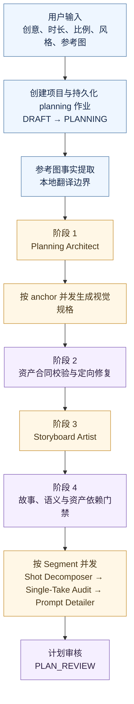
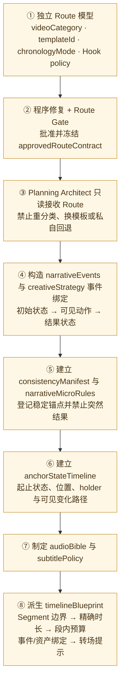
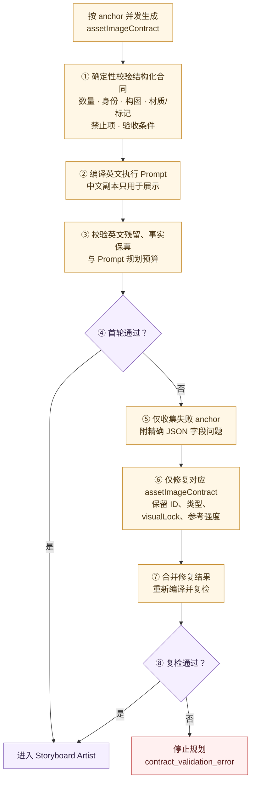
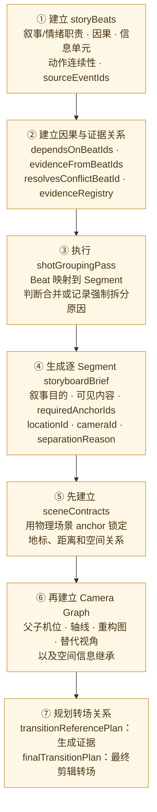
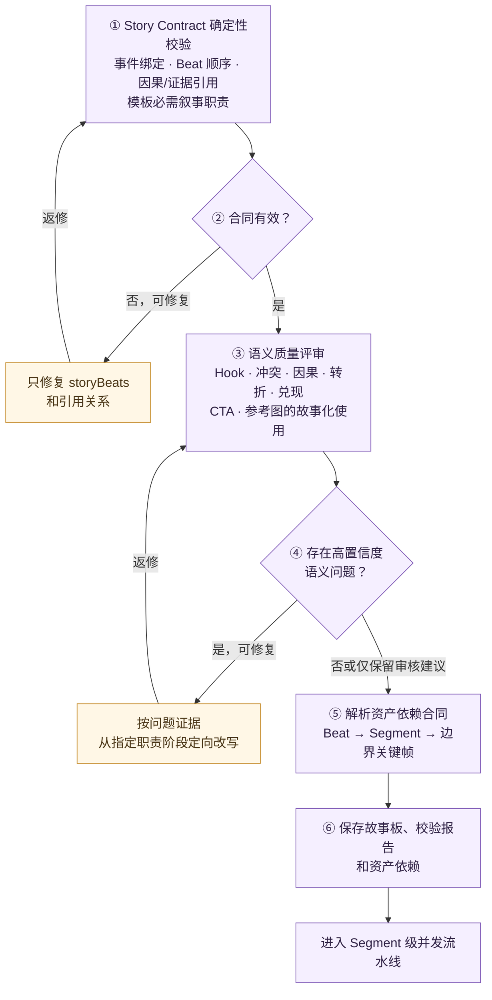
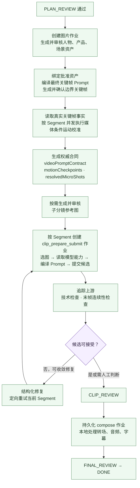

# 一句话成片：当前执行架构、功能与流程

> 文档版本：2026-07-28（第二次复核，按当前工作区代码更新）
>
> 适用范围：`RenYiMen` 一句话成片（One Prompt Video）工作流
>
> 本文只描述当前实际执行路径，不保留历史架构说明。

## 1. 一句话总览

当前“一句话成片”是一套以结构化创作合同为核心、以人工审核门为业务边界、以目标级持久化作业和独立 Worker 为执行底座、以 Provider 能力声明适配不同生成模型的视频生产系统。

它不是让单个模型一次吐出完整成片，而是把一句创意逐步转换为：

1. 可验证的故事、资产、镜头和时间线合同；
2. 已审核的人物、产品、场景和边界关键帧；
3. 基于真实关键帧校准后的权威运动合同与子分镜；
4. 按 Segment 独立排队、生成、质检和重试的视频片段；
5. 通过持久化合成作业驱动的本地转场、音频、字幕与最终成片。

整个流程支持版本化 checkpoint 恢复、局部返工、候选版本保护、容量等待、结构化错误与恢复动作、Worker 健康追踪和 Provider 差异适配。

---

## 2. 当前完整业务流程

### 2.1 全流程大图

```mermaid
%%{init: {"flowchart": {"useMaxWidth": false, "htmlLabels": true, "nodeSpacing": 60, "rankSpacing": 80}, "themeVariables": {"fontSize": "22px"}}}%%
flowchart TD
    A["用户输入一句创意<br/>时长、比例、风格、参考图"] --> B["创建项目 DRAFT"]
    B --> C["创建持久化 planning 作业<br/>PLANNING"]

    C --> C1["参考图客观事实提取"]
    C1 --> C2["本地翻译边界<br/>模型请求统一转为英文"]

    subgraph ROUTE["阶段 1A｜独立 Route：冻结叙事路线"]
        direction TB
        R1["① 轻量分类<br/>video category / template / chronology / Hook policy"]
        R2["② 程序修复 + Route Gate<br/>得到 approvedRouteContract"]
        R1 --> R2
    end

    subgraph PA["阶段 1B｜Planning Architect：按已批准路线建立全片上游创作合同"]
        direction TB
        PA2["① 接收只读 approvedRouteContract<br/>禁止重分类、换模板或修改时间路线"]
        PA3["② 构造 narrativeEvents<br/>初始状态 → 可见动作 → 结果状态<br/>并登记前置事件依赖"]
        PA4["③ 从事件链派生 creativeStrategy<br/>绑定 Hook / 冲突 / 转折 / 兑现 / CTA"]
        PA5["④ 建立一致性锚点注册表<br/>静态身份、外观、场景与风格锁定"]
        PA6["⑤ 制定 narrativeMicroRules 与 anchorStateTimeline<br/>记录状态变化路径并禁止突然结果"]
        PA7["⑥ 制定声音与字幕总策略<br/>audioBible / subtitlePolicy"]
        PA8["⑦ 从事件复杂度派生 timelineBlueprint<br/>分段边界 → 每段时长 → 段内时间预算 → 转场提示"]

        PA2 --> PA3 --> PA4 --> PA5 --> PA6 --> PA7 --> PA8
    end

    C2 --> R1
    R2 --> PA2
    PA8 --> C4["按需要参考图的 anchor 并发生成视觉规格<br/>每个 anchor 产出结构化 assetImageContract"]

    subgraph ASSET_GATE["阶段 2｜资产合同校验与定向修复"]
        direction TB
        AG1["① 确定性校验 assetImageContract<br/>数量、身份、构图、材质、标记、禁止项、验收条件"]
        AG2["② 从结构化合同编译英文执行 Prompt<br/>中文副本仅用于展示"]
        AG3["③ 校验英文、事实保真与 Prompt 规划预算"]
        AG4{"④ 首轮是否通过？"}
        AG5["⑤ 只收集失败 anchor<br/>附带精确 JSON 字段问题"]
        AG6["⑥ 模型只定向修复 assetImageContract<br/>不改 anchor ID、类型、visual lock 等上游事实"]
        AG7["⑦ 合并修复结果，重新编译并复检<br/>最多执行一轮定向返修"]
        AG8{"⑧ 复检是否通过？"}
        AG9["停止规划<br/>contract_validation_error"]

        AG1 --> AG2 --> AG3 --> AG4
        AG4 -- "否" --> AG5 --> AG6 --> AG7 --> AG8
        AG8 -- "否" --> AG9
    end

    C4 --> AG1

    subgraph STORYBOARD["阶段 3｜Storyboard Artist：把事件合同组织成可拍摄故事板"]
        direction TB
        SB1["① 建立 storyBeats<br/>叙事职责、情绪、因果、动作连续性与源事件"]
        SB2["② 建立显式因果与证据关系<br/>dependsOn / evidenceFrom / resolvesConflict<br/>并登记 evidenceRegistry"]
        SB3["③ 执行 shotGroupingPass<br/>把相邻节拍映射到 Segment<br/>记录合并依据与强制拆分原因"]
        SB4["④ 生成逐 Segment storyboardBrief<br/>叙事目的、可见内容、所需锚点、地点与 cameraId"]
        SB5["⑤ 先建立 sceneContracts<br/>用物理场景资产锁定地标和空间关系"]
        SB6["⑥ 再建立 Camera Graph<br/>机位父子关系、轴线、重构图与空间继承"]
        SB7["⑦ 规划转场关系<br/>transitionReferencePlan / finalTransitionPlan"]

        SB1 --> SB2 --> SB3 --> SB4 --> SB5 --> SB6 --> SB7
    end

    AG4 -- "是" --> SB1
    AG8 -- "是" --> SB1

    subgraph STORY_GATES["阶段 4｜故事与资产门禁"]
        direction TB
        SG1["① Story Contract 确定性校验<br/>事件绑定、节拍顺序、因果引用、证据引用、模板必需职责"]
        SG2{"② 合同是否有效？"}
        SG3["③ 只修复 storyBeats 与引用关系<br/>重新执行 Story Contract 校验"]
        SG4["④ 语义质量评审<br/>Hook、冲突、因果、转折、兑现、CTA 与参考图转化"]
        SG5{"⑤ 是否存在高置信度语义问题？"}
        SG6["⑥ 按问题证据定向改写<br/>从指定职责阶段重新评审"]
        SG7["⑦ 解析资产依赖合同<br/>把人物、产品、品牌、场景锚点映射到<br/>Beat → Segment → 边界关键帧"]
        SG8["⑧ 保存通过的故事板、校验报告与资产依赖<br/>进入 Segment 级流水线"]

        SG1 --> SG2
        SG2 -- "否，可修复" --> SG3 --> SG1
        SG2 -- "是" --> SG4 --> SG5
        SG5 -- "是，可修复" --> SG6 --> SG4
        SG5 -- "否或仅保留审核建议" --> SG7 --> SG8
    end

    SB7 --> SG1
    SG8 --> C8["按 Segment 并发流水线"]
    C8 --> C9["Shot Decomposer<br/>Zod 结构化输出合同"]
    C9 --> C10["Single-Take Audit v2"]
    C10 --> C11["Prompt Detailer<br/>关键帧、视频、暂定子分镜 Prompt"]
    C11 --> D["计划审核 PLAN_REVIEW"]

    D --> E["按目标创建图片准备/提交作业"]
    E --> F["生成并审核人物、产品、场景资产"]
    F --> G["把已批准资产绑定到边界合同"]
    G --> H["提交前编译最终关键帧 Prompt"]
    H --> I["生成全部边界关键帧"]
    I --> J["候选质检、选择并整体确认"]

    J --> K["并发读取真实关键帧画面事实"]
    K --> L["按 Segment 并发执行媒体条件运动校准"]
    L --> M["生成权威 videoPromptContract<br/>motionCheckpoints / resolvedMicroShots"]
    M --> N["按需并发生成子分镜参考图"]
    N --> O["子分镜审核 MICRO_SHOT_REVIEW"]

    O --> P["按 Segment 创建 clip_prepare_submit 作业"]
    P --> Q["收集候选参考图并读取模型能力"]
    Q --> R["智能选图、固定编号和传输顺序"]
    R --> S["编译模型友好动作 Prompt<br/>附加精简系统硬约束"]
    S --> T["提交一个视频候选"]
    T --> U["同一目标作业进入 waiting_upstream<br/>持续追踪上游并落库"]
    U --> V["技术检查与自动末帧连续性检查"]
    V --> W{"可接受？"}
    W -- "否，可收敛修复" --> X["结构化修复/定向重试"]
    X --> P
    W -- "是或需人工语义判断" --> Y["视频片段审核 CLIP_REVIEW"]

    Y --> Z["创建持久化 compose 作业<br/>COMPOSING"]
    Z --> AA["Clip/Compose Worker 调用本地合成器<br/>处理转场、音频、字幕"]
    AA --> AB["最终审核 FINAL_REVIEW"]
    AB --> AC["完成 DONE"]

    classDef input fill:#eef6ff,stroke:#4b78a8,color:#172b4d;
    classDef contract fill:#fff7e6,stroke:#c58b2a,color:#4a3515;
    classDef gate fill:#f5efff,stroke:#7f5ab6,color:#2f2145;
    classDef execution fill:#eef9f0,stroke:#4f8a5b,color:#1f3b25;
    classDef stop fill:#fff0f0,stroke:#c44949,color:#5b1f1f;

    class A,B,C,C1,C2 input;
    class R1,R2,PA2,PA3,PA4,PA5,PA6,PA7,PA8,C4,SB1,SB2,SB3,SB4,SB5,SB6,SB7 contract;
    class AG1,AG2,AG3,AG4,AG5,AG6,AG7,AG8,SG1,SG2,SG3,SG4,SG5,SG6,SG7,SG8 gate;
    class AG9 stop;
    class C8,C9,C10,C11,D,E,F,G,H,I,J,K,L,M,N,O,P,Q,R,S,T,U,V,W,X,Y,Z,AA,AB,AC execution;
```



上图关闭了 Mermaid 的自动宽度压缩，使用自然尺寸和 22px 字号渲染。下方同时保留分阶段局部图，便于不放大时逐段阅读。编号表示严格的前后依赖，返修箭头表示只返回当前职责阶段，不会从头重跑整条规划链。

### 2.2 规划主链



### 2.3 阶段 1：独立 Route 与 Planning Architect 内部顺序



#### 2.3.1 第①步的专项职责边界

第①步必须作为独立的轻量路由判断执行，只负责：

```text
视频品类 → 叙事模板 → 时间顺序模式
                    → Hook 基本类型与结果透露程度
                    → 判断理由、置信度、歧义与安全回退
```

它不得提前生成剧情事件、事件 ID、事件引用、资产锚点、Segment、时长分配、声音/字幕策略、资产图片合同、关键帧或生成 Prompt。特别禁止输出 `hookEventIds`、`conflictEventIds`、`turningPointEventIds`、`payoffEventIds`、`ctaEventIds` 和 `returnToEventId`，因为此时剧情事件尚不存在。

本步骤使用独立合同 `planning-route-v1`。详细规范：

- [任务分类与叙事路线职责边界](planning-route-v1/任务分类与叙事路线职责边界.md)
- [`planning-route-v1` 字段定义](planning-route-v1/planning-route-v1-字段定义.md)
- [Category / Template 映射与确定性回退](planning-route-v1/category-template-映射与回退规则.md)
- [Chronology 决策与 Hook Policy](planning-route-v1/chronology-决策与-Hook-policy.md)
- [路由输入合同与参考事实压缩规则](planning-route-v1/路由输入合同与压缩规则.md)
- [轻量 Route 模型调用设计](planning-route-v1/轻量路由模型调用设计.md)
- [确定性 Route Gate](planning-route-v1/确定性-Route-Gate.md)
- [程序优先修复与完整重校验](planning-route-v1/程序优先修复与重校验.md)
- [模型定向修复限制](planning-route-v1/模型定向修复限制.md)
- [安全回退与用户警告](planning-route-v1/安全回退与用户警告.md)
- [Approved Route Contract 接入 Planning Architect](planning-route-v1/接入-Planning-Architect.md)
- [`route_classification` 独立 Checkpoint 与复用规则](planning-route-v1/route-classification-checkpoint.md)
- [Route Contract 字段级比较与局部失效规则](planning-route-v1/route-contract-local-invalidation.md)
- [Route 独立日志事件与 P50/P95 统计口径](planning-route-v1/route-logging-performance.md)
- [PLAN_REVIEW：任务分类与叙事路线展示及人工修改](planning-route-v1/plan-review-route-ui.md)
- [步骤17：Planning Route 单元测试](planning-route-v1/step17-unit-tests.md)
- [步骤18：固定分类样本与验收指标](planning-route-v1/step18-fixed-classification-samples.md)
- [步骤19：Tongits King 稳定性与耗时测试](planning-route-v1/step19-stability-performance.md)
- [步骤20：Planning Route 灰度上线](planning-route-v1/step20-rollout.md)
- [输出 JSON Schema](planning-route-v1/planning-route-v1.schema.json)
- [输入白名单 JSON Schema](planning-route-v1/planning-route-v1-input.schema.json)

### 2.4 阶段 2：资产合同校验与定向修复



定向返修最多一轮；已经通过的 anchor 不重新生成。

### 2.5 阶段 3：Storyboard Artist 内部顺序



### 2.6 阶段 4：故事与资产门禁



### 2.7 审核、生成与合成主链



---

## 3. 系统的五层架构

### 3.1 创作规划层

负责把一句话转换为结构化生产计划，包括：

- 剧情事件、因果关系、Hook、冲突、兑现和 CTA；
- Segment 时间线和叙事职责；
- 人物、产品、品牌、场景等一致性锚点；
- 边界关键帧的静态目标状态；
- Camera Graph、转场意图和音频策略；
- 每个 Segment 的动作、机位、一镜到底合同和暂定子分镜。

当前只保留并执行 `v2` 架构，规划拆分模式固定为 `split`。系统不会再运行旧本地规划器，也不存在旧规划器驱动生成、新规划器只做影子的路径。

规划调用按职责拆分：

```text
Planning Architect
→ 资产视觉规格
→ Storyboard Artist
→ Shot Decomposer
→ Single-Take Audit
→ Prompt Detailer
```

不同 Segment 可并发，单个 Segment 内部保持有序执行。

### 3.2 媒体条件运动校准层

规划期只能描述预期画面。关键帧实际生成后，人物位置、姿势、遮挡、产品朝向和构图可能与文字设想不同。

因此全部边界关键帧确认后，系统会：

1. 并发读取真实关键帧的视觉事实；
2. 为每个 Segment 取得真实起止画面；
3. 在不改写剧情职责的前提下校准连续运动；
4. 检查规定时长内的一镜到底可达性；
5. 生成权威 `motionContract`、`singleTakeContract`、`motionCheckpoints`、`videoPromptContract`；
6. 生成带修订号的 `resolvedMicroShots` 并同步到实际生成路径。

这一步不是重新写剧本，而是“基于真实边界画面的媒体条件运动校准”。目前所有 Segment 都会执行校准，尚未实现“差异足够小时跳过视觉模型调用”的复用优化。

动作检查点数量有界，当前最多 3 个，避免短视频被过多相似参考状态挤占注意力。

### 3.3 Prompt 编译与本地翻译层

系统内部保存结构化工程合同，提交模型前再确定性编译 Prompt。内部合同负责正确性，模型 Prompt 负责可理解性。

当前规划模型还增加了本地翻译边界：

- 递归提取模型请求中的中文文本；
- 通过本地 LibreTranslate 批量翻译为英文；
- 保留 JSON 技术键、ID 和协议字段；
- 提交前拒绝仍残留中文的模型请求；
- 模型响应只把 `_zh`、`Zh` 等展示字段翻译回中文；
- 使用去重和内存缓存减少重复翻译开销。

因此核心生成模型面对的是英文协议和英文创作内容，中文主要作为 UI 展示层存在。

资产图片生成进一步采用“单一英文执行合同”：

- `imagePromptZh` 是尽力生成的中文展示副本，不参与生产门禁；
- `imagePromptEn` 由结构化 `assetImageContract` 确定性编译，是图片生成的执行文本；
- 规划阶段先限制结构化资产合同总体积，再限制英文执行 Prompt；
- Provider 提交前按语义单元去重和压缩，不做原始字符串尾部截断；
- 只有身份、精确数量、品牌文字、固有标记、扑克牌点数/花色、关键空间关系、用户硬要求和本轮返修问题才属于不可丢失事实；
- 普通描述、通用负面词、历史说明和装饰性质量词允许压缩。

如果真正不可丢失的事实仍超过 Provider 硬预算，系统会阻止付费提交并返回结构化合同错误。当前能够正确停止和路由错误，但生成阶段的预算错误尚不能自动回写并重构对应资产合同，仍可能需要恢复流程或人工修改合同。

### 3.4 生成与质量层

负责：

- 一致性资产图；
- 边界关键帧；
- 子分镜参考图；
- Segment 视频；
- 转场参考图和生成式桥接视频；
- 媒体技术检查、图片视觉质检、视频连续性检查；
- 候选选择、自动修复和人工接管。

图片和视频首次都只生成一个付费候选，不默认一次生成两个再挑选。只有明确失败、有效修复或用户主动重生成时才追加候选。

### 3.5 持久化执行层

业务状态机描述用户处于哪个制作或审核阶段；生产作业状态机描述 Worker 正在等待依赖、等待容量、准备 Prompt、提交上游、质检还是等待人工确认。

长任务不依赖浏览器轮询推进。页面读取只投影数据库中的真实状态；规划、图片、子分镜、视频、上游轮询、质检和合成都由持久化作业推进。

---

## 4. 规划、校验和恢复

### 4.1 Planning Architect

主要产出：

- `narrativeEvents`
- `creativeStrategy`
- `timelineBlueprint`
- `consistencyManifest`
- `anchorStateTimeline`
- `audioBible`
- 后续生产所需的结构化合同

它不承担全部最终 Prompt 的编写，资产合同也不会由自由文本直接代替。

#### 4.1.1 “剧情因果、时间线、资产锚点、声音策略”的具体含义

Planning Architect 是全片结构化创作合同的上游设计者，可以理解为“总编剧 + 制片规划器”。它先确定全片必须遵守的故事、时长、一致性和声音边界，再把这些约束交给 Storyboard Artist、Shot Decomposer 和 Prompt Detailer 逐步细化。这里的四项职责具体如下。

**剧情因果**

剧情因果由 `narrativeEvents` 和 `creativeStrategy` 表达。系统不是只列出若干画面，而是把故事拆成可追踪的事件链。每个事件需要说明：

- 事件的初始状态、可见动作和动作后的结果状态；
- 参与者、发生地点以及必须出现的资产；
- 它依赖哪些先前事件，为什么能够导致下一事件；
- 它承担 Hook、冲突、升级、转折、兑现、反应或 CTA 中的哪些叙事职责；
- 是否因为地点、时间、状态或镜头连续性变化而必须成为独立 Segment。

`creativeStrategy` 则在同一条事件链上确定受众、核心承诺、叙事模板、时间顺序，以及 Hook、冲突、转折、兑现和 CTA 分别绑定到哪些事件。它不能另外创造一套与 `narrativeEvents` 不一致的故事。这样可以避免“结果突然出现”“人物无动机行动”“产品能力没有被可见动作证明”或“CTA 早于剧情兑现”等问题。

**时间线**

时间线主要由 `timelineBlueprint` 表达。它把剧情事件分配到实际成片时间，并规定每个 Segment 的生产边界，包括：

- 开始时间、结束时间和精确时长；
- 该段承载的源事件和叙事职责；
- 准备、动作、结果各自占用的时间预算；
- 必须出现的资产、字幕意图和声音意图；
- 为什么需要在这里分段，以及与相邻段采用连续、硬切、匹配剪辑或溶解中的哪种边界提示。

每个 Segment 必须能够作为一个连续、不中断的镜头生成。地点替换、大幅时间跳跃、主体瞬移、产品状态突变或主要机位重置不能被强塞进同一 Segment。所有 Segment 的时长之和必须严格等于用户要求的总时长。因此，这里的时间线是后续故事板、关键帧、视频生成和最终合成共同遵守的硬合同，不是粗略的剪辑建议。

**资产锚点**

资产锚点是跨镜头必须保持身份或视觉规则一致的对象，由 `consistencyManifest` 登记，并由 `anchorStateTimeline` 描述其允许发生的动态变化。锚点可以是人物、产品、道具、车辆、食物、物理场景、品牌视觉、渲染风格或其他任务对象。

两类信息必须分开：

- 静态锁定：人物脸型、发型和服装，产品包装、颜色、材质和标记，场景的固定空间结构等。这些内容变化通常属于一致性漂移。
- 动态状态：对象的位置、朝向、开合状态、损耗状态和持有者等。这些内容可以随剧情变化，但必须在 `anchorStateTimeline` 中记录起止状态，并给出画面中可见的变化路径。

例如，咖啡罐从桌面移动到人物手中是合法状态变化，但中间需要出现伸手拿起的可见动作；咖啡罐无原因地改变包装颜色或同时出现在两个互斥位置，则属于合同冲突。需要独立参考图的锚点随后会进入资产视觉规格生成与审核，已批准资产再被注入关键帧和视频 Prompt。

**声音策略**

声音策略主要由 `audioBible` 表达，并通过各 Segment 的 `audioIntentZh` 落到时间线上。它定义的是全片统一的声音设计原则，包括：

- 是否使用旁白、对白、字幕、背景音乐和动作音效；
- 人声的角色一致性、语气、节奏和信息职责；
- 音乐的整体情绪及随剧情变化的强弱关系；
- 哪些动作必须有声音反馈，哪些时刻需要留白；
- 后续合成时是否保留片段原生音轨，以及音乐、人声和音效之间的基本关系。

Planning Architect 在这一阶段只制定声音合同和分段意图，不等于已经生成最终 BGM、配音或音效文件。实际音频素材和混音在后续生产及最终合成阶段完成。

例如，对于“疲惫女孩喝咖啡后恢复精神并完成工作”的 20 秒广告，Planning Architect 可以规划为：

1. 0–4 秒：疲惫与工作停滞，低能量音乐、缓慢键盘声；
2. 4–9 秒：发现并拿起咖啡，咖啡罐从桌面转移到人物手中；
3. 9–15 秒：喝下后精神恢复，音乐节奏增强，工作动作明显加快；
4. 15–20 秒：完成工作并展示产品，提示音后进入品牌旁白和 CTA。

在这个例子中，“疲惫 → 喝咖啡 → 恢复 → 完成工作”是剧情因果；四段的秒数和分段理由是时间线；人物、咖啡罐和办公室是资产锚点；低能量开场、转折升调、动作音效和 CTA 旁白是声音策略。

### 4.2 资产合同校验与定向修复

资产规划不是直接保存一段自由文本，而是为每个需要参考图的 anchor 生成结构化 `assetImageContract`，覆盖主体数量、身份与外观、构图、材质/标记、隔离边界、禁止元素和可验收条件。

规划阶段依次执行：

```text
按 anchor 并发生成视觉规格
→ 确定性校验结构化资产合同
→ 编译英文执行 Prompt
→ 校验英文执行 Prompt 的语言与规划预算
→ 只把失败 anchor 和精确字段问题交给模型
→ 合并修复后的 assetImageContract
→ 重新编译并复检
```

定向修复遵循以下边界：

- 只把失败 anchor 放入返修输入，已经通过的 anchor 不重做；
- 保留 anchor ID、类型、身份描述、visual lock、参考强度等上游事实；
- 模型只修改结构化 `asset_image_contract`，不直接维护中英文两套执行文本；
- 中文展示文案不再阻断规划；
- 一轮返修后仍不合格时，以不可重试的 `contract_validation_error` 停止，不重复调用相同返修。

Provider 提交前还有第二层 Prompt 预算合同。它会优先保留精确事实并压缩普通描述；预算仍不可满足时进入 `contract_validation` 失败和 `REPAIR_CONTRACT` 恢复动作。目前这条晚期错误能被正确分类和停止，但尚未自动重新启动 Planning Worker 定向重写对应 anchor。

### 4.3 Shot Decomposer、结构化输出合同与 Single-Take Audit

每个 Segment 默认执行：

```text
镜头拆解
→ 一镜到底审计
→ 必要时确定性修复或模型定向修复
→ Prompt 细化
```

审计结果包括：

| 结果 | 含义 |
|---|---|
| `allow` | 可直接执行 |
| `allow_with_warning` | 可执行，但保留风险 |
| `repair_contract` | 修复缺失或冲突的合同字段 |
| `repair_camera_graph` | 修复机位继承关系 |
| `repair_segment` | 模型定向修改当前 Segment |
| `replan_timeline` | 局部重排存在时空跳变的时间线 |

程序能确定的问题优先由程序修复；需要创作判断时才调用模型。

模型修复必须先产出结构化 Repair Plan，明确操作类型、目标 JSON 路径、问题来源、修改目标、保留项和验收条件。修复结果只能通过白名单路径合并，并重新执行确定性校验。

Shot Decomposer 的目标 Segment 输出不再由 Prompt 示例、TypeScript 类型和手写 JSON Schema 分别维护。当前使用 Zod 作为该阶段的唯一类型源：

- TypeScript 类型由 `z.infer` 生成；
- JSON Schema 由同一 Zod 合同生成；
- Prompt 中的 canonical example 是同一合同对象的序列化结果；
- 回归测试要求该示例必须通过同一 Zod Schema；
- 所有模型 JSON 调用统一经过泛型 `executeStructuredStage<T>()`；
- 可无损的字段别名和单字段 `prop_paths: [{ path: "..." }]` 可以程序归一化；
- `motion_steps` 超量等语义问题与字段类型错误都会返回精确 JSON Path，只返修当前 Segment。

为防止模型在相同错误上空转，系统把 `stage + segment + schemaVersion + issue fingerprint` 写入 checkpoint。同一指纹连续两次不变时停止自动重试，转入合同修复或人工检查；错误内容发生变化时计数重新开始。

### 4.4 规划 checkpoint

当前 checkpoint envelope 版本为 v14。它显式保存：

- `plannerMode`
- `completedStages`
- `stageOutputs`
- 各职责阶段的 `contractVersions`
- 输入快照与参考图指纹
- 结构化失败指纹
- migration audit

v12、v13 和旧式 envelope 会迁移到 v14；迁移不会只因总版本号变化就清空全部结果，而是比较输入、参考图和各阶段合同版本，从第一个失效职责阶段向下清理。若缓存失效，系统只从对应职责阶段向下失效，例如：

- 故事架构失败：回到 Planning Architect；
- 资产合同失败：只修复相应资产合同；
- 故事板失败：回到 Storyboard Artist；
- 某个 Segment 拆解或 Prompt 失败：只重跑对应 Segment 的下游阶段。

规划性能记录使用根任务 ID 和尝试编号区分不同运行，避免续跑时与旧统计记录冲突。

### 4.5 权威 Prompt 合同

规划阶段的关键帧、视频和子分镜 Prompt 是语义初稿。最终提交前会注入已批准资产、真实边界事实、修复反馈和 Provider 能力。

视频运行时必须存在权威 `videoPromptContract`。旧式运行时临时拼装合同的 fallback 已关闭；缺失权威合同时会进入合同修复，而不是带着不完整 Prompt 继续提交。

---

## 5. 图片与关键帧生产

### 5.1 目标级持久化作业

资产图、边界关键帧和子分镜图会创建带明确 `targetId` 的持久化作业。Worker 不再在执行时猜测“下一个该生成什么”，而是只处理作业已经固定的目标和修订版本。

Worker 执行顺序：

```text
验证目标和修订版本
→ 检查依赖与项目并发容量
→ 读取结构化合同、历史候选和质检反馈
→ 选择当前目标所需参考图
→ 编译最终图片 Prompt
→ 检查视觉合同与 Prompt 预算
→ 获取 Provider 容量
→ 提交上游任务
→ 原目标作业进入 waiting_upstream 并继续轮询
```

人物等必需身份参考无法满足时，不允许静默降级成纯文本生成。

### 5.2 两层关键帧 Prompt

| 层级 | 生成时间 | 作用 |
|---|---|---|
| 规划期关键帧 Prompt 初稿 | 剧本与镜头拆解阶段 | 确定构图、状态和叙事意图 |
| 最终关键帧执行 Prompt | 资产批准并绑定后、上游提交前 | 注入批准资产、参考图、边界合同、Camera Graph、修复反馈和硬约束 |

因此实际顺序是：

```text
关键帧 Prompt 初稿
→ 生成人物、产品、场景资产
→ 用户批准资产
→ 绑定 canonical boundary contract
→ 编译最终关键帧 Prompt
→ 生成边界关键帧
```

### 5.3 图片候选与质量

图片首次只生成一个候选。上游完成后由质量 Worker 检查媒体可用性、身份和结构一致性、主体数量、构图、必需元素、禁止元素以及 Prompt/合同冲突。

用户明确选择或锁定的候选不会被迟到结果替换。图片质量失败优先重新评估同一媒体；只有确认生成内容本身不合格时才消耗新的生成预算。

全部边界关键帧均有有效图片并完成整体确认后，才进入媒体条件运动校准。当前不会按相邻关键帧局部提前启动后置流程。

---

## 6. 权威子分镜

| 版本 | 来源 | 驱动最终生成 |
|---|---|---|
| `provisionalMicroShots` | 剧本拆解阶段 | 否，仅保留创作意图和历史 |
| `resolvedMicroShots` | 真实关键帧确认后的运动校准 | 是 |

激活权威版本后：

- `segments[].microShots` 指向 `resolvedMicroShots`；
- Segment 渲染描述保存相同修订；
- 子分镜带 `resolvedRevisionId`；
- 迟到的旧版本结果保留审计信息，但不能满足当前任务。

`referenceType` 决定是否生成图片：

| 类型 | 行为 |
|---|---|
| `text` | 只进入动作合同，不生成图 |
| `image_prompt` | 生成子分镜参考图 |
| `mixed` | 同时作为文字检查点和图片参考 |

子分镜 Prompt 编译、参考图选择和任务提交采用有界并发，默认 5、硬上限 5；上游渲染可继续重叠。全部必需子分镜图片完成并确认后，才允许创建视频片段作业。

---

## 7. 视频 Prompt 与多模型适配

### 7.1 内部统一合同

每张视频候选参考图在系统内部记录：

- `role`、`authority`、`entityName`、`anchorId`
- `actionRole`
- `allowedUse`、`forbiddenUse`
- `temporalPosition`
- `requiredForSegment`
- `selectionReason`
- 最终图片编号和传输顺序

这些工程字段用于选图、预算、校验、日志、重试和质量评估，默认不把完整技术映射塞入模型主 Prompt。

### 7.2 Provider 能力声明

编排层根据当前 Provider/Model 获取：

- 输入传输协议；
- 最大图片数和 Prompt 字符预算；
- 是否支持有序多图及 `[Image N]` 引用；
- 是否保持图片顺序；
- 是否原生支持首帧、尾帧；
- 是否支持语义末帧目标；
- 选图策略和降级能力。

参考图不是简单 `.slice(0, N)`。系统优先保留批准的首帧、目标尾帧、必需活动人物/产品/场景，再从动作检查点中选择时间覆盖度高且不重复的图片。无法覆盖必需硬锚点时会进入合同错误，不会静默截断后提交。

### 7.3 HappyHorse 表达方式

对于支持有序多图引用的 HappyHorse，主 Prompt 使用接近官方输入分布的自然语言关系：

```text
MAIN ACTION

The heroine from [Image 3], starting in the opening composition from
[Image 1], raises the phone from [Image 4] and reaches the victorious
pose shown in [Image 2], inside the game room from [Image 5].

Preserve the heroine's face, hairstyle, red jacket and body proportions
from [Image 3]. Preserve the phone structure from [Image 4].

SYSTEM CONSTRAINTS

Complete the movement as one continuous physically plausible take.
Do not cut, teleport, replace the scene, or exchange visual attributes.
```

完整 `REFERENCE MAP` 默认只用于内部调试和审计。系统保留实验开关，但生产默认是“官方风格自然语言主动作 + 精简系统硬约束”。

其他模型复用同一内部合同，只替换最后的表达编译方式：

- 支持有序引用：使用同类自然语言；
- 不支持编号引用：退化为普通动作 Prompt；
- 有特殊输入协议：由 Provider Adapter 转换；
- 无法满足硬能力：阻止提交并返回合同修复。

Adapter 接收已经固定顺序的图片和已编译 Prompt，原则上原样提交，不重新解释上层业务合同。

---

## 8. 视频片段生产

### 8.1 按 Segment 排队，而非请求内直接生成

子分镜批准后，系统为每个 Segment 创建 `clip_prepare_submit` 持久化作业。每个作业带固定的：

- `projectId`
- `targetId`（Segment ID）
- 修订指纹
- payload schema 版本
- 所需 Worker 运行版本
- 幂等键和最大尝试次数

Clip Worker 负责 Prompt 编译、参考图选择、预算校验、Provider 容量获取和首次上游提交。首个候选仍然只有一个。

### 8.2 目标作业自行对账上游

当前已经没有独立的 `project_reconcile` 作业类型，也不再依赖 Cron 或读取 API 扫描项目来发现生产工作。

图片、子分镜和视频目标作业完成首次提交后，会把同一条持久化作业转入 `waiting_upstream`。Worker 下一次领取该目标时：

- 将阶段切换为 `provider_polling`；
- 查询该目标对应的上游候选；
- 调用项目级 reconcile 逻辑更新候选状态和媒体地址；
- 把生成结果持久化到对象存储；
- 若仍在排队或渲染，按约 3 秒重新调度同一条作业；
- 若候选成功，继续质量与审核状态；
- 若候选确定失败，按错误分类决定重试、合同修复或终止。

因此“提交、轮询、落库”属于同一目标作业的生命周期，不会为每轮轮询创建新作业，也不会由一个无目标的全局 Reconcile Worker 猜测该推进哪个项目。

### 8.3 自动视频质量边界

当前自动路径实际执行：

- 文件下载、持久化和可解码性检查；
- 基础技术质量检查；
- 目标末帧连续性评估；
- 有界的末帧连续性定向重试；
- 结构上不可达时返回相应规划/关键帧阶段。

完整的视觉语义质量分析目前是显式或按需执行的 advisory review：它会生成报告供用户和修复流程参考，但不会仅凭一次语义模型判断自动淘汰一个技术上可播放的视频。

如果自动视觉证据不可用或结论需要人工判断，系统保留可播放候选并进入片段审核，而不是无限重试。

---

## 9. 最终合成

全部 Segment 视频通过审核并满足转场依赖后，系统创建目标为 `final` 的持久化 `compose` 作业，并以时间线修订指纹保证幂等。

合成执行器在本地完成：

1. 排列片段和生成式桥接视频；
2. 执行 `hard_cut`、`match_cut`、`dissolve`、`fade_to_black` 或已批准的 `generated_bridge`；
3. 处理片段原生音轨；
4. 混入后期声音；
5. 添加字幕；
6. 输出最终审核视频；
7. 把项目推进到 `FINAL_REVIEW`。

用户确认后进入 `DONE`。

本地开发和 Docker 部署都已经把 `compose` 分配给 Clip/Compose Worker：

- 本地：`local-clip-compose` 领取 `clip_prepare_submit,compose`；
- Docker：`video-clip-worker` 领取 `clip_prepare_submit,compose`。

因此此前“Compose 作业无人领取”的部署缺口已经关闭。

---

## 10. 两套状态机

### 10.1 业务状态机

```text
DRAFT
→ PLANNING
→ PLAN_REVIEW
→ IMAGE_GENERATING
→ IMAGE_REVIEW
→ MICRO_SHOT_REVIEW
→ CLIP_GENERATING
→ CLIP_REVIEW
→ COMPOSING
→ FINAL_REVIEW
→ DONE
```

异常或人工停止时进入 `FAILED`；满足恢复条件后可从已保存合同、候选和 checkpoint 继续。

当前还包含两个显式异常状态：

- `WAITING_RECOVERY`：任务已停止，等待执行结构化恢复动作；
- `STATE_INVARIANT_VIOLATION`：持久化业务状态、目标作业或产物关系违反系统不变量，需要先修复状态。

### 10.2 生产作业状态机

生产作业把“状态”和“执行阶段”分开保存。

作业状态包括：

```text
queued
claimed
running
waiting_upstream
waiting_review
completed
failed
cancelled
```

执行阶段包括：

```text
planning
contract_validation
provider_submission
provider_polling
quality_evaluation
composition
```

当前作业类型：

- `planning`
- `image_prepare_submit`
- `micro_shot_prepare_submit`
- `clip_prepare_submit`
- `image_quality`
- `compose`

作业包含幂等键、目标 ID、artifact ID、修订、优先级、可执行时间、尝试预算、容量等待计数、lease、heartbeat、payload schema、production contract 版本、所需/实际 Worker 版本、错误分类、错误码、恢复动作和有意义进度时间。

容量不足通过 `errorCategory=internal_capacity` 和下一次可执行时间表达，不消耗生成尝试次数；持续超过等待次数或时间预算后进入 `WAITING_RECOVERY`，不会无限自旋。

错误分为：

- Provider 限流或网络问题：可重试；
- 合同、schema 或 Prompt 预算问题：作业以 `contract_validation` 阶段失败，并记录 `REPAIR_CONTRACT`；
- Provider 鉴权或内部调度错误：终止失败；
- Worker 宕机或 lease 过期：安全重新排队。

Worker 在修改目标状态前会验证 lease 所有权和目标修订，防止迟到 Worker 覆盖新结果。

---

## 11. Worker 分工与运行健康

| Worker 通道 | 当前职责 |
|---|---|
| Planning Worker | 规划、checkpoint 校验与续跑 |
| Image Worker | 资产图、关键帧、子分镜图的 Prompt 准备与上游提交 |
| Clip/Compose Worker | 按 Segment 准备视频 Prompt、选图和提交视频候选，并执行最终合成 |
| Quality Worker | 图片视觉质量评估与质量重试 |

Worker 会登记：

- Worker ID、进程 ID、启动时间；
- 支持的作业类型；
- 当前代码/协议版本；
- heartbeat；
- 当前领取的作业；
- 最近领取时间；
- 最近一次有意义进度；
- 最近错误。

生产作业声明 `requiredWorkerVersion`，领取者记录 `claimedWorkerVersion`。不兼容的旧 Worker 不应执行新 payload，避免滚动部署期间新旧代码混跑破坏合同。

前端任务图可以投影等待容量、提交状态、Worker 停滞和实际目标进度，不再把“HTTP 请求仍在轮询”误当作生产进度。

当前本地和 Docker 默认都是四条 Worker 通道。上游轮询由 Image 或 Clip/Compose Worker 继续领取原目标作业完成，不需要第五条 Reconcile 通道。

---

## 12. 当前默认并发与候选策略

| 环节 | 默认值 | 上限或说明 |
|---|---:|---|
| 资产视觉规格生成 | 5 | 规划阶段有界并发 |
| Shot Decomposer Segment 流水线 | 10 | Segment 间并发，单 Segment 内有序 |
| 资产/关键帧图片上游任务 | 5 | 硬上限 5 |
| 子分镜 Prompt、选图和提交 | 5 | 硬上限 5 |
| Segment 视频上游任务 | 5 | 硬上限 5 |
| Worker 单批领取作业数 | 20 | 可配置 1–100 |
| 图片首次候选数 | 1 | 渐进式候选 |
| 视频首次候选数 | 1 | 渐进式候选 |
| 单个 Segment 动作检查点 | 最多 3 | 根据时长进一步收紧 |

Worker 批量领取数量与昂贵上游并发不是同一个概念。真正的图片和视频提交仍受项目级、Provider 级容量、公平队列和 lease 约束。

图片 Prompt 当前使用分层预算：

| 层级 | 当前值 | 行为 |
|---|---:|---|
| 单个首轮结构化资产合同 | 2400 字符 | 超出则在规划阶段定向修复 anchor |
| 规划期英文资产执行 Prompt | 3000 字符 | 超出则修复结构化合同，不直接截断 |
| Provider Prompt 软压缩阈值 | 4200 字符 | 开始按完整语义单元去重、裁减普通描述 |
| Provider Prompt 硬上限 | 5000 字符 | 不可丢失事实仍装不下时阻止提交 |

---

## 13. API 与目标命名

当前资源路由已按真实领域对象拆分：

- 关键帧：`/video-projects/[projectId]/keyframes/[keyframeId]`
- 关键帧图片：`.../keyframes/[keyframeId]/image`
- Segment：`/video-projects/[projectId]/segments/[segmentId]`
- Segment 视频：`.../segments/[segmentId]/clip`
- Segment 下载：`.../segments/[segmentId]/download`
- 子分镜图片：`.../segments/[segmentId]/micro-shots/[microShotNo]/image`

旧 `/shots/...` 与项目 `/sync` API 路由已经删除。项目读取不承担推进生产副作用；需要推进的工作由持久化 Worker 完成。

---

## 14. 当前已经实现与仍存在的边界

### 已实现

- 只保留 `v2` 拆分式规划；
- 规划 checkpoint 复验、阶段级失效和续跑；
- 本地中文到英文的模型输入翻译边界；
- 资产中文展示副本与英文执行合同分离；
- 资产合同总体积、英文执行 Prompt 和 Provider Prompt 三层预算；
- 只保护身份、数量、品牌、固有标记、空间关系、用户硬要求和当前返修问题；
- 结构化 Repair Plan 和白名单合并；
- Zod 驱动的 Segment Shot Decomposer 单一类型源、TS 类型、JSON Schema 和可测试 Prompt 示例；
- 统一 `executeStructuredStage<T>()` 结构化阶段执行器；
- 相同结构化合同错误连续两次不变时按 stage、segment、schemaVersion 和 issue fingerprint 熔断；
- v14 checkpoint envelope、阶段合同版本和迁移审计；
- 真实关键帧确认后的权威运动校准；
- `resolvedMicroShots` 驱动实际子分镜和视频生成；
- 图片、子分镜、视频和合成的目标级持久化作业；
- Clip/Compose Worker 独立承担视频首次提交和最终合成；
- 单候选渐进式生成；
- Provider 能力声明和智能参考图预算；
- HappyHorse 官方风格自然语言多图引用；
- Prompt 预算和合同失败进入修复而非盲目重试；
- 容量等待不消耗生成尝试；
- Worker 版本握手、heartbeat、停滞检测和 lease 所有权保护；
- 同一目标作业从提交持续到上游轮询和结果落库；
- 局部依赖失效、候选版本保护和可恢复执行；
- 本地 FFmpeg/合成器、持久化 `compose` 作业和已配置的 Clip/Compose Worker。

### 当前仍然如此

- 必须等待全部边界关键帧完成并整体确认，才开始媒体条件运动校准；
- 所有 Segment 都会进行媒体条件校准，尚未按画面差异跳过；
- 全部必需子分镜参考图完成并确认后，才允许视频生成；
- 自动视频审查主要覆盖技术质量和末帧连续性，完整语义审计仍是按需建议性报告；
- 仍保留计划、资产、关键帧、子分镜、视频片段和最终成片等人工审核门；
- 生成提交阶段若真正不可丢失的图片事实仍超过 Provider 硬预算，当前会正确停止并给出 `REPAIR_CONTRACT`，但尚不能自动回到对应 anchor 重写结构化资产合同；
- Shot Decomposer 已接入 Zod 单一类型源；其他模型阶段仍主要依赖各自的确定性规范化和业务校验，尚未全部迁移为独立 Zod 合同。

---

## 15. 用户视角的最简流程

```text
输入一句话和参考素材
→ 审核系统生成的剧本与分镜计划
→ 审核人物、产品和场景资产
→ 审核全部边界关键帧
→ 系统按真实画面校准运动并生成权威子分镜
→ 审核子分镜参考
→ 系统按 Segment 排队生成和质检视频
→ 审核视频片段
→ 系统排队执行本地转场、声音、字幕和最终合成
→ 审核并完成成片
```

---

## 16. 核心代码位置

| 模块 | 文件 |
|---|---|
| 项目状态、生产编排、Prompt 编译、审核和合成入口 | `src/services/video-orchestrator/project-service.ts` |
| 多阶段规划器 | `src/services/video-orchestrator/three-stage-planner.ts` |
| 通用结构化阶段合同、Zod 校验、JSON Schema 与错误指纹 | `src/services/video-orchestrator/structured-stage-contract.ts` |
| Segment Shot Decomposer Zod 单一类型源与 canonical example | `src/services/video-orchestrator/segment-shot-decomposer-contract.ts` |
| 资产图片结构化合同、执行 Prompt 编译和规划预算 | `src/services/video-orchestrator/asset-image-contract.ts` |
| 本地模型请求/响应翻译边界 | `src/services/video-orchestrator/local-translation.ts` |
| 媒体条件运动校准 | `src/services/video-orchestrator/media-conditioned-planner.ts` |
| 一镜到底审计 | `src/services/video-orchestrator/single-take-audit.ts` |
| 结构化修复计划 | `src/services/video-orchestrator/repair-plan.ts` |
| Provider 视频图片输入合同与智能选图 | `src/services/providers/video-input-contract.ts` |
| HappyHorse 视频 Prompt 和提交装配 | `src/services/video-orchestrator/aliyun-workflow.ts` |
| Provider Adapter | `src/services/providers/` |
| 持久化生产作业、版本协议、错误分类和 Worker 健康 | `src/services/video-orchestrator/production-job-queue.ts` |
| 独立生产 Worker | `scripts/video-production-worker.ts` |
| 本地多 Worker 启动配置 | `scripts/dev-with-video-worker.mjs` |
| 生产 Worker 容器配置 | `docker-compose.yml` |
| 数据库业务状态、作业和 Worker runtime 模型 | `prisma/schema.prisma` |

---

## 17. 架构结论

当前系统的核心不是“生成更多候选”，而是：

1. 用拆分式结构化合同固定创作意图；
2. 用已批准资产保证人物、产品和场景一致性；
3. 用真实关键帧校准最终运动；
4. 用权威 `resolvedMicroShots` 和 `videoPromptContract` 驱动生成；
5. 用 Provider 能力层适配 HappyHorse 和其他模型；
6. 用目标级持久化作业贯穿提交、上游轮询和落库，并以 lease、版本握手和 Worker 健康追踪保证长流程可恢复；
7. 用质量证据、结构化修复和有界退避控制返工；
8. 只让受影响的下游内容重新生产。

因此当前“一句话成片”的准确定位是：

> **一个从自然语言创意出发，经结构化规划、多级审核和真实画面校准，能够跨模型执行、按目标持久化恢复并局部返工的视频生产编排系统。**
